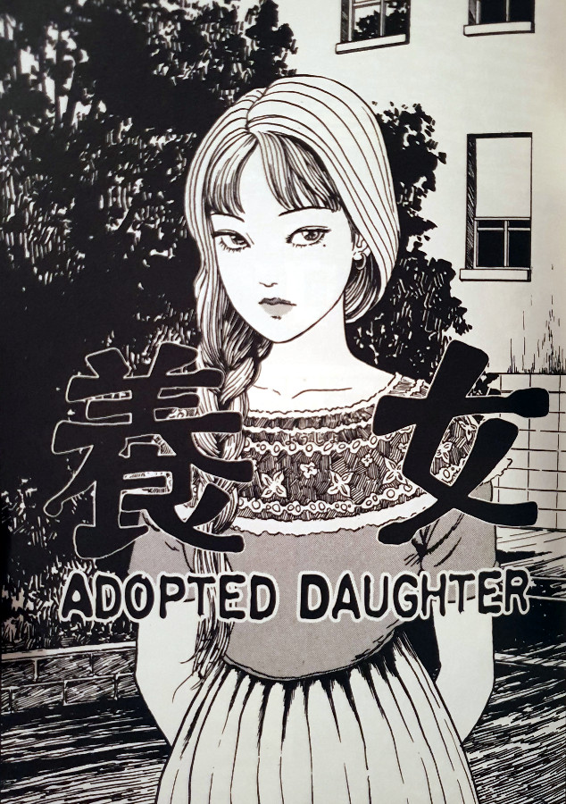
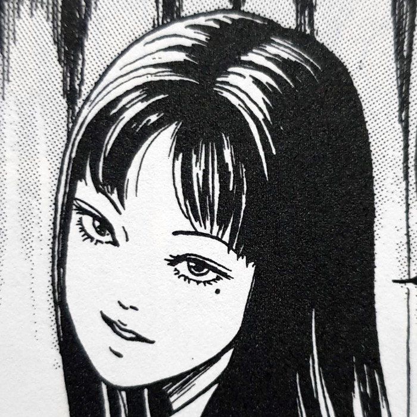
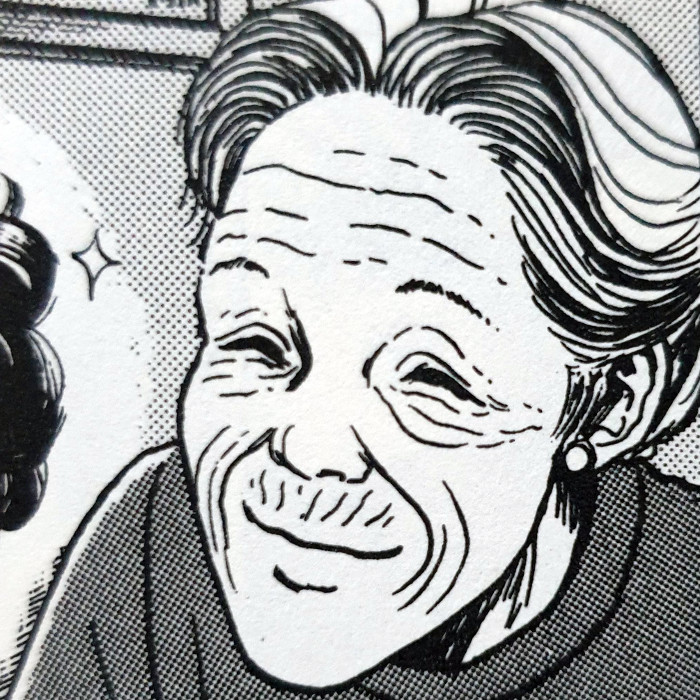
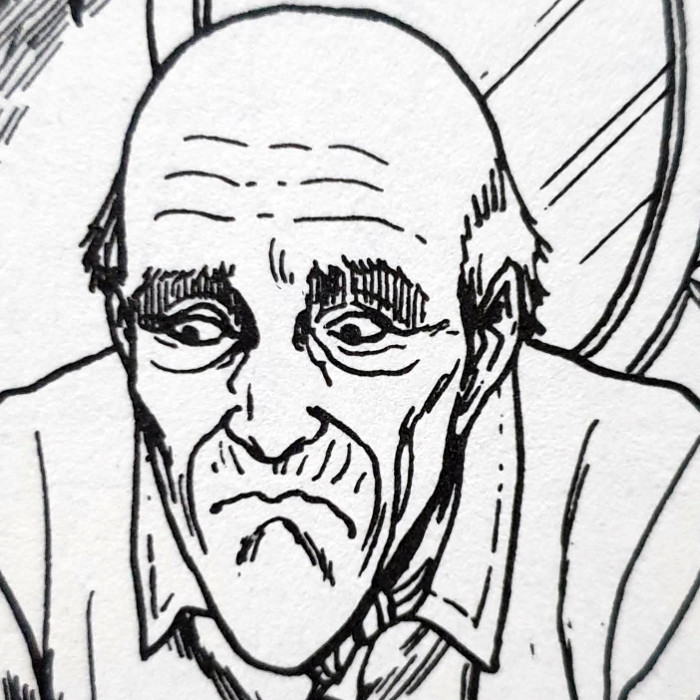
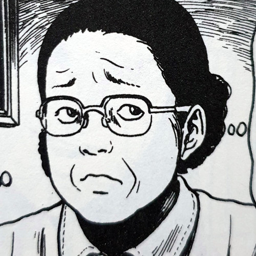
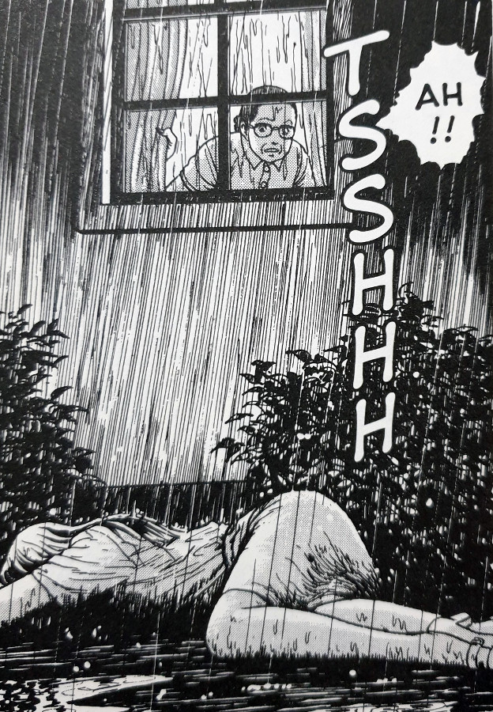
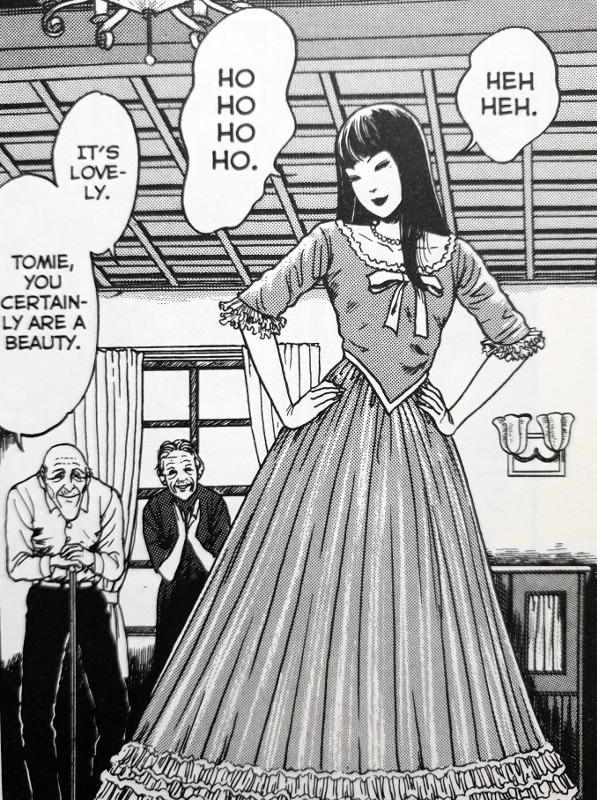
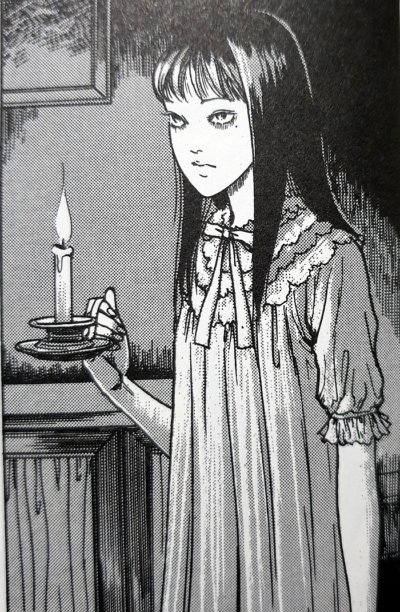

> Oh, how sweet. To stay here, with you... it would be like a dream.
> 
> Tomie is welcomed into the couple's home — Adopted Daughter

## What is Adopted Daughter about?

In the twelfth chapter from the Tomie Collection, Adopted Daughter sees the lady herself be taken in by a friendly old couple. This lovely couple have been unable to have children themselves, and so have previously adopted from a local orphanage. However, their fate seems cursed, as every one of the girls they have adopted has died mysteriously. These strange deaths, whilst under their care, have birthed some very bizarre and troubling rumours about them.

One rainy night, the unconscious body of a young woman is found just outside of their window. The couple quickly take her inside, dry her up and make her feel at home. She introduces herself - her name is Tomie. The couple see this event as a blessing and immediately offer her a home. She accepts, after explaining about how both of her parents have recently died. And it isn't long until she finds herself right at home.

The old couple dote on her as if she were their very own. They do their very best to make her every desire come true, no matter what she asks of them. They buy her nice jewellery; dress her in beautiful gowns; make her hair up like royalty. But none of this manages to stop the inevitable effect that Tomie ends up having on those around her. Those same desires in the innocent soon reveal themselves with gusto, for the story's climactic ending.

## Main Characters

Tomie

Elderly Lady

Elderly man

Satoko

## Twists and tragedy

Adopted daughter is definitely one of the darkest Tomie stories I have read. All of the stories within this world are pretty dark by definition, however, this one manages to go that one extra step. For me, this was down to the sub-plot that is hidden within the over-arching story. I'm not going to mention a word of its details here, for fear of spoiling it for you. Let me just say that it was a twist that I didn't see coming, and reminded me that the scariest things in horror are those that are rooted in reality.

My heart went out to this sweet, old couple. Although I don't want to reveal their ultimate fate, the fact that they seem to be cursed with sick daughters - and then to have Tomie turn up - is a truly upsetting situation to be in. Not only that, but the rumours that go around about them are unfair too. I know that people will talk, especially about certain unknowns in their neighbourhood, but when you add it all up, this couple just doesn't deserve it.

The couple are without a doubt shunned from society - alone together - and unable to make a family. Mix that with the horrific events that they come to witness, and you have a very unfortunate final stage in life.

Tomie is found in the rain

Dressed like a Princess

Tomie by candlelight

## Closing thoughts

I would definitely put this chapter into my top five from the entire Tomie Collection. The sense of depth in the story's history, which comes out from the later-revealed sub-plot, is the most rich out of all I've read so far. I would even go so far as to say that Adopted Daughter would make an excellent Tomie film, in the right hands.

If you haven't read a Tomie story before, or indeed any of Junji Ito's stories, I think that this would give you a great introduction. This chapter has one of the best written narratives from the collection in my opinion. And it gives a good level of gore without being completely in your face. Adopted daughter is a standalone story in the collection, so feel free to read this one during any stage of your exploration.
