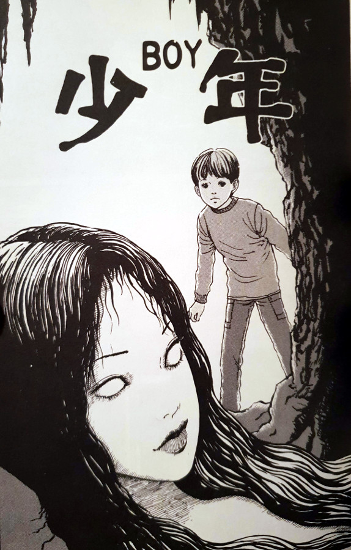

> But sweetie, don't tell anyone about me. Instead, come visit me here every day.
> 
> Tomie starts corrupting the young boy — Boy

## What is Boy about?

Satoru is a young boy whose parents have recently moved them all to live by the sea. It was the father's thinking that it would be good for a young child's health and growth - how wrong he was. While wandering the beach alone, Satoru stumbles across a small cave with a pool of dark red coloured sea water inside. On closer inspection he finds the body of a young woman floating to the surface - her face cut to pieces but miraculously, still alive.

The young boy befriends the woman, who introduces herself as Tomie. As their friendship grows, she convinces the boy to help her in her recovery. First with bringing her food and some clothes form his mother's wardrobe, followed by her having him steal a fancy dress more "befitting" of her. Tomie has the boy completely under her spell, even convincing him to call her "Mommy" from now on.

Satoru's sanity declines very fast, as his obsession over his new mommy drives him to do some very bad things. Eventually, the parents notice that something strange is happening, and do their best to stop it. But will the boy's parents be able to break the hold that Tomie now has on their son? Or have they tried to help him too far down the track; are they too late to save their only son?

## The darkest Tomie chapter

Throughout our looking into the stories from the Tomie Collection, we have come across some pretty dark themes. However, this chapter sits up top for me as being the single most darkest one. Simply down to the fact that it involves the corruption and gradual insanity of a young boy. Junji Ito is most definitely not afraid to explore areas of his world that other people would perhaps be too afraid to conquer.

Characters who cross Tomie's path generally have a pretty bad time with her. But when it comes to children, the horror becomes that little bit more scary. Ito has a talent for getting under my skin, and indeed many other people's skins. However, this is where he officially got all of his claws in and asked "Are you ready to go deeper and darker?"

I remember having similar feelings from a chapter within Dissolving Classroom, where the young girl - Chizumi - has a boy her age kidnapped. But I think that Boy just pips that one to the post, as it goes pretty deep into how Satoru is changed at his very core. And how he transforms very quickly from innocent to cursed. So much so that it sets in motion the events for the rest of his tainted life. The final few panels that detail the boy's adult life were pretty heartbreaking.

## In Summary

Depending on your disposition, this could be quite a tough one to get through. This is all down to the fact that throughout the entire story, Tomie is corrupting a very young boy and moving herself into his mind as his mother. This is a big splinter that risks breaking the family right down the centre. The fact that she has no reason whatsoever to bring terror upon these people, makes it very easy to hate her completely.

I have mentioned in the past about how she had some characteristics that I enjoyed about her - even liking her at times. But in this chapter, Tomie is without redemption; without reason; and is at her most callous and destructive from start to finish.
