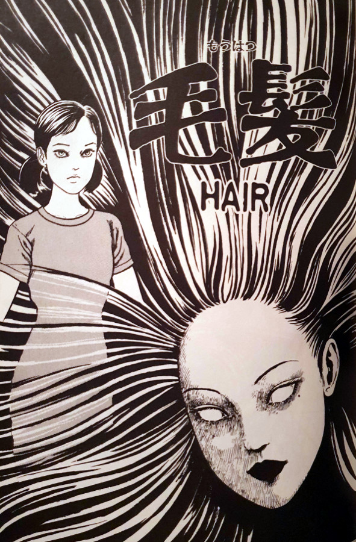
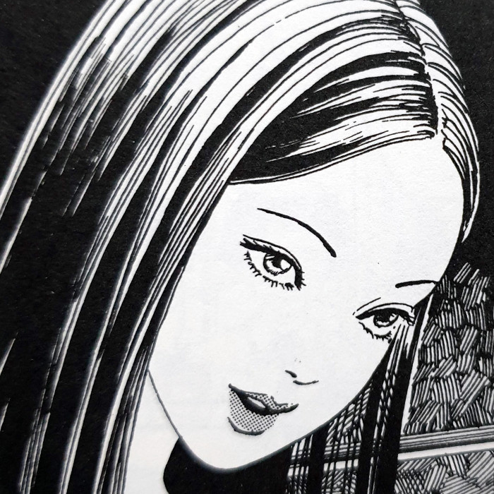
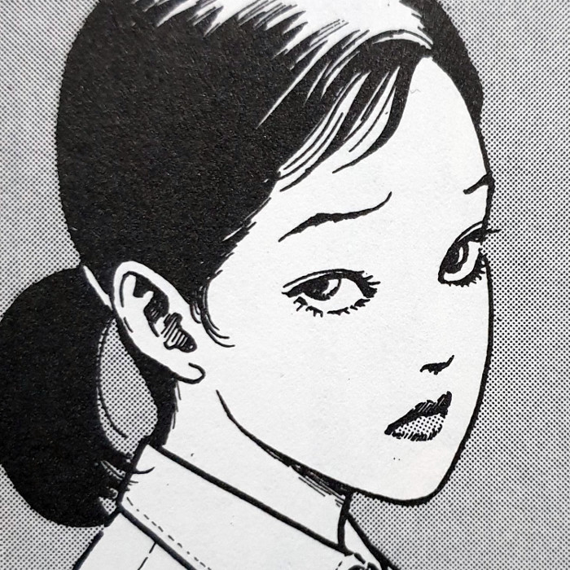
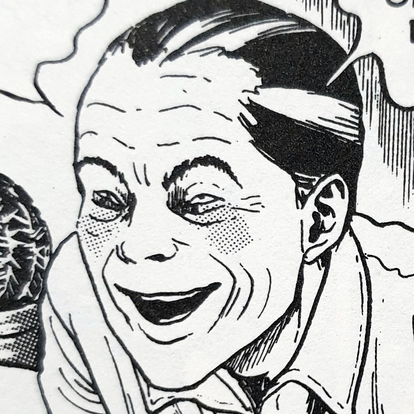
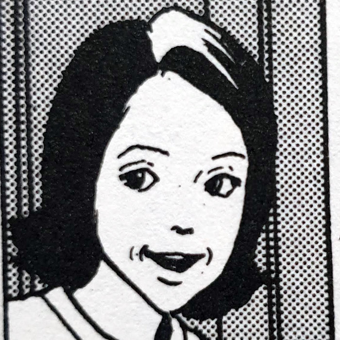
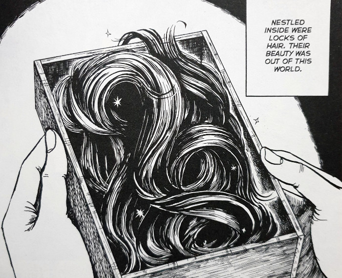
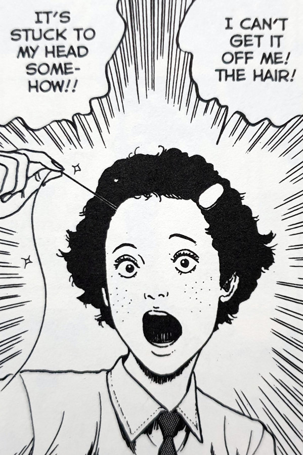
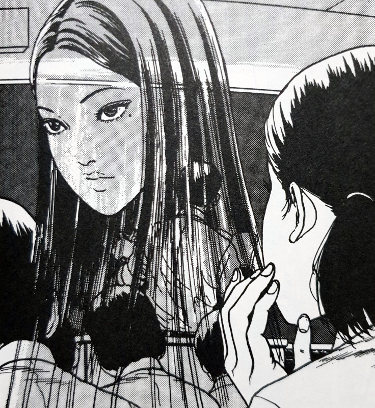

> Tomie came to me more and more often. I sat in my room, dwelling, transfixed by her beauty. I felt no desire to go anywhere.
> 
> Chie becomes increasingly obsessed by Tomie — Hair

## What is Hair about?

After looking around her father's study, Chie discovers a very weird trinket hidden in secret. That trinket is a wooden box, within which is a large collection of long black hair. Although the contents of the box are strange, the hair's unique properties are stranger still.

Once the box has been opened, the hair seems to start growing of its own accord. To share in her weird discovery, Chie confides in her best friend Miki and tells her all about her find. Playing around as children do, each of them get a strand of the hair attached to their heads. It just sticks into their scalp and makes a permanent home there.

As time goes on, they both start having strange dreams - dreams of a beautiful young woman who introduces herself as Tomie. But those dreams become increasingly real for one of the girls as she starts attaching more strands of hair to herself. But how much is too much? And what effect will Tomie's hair ultimately have on these innocent girls?

## Main Characters

Tomie

Miki

Chie

Chie's Father

Chie's Mother

## Body horror

When I think of the body horror sub-genre within horror manga, I imagine the contorted faces from some stories. Or even the devastated bodies from viruses and curses such as in Emerging or Manhole. What I never even considered was how hair could be used in just as an effective way. It just took someone like Junji Ito to see what I could not, and bring it to my eyes in as demented a form as possible.

What Ito has managed to do, yet again, is go to a place that I could never have even dreamt of. We all know that increased hair is a universal sign of maturing within us humans. So to have that taken and used as a catalyst for the changes that these girls start going through was a stroke of genius.

The conclusion to this chapter gave me some remembered feelings from another story of his called Greased. Although not anywhere quite as vulgar as Greased in what it shows, Hair does a great job at ticking some of those same boxes. It too uses parts of the body's natural processes to try and completely unnerve you. And for me it completely succeeded.

## Transformations

Hair is a chapter that focuses solely on Tomie's ability to take over an unknowing host. We saw a similar case to this in the Basement chapter through the infection of Yukiko's blood. However, here Tomie is doing the same thing through the DNA of the hair that Chie's father had been keeping. As soon as it latches on to them, it works its way into their mind and begins to take them over.

The more I think about it too, the more I can't necessarily blame Tomie for what she is doing. I mean, of course she is the enemy here, but is she not simply clinging on to her life like any self-aware being would? Of course it is to the detriment of the girls she is affecting, but I find Tomie's motives here somewhat pure. It is the father who kept the hair hidden for himself for so long that I blame. He would have known the powers that Tomie had, yet still he kept that hair in the same house as his wife and daughter.

What I found interesting, and even refreshing, with this chapter, was how Tomie herself doesn't actually appear in the story in physical form. Instead, it is only through the hallucinations that both girls witness that she appears.

Chie finds the box of hair

A hair attaches itself

Chie gets visions of Tomie

## In summary

I found Hair to be a calmer chapter in the Tomie Collection, but with one of the more visually disturbing endings in my opinion. I think that any dark ending to a story that affects children is by default more disturbing. But in how Ito chooses to essentially teach these girls a lesson really touched a nerve in me when I saw its conclusion.

I guess that those are the buttons that horror manga should press. If you're not left feeling at least partially disturbed after reading one, then the author hasn't taken full advantage of the genre.
