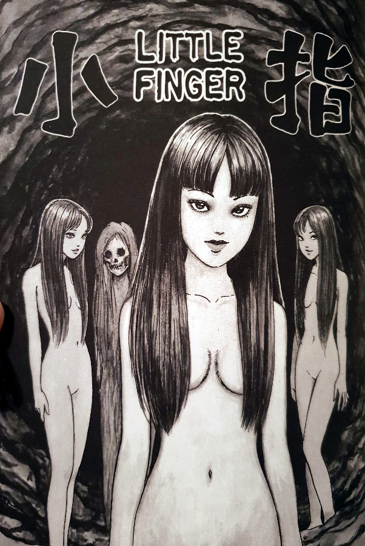

> My brothers regarded her not as their mother... but as a woman. It didn't take long for her to reciprocate, either. Motherly love, indeed.
> 
> Hiroya talks about their Father's new wife — Little Finger

## What is Little finger about?

A father of four brothers brings home a new woman in his life. Her name is Tomie. As you can probably imagine, Tomie has an immediate effect on the brothers, an attraction that she returns. This chemistry between the brothers and Tomie takes its toll on the father, who soon commits suicide. She is then left alone with the four brothers.

The thing is though, not all of the brothers have desires towards Tomie. Hiroya is not conventionally attractive, often being the target of bullying from his three siblings. But he has something that his brothers do not - an immunity to Tomie's charms. She hates the fact that he isn't obsessed with her as the others are. And despite her best efforts, she is unable to win him over. This leads to Hiroya being locked away from everyone in the basement, away from the people who matter.

Hiroya is later released and discovers that his brothers have done something terrible to Tomie. They have killed her and cut her to pieces, which she probably expected to be honest. The weak, sickly brother is then forced to dispose of her body parts in exchange for his being let free. Hiroya makes good on his deal, but little does he know that he is forever sealing his fate. What follows is an encounter with Tomie, as she regenerates around him, tormenting him with echoes of his past. But will he survive the suffering, and will he reach the end of this path with his life intact?

## A damaged man

This is the first time I have read a story from the Tomie Collection where the central character was weak and completely lacking in self-confidence. The characters in these stories are normally well-adjusted people, however, in Hiroya's case this couldn't be further from the truth. But with his weaknesses, comes a huge strength that many don't possess - the power to resist Tomie's powers.

That inner strength of his is soon put to the test though, as he is left hidden away with Tomie as she regenerates. And not one of her, but four! These four instances of her give Hiroya a glimpse at his own life from an outsider's perspective. He is able to see these four versions of her grow up, with one of them significantly slower and weaker than the others. This echoing back to the story's earlier theme is one of the things that makes Junji Ito the craftsman that he is.

Through the horrors of the regenerating Tomie siblings, Hiroya is reminded of elements from his own life. He knows what its like to be the slowest and the most hated, which allows him to know the pains of the weakest Tomie sibling. His inner strength knows no bounds too it seems, as he is able to befriend - and give comfort to - that weaker version of her. But at what cost?

## In Summary

Despite being outwardly one of the weakest characters within the Tomie Collection, I think Hiroya is inwardly one of the strongest. Not just from his ability to resist Tomie, but with his power to empathise with something so threatening and grotesque. He is truly a man who is able to not only confront the fears from his past, but is able to embrace them too.

Little finger was a very enjoyable read for me. It was great to finally see a man who was almost invincible to Tomie's powers. Although it took him being slightly disfigured and having zero self-confidence in order to have that gift. While this wasn't the most visually inventive chapter, it does have many aspects that are to be admired. Like how Ito is able to tie in such a strong theme, that is used so well in the story's pay off.

It is probably not the best introduction to the character of Tomie, but it is a chapter that is definitely worthy of your time. It will do well in expanding a preexisting knowledge of this awesome, and horrific, world.
