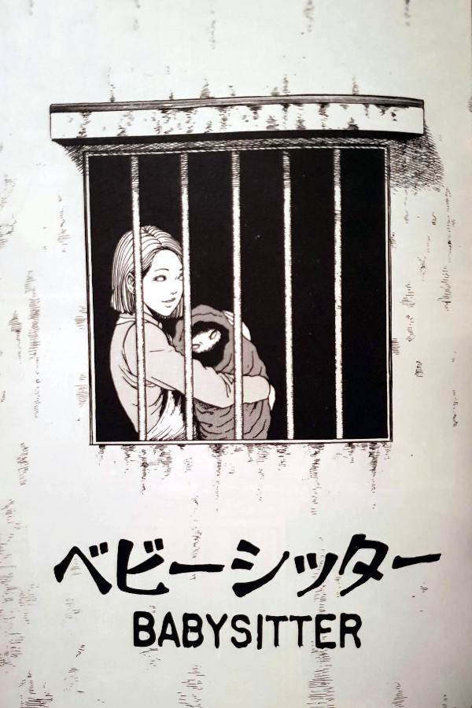

> Just insurance, my dear. Sitters have a habit of running out on us.
> 
> The lady of the house explains the locks on the nursery door — Babysitter

## What is Babysitter about?

In Babysitter, the story is confined to one small room throughout its entire 22 pages. That small room has the look of a cell, but is in fact a baby's nursery. The babysitter herself is a young woman named Erita, who arrives at an elderly couple's home in the opening pages. She is quickly introduced to the couple's baby, although without actually seeing it properly, before being shown into the nursery.

Once in the nursery, Erita is locked inside with the baby. The couple tells her that they've had past babysitters run away during the job, so this is merely a precaution from them. After the brief explanation to the situation, Erita is encouraged to pull back the baby's blanket. Can you guess what she finds underneath? That's right - underneath the blanket is not a baby at all, but what she believes to be a little monster. However, us as readers of this series will recognise it as being a regenerating Tomie.

Once the couple have left Tomie (the baby) and Erita alone, Tomie begins to cry and slowly drive Erita mad. Babies crying in general, to those outside of their family, tend to have that shrill, piercing effect on many. But couple that with the powers that Tomie has and you have a deadly mixture. As it turns out, the only thing that can calm the small Tomie is the colour of red, which Erita slowly realises she must use to her advantage. But in such a small, confined space that colour is sparse - save for the blood in her veins and the growing number of town fires outside the window. Oh yes the fires - I didn't even mention those did I?

## Confined in space and story

Babysitter is very much a confined story. Not only does it trap our heroine, Erita, inside a small cell with this demon baby Tomie, but it also focuses the story there too. Except for the opening panels with Erita travelling to the home, we only see things from her perspective within that room. Even whispers and rumours from outside are learned from her spying outside of the barred window. We only know what she knows.

Tomie's madness is always something to be feared, but generally when people start to feel the effects, they have the opportunity to run or hide. However, in this small locked room, the babysitter Erita has no choice but to withstand and eventually comply with Tomie's demands.

Despite the story taking place solely within this nursery, don't be fooled into thinking that this has no extra layers. There is in fact a wider story going on outside the window, which actually has a big impact on the overall story. And not only that, but only the future of both Erita and Tomie.

## In Summary

I find this chapter to be a very charming one. Something about it makes it one of my favourite from the collection. It has a certain charm in how it focuses in on the doomed relationship between Erita and Tomie. Although the story doesn't really take us to many places, I find it does quite a lot in the space it does have.

I always find it more interesting somehow, when artists work within certain constraints, whether self-imposed or not. In this, Junji Ito has limited himself to a single room and seen what he can create from it. For me, he has created a short but nonetheless very entertaining segment of Tomie's life. At least one of her many lives anyway.
