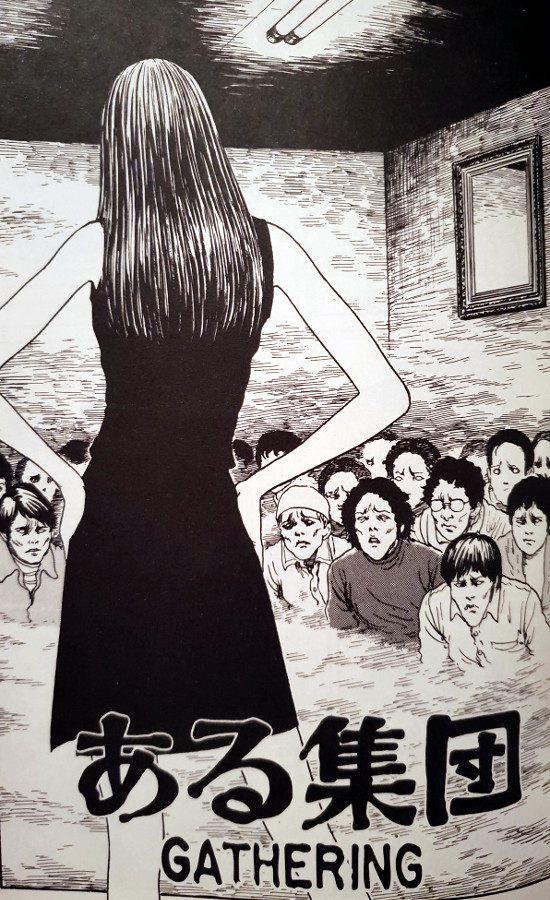

> You interest me. That's all. For you to see me and not feel anything, it's too weird.
> 
> Tomie can't believe Umehara doesn't like her — Gathering

## What is Gathering about?

Umehara is in the throws of grief over the passing of his girlfriend. We join him as he is being consoled by his good friend, Miyagawa, who offers a hand to help. Miyagawa invites his friend to a gathering that he has been regularly attending, but it is a gathering like no other.

On arriving, Umehara finds a room full of men on their knees all looking towards an empty chair on the room's opposite wall. The whole place has the air of a cult, with those suspicions being solidified once the target of these men's attention appears. It is Tomie. All of the men go wild and Miyagawa reveals that he has brought his friend as a gift to Tomie in order to receive a reward.

Tomie seems taken by Umehara immediately, however, he couldn't care less about her. It seems his love for his recently passed lady are just too strong. As the story moves forward, Tomie tries to work out why she has no effect on him. Her failure leads to her turning her worshippers against him in response. But what is truly shocking, is when the inevitable happens and the crowds of men move past the infatuation stage, and into the "I just want to kill her and cut her up" stage. By the end of this gathering, things get rather messy - and perhaps not for the reasons you may first think.

## An army of the obsessed

This story is about Tomie's power of obsession over men, except it's turned up to eleven. She essentially has an army at her disposal, and chooses to have them shower her with complements and gifts. She will demand for them to make her laugh; to entertain her in any way she shes fit. But when she doesn't get her way, as is the case with Umehara, you'd better not be in her path.

The power that she has over these men is potent. And the conclusion of such an odd situation - with these men all sitting at her feet in a growing internal frenzy - could only lead to bad things. The whole chapter feels like a boiling pot of water just waiting to break over the sides. The final panels present a suitably violent scene for such a dangerous, high-pressure atmosphere.

## In Summary

Not a favourite of mine in the Tomie Collection, but still a very worthwhile addition to its overall world. Here, Junji Ito is focusing in on the side of Tomie that drives men to obsess over her - and to do anything she asks in order to please her. Although it isn't very large in scope, when it is digested along with all of the other chapters, really give a complete picture of this Queen of horror manga.

I don't think this would be the best chapter to serve as an introduction to the lady. Although most of what you see in here would have been seen before in earlier chapters, there is one part that I believe is new. She manages to force herself into the reoccurring dreams of Umehara. Whether it is her doing or just from the effect she's had on him, is not clear. So perhaps she manages to win him over after all?

If you are an existing fan of the series and want to see more of what you have come to enjoy from Tomie, then Gathering will make a fine addition to that repertoire.
