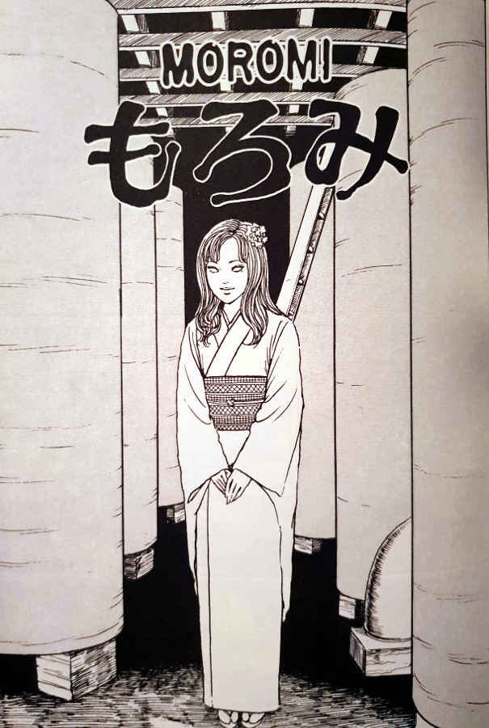

> It... reminds me of Tomie's voice. I mean, it... sounds just like her.
> 
> Ishizuka might be hallucinating in the factory — Moromi

## What is Moromi about?

In Moromi, Junji Ito mixes things up a bit, centring the entire chapter around the attempted disposal of an already-killed Tomie. Not only has she already been killed, but her former partner - Ishizuka - is busy mashing her remains into a fine paste on the floor. And even though he is putting a lot of work into it, her bloody remains seem to not be getting any smaller. In fact, he has noticed that the flesh seems to be getting larger in volume.

In order to get some help, Ishizuka invites his friend Nagaoka round. Once he arrives, he is told about the strange situation going on. Ishizuka brings him up to speed, revealing that he has discovered that the pieces of Tomie seem to be regenerating. Tomie just can not die. He explains how he has tried to fight the growing flesh, by cutting it up as small as possible. However, he now has buckets and buckets of her remains that are still growing out of all proportion with no way of disposing of it.

His friend then comes up with a very strange method of disposing of the meat. And this is where the story gets a bit odd, at least within the context of Tomie. They both travel to Nagaoka’s parent's Sake factory, where there are huge tanks of mixing vats. These mixing vats are where the family Sake is produced, and it will also become the target for Tomie's disposal. They begin mixing in parts of the flesh piece by piece into the Sake mix. This begins to have a very strange effect on everyone as the vapours begin to circulate round the factory. Not only that, but when they decide to taste the new recipe things really get turned up a notch in strangeness.

## Regeneration

This is a story that focuses solely on Tomie's regenerative powers. But not as we've seen before from complete limbs or cuts in the body. Instead, this is regeneration from the mangled, squashed flesh of a once-beautiful woman. Her appearance in this chapter is relegated mostly to being just that of buckets of body parts and ooze. Except, that is, for the spirit hallucinations that occur once the vapours being to rise. It reminded me of the chapter Hair in that respect, as she didn't appear completely in that one either.

There isn't as much elegance attached to her here either, due to the fact that she spends the time as buckets of chopped-up flesh. This chapter is a much grittier, dirtier story than we've come to expect so far from the Tomie Collection. For that reason I enjoy it on its own level from others. I believe that Junji Ito must have approached this story in a very tongue-in-cheek manner. Just the fact that the friends very first suggestion, and the one that they actually go with, is to shove her parts into Sake vats in his family's factory. It's so ludicrous, but its one of those stories that always makes me smile.

Not only is it a fun and silly one, but it provides some much-needed relief after the much darker events of the previous chapter "Boy" too.

## In Summary

This isn't a chapter that features highly in my favourite Tomie stories, but it is still enjoyable nonetheless. I loved the juxtaposition of the opening panels - with the loving words from the boyfriend, followed by him beating her corpse into the ground.

This is another standalone chapter, which I think is suitably placed with its other chapters. Moromi sits comfortably in the middle of the overall collection. And while not the best there is, is definitely worthy of your time in reading.
