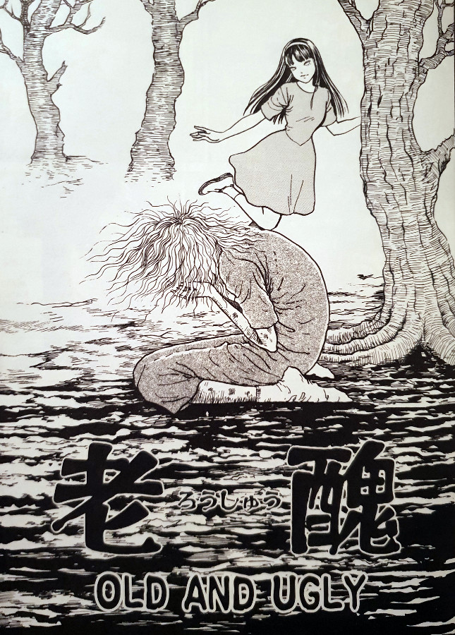

> This was the only way to keep Tomie from multiplying. Don't worry. She won't die in there.
> 
> Ryo traps Tomie somewhere he hopes she can't escape from — Old and Ugly

## What is Old and Ugly about?

In Old and Ugly, we not only close off a trilogy of stories, but the entire Tomie Collection too. We pick up where we left the story at the end of Passing Demon. The strange figure, who we now know as being the "Top Model" Ryo, has approached Ayaka's sister - Yasuko. Oh, and the three Tomie girls are each still trying to kill one another by possessing local boys to carry out their attacks. Ryo is doing his best to protect them all, but that does prove to be quite difficult.

After Ryo and Yasuko have joined forces, they decide to take Ayaka away to safety. If he can't save them all, at least he has a chance of saving one of the Tomie girls. And by "saving" I really mean preserving. For, as long as she doesn't multiply she will retain her human characteristics and age as any normal person would. This is Ryo's, and later also Yasuko's, end goal - they wish to see their Tomie contend with the frailty of human life; to see herself as old and ugly before her life ends.

Ryo and Yasuko essentially give up their lives to focus solely on the preservation of Ayaka. Their revenge is so focused and so tunnel-visioned, that they literally want nothing else in the world but to see her suffer. As their own lives pass them by they let their thirst for revenge drain them of all that is good. But will Tomie be contained in her human shell? Will she succumb to weakness and old age? Or will she break free from her shackles and have the last laugh once and for all?

## The end of the journey

We have finally reached the end of our journey through the entire Tomie Collection. Through twenty stories we have followed the lady in many of her incarnations. With this final chapter, it really felt like the end of the line. And I don't just say that because it's the last chapter, but the theme of this one really felt like a close for me. Of course Tomie as a force of nature could literally go on forever.

Throughout these chapters we have only seen a small percentage of all of the Tomies that would now exist in the world. Remember all of those bodies that walked out of the "Waterfall Basin"? Or the five that walked out of the cave at the end of "Little Finger"? And what about that original first chapter where many parts were scattered all over the town?

I love how this is a world that would never be rid of Tomie. She truly is a force of nature that just can not be stopped. If there ever was a final chapter after this one it would have to be something like Tomie: World Order.

## The real evil

In "Old and Ugly", Tomie is essentially kept prisoner, initially under a sort of mild house arrest, but soon in a very solid manner. This whole story is about Ayaka's sister and, more crucially, Ryo's revenge against her. Of course this isn't the same Tomie as he had dealt with all those years before. But since all versions of her originate from the same dark place, I guess any suffering Tomie is better than none.

It was interesting to finally see somebody using Tomie's powers against her. By harnessing her blood and injecting it into three (or possibly more?) innocent children, he was able to harvest his very own Tomie clones. Clones whose sole purpose was for him to have his revenge. I believe Ryo to be the real enemy here in this final story. Tomie is simply doing what it is in her nature to do - survive. However, by corrupting the futures of these innocent girls, Ryo firmly placed himself on the side of true evil.

As the pages of their lives move towards their conclusion, so too do we reach the final pages of this collection. And surprising to me, Ito didn't decide to go out with a bang in a huge gory mess. He stayed true to the story at hand and followed it through to its natural, strange conclusion. I have grown to have a special fondness for this collection, through my exploration of its details, and am glad that Ito ended it in the way that he did.

## In Summary

An interesting closing chapter that truly did feel like a bookend to the whole collection for me. I often think about how it may have been good to bring back some past characters from other chapters for a huge finale. Like Tsukiko from "Photo" or Mitsuo from "Painter". But perhaps that would have been just a little bit too cheesy.

You will need to have read at least the previous two chapters for this one to really make full sense. In fact, I feel that this whole closing trilogy of "Passing Demon", "Top Model" and "Old and Ugly" are best experienced at the end of the collection as intended.
