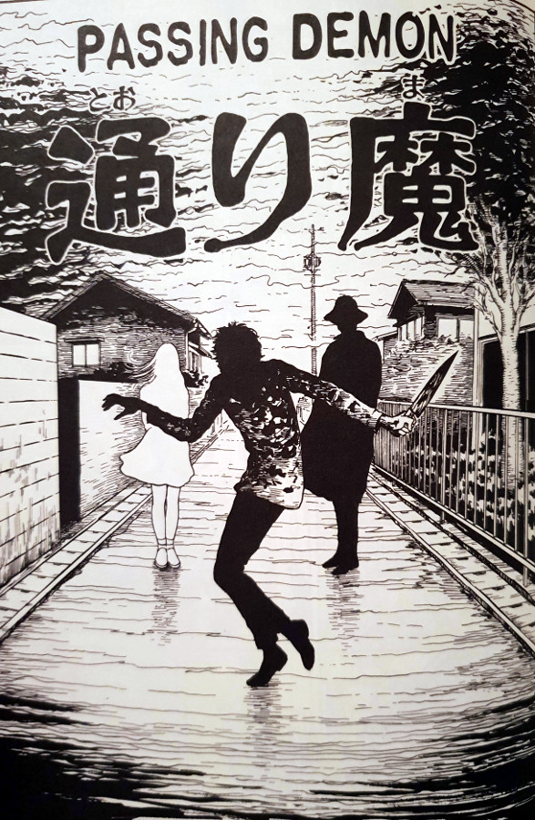

> What an uppity fake you are. Mark my words, you'll pay for it.
> 
> One of the girls warns the other — Passing Demon

## What is Passing Demon about?

Ayaka, the youngest of a couple's two daughters, is the odd one out in her family. She is beautiful; she is confident; and she bares a striking resemblance to a certain lady we've all come to know and love - Tomie. But she is not Tomie - at least not yet. A shocking event that happened to the family when Ayaka was just a baby, put her on a completely new - and doomed - path. A shadowy figure had taken away her innocence in one fell swoop.

It seems that Ayaka wasn't the only one either. There are other young girls of Ayaka's age who are discovered living in the very same town. They each stand identical to the next, and bare that unbelievable resemblance to Tomie. And It isn't long at all until they become aware of each other's existence - triggering the desire in each of them to kill off the others.

This desire to each rid the world of the others' existence leads to some very troubling and violent scenes. These mainly come from the poor people who are caught in the crossfire, however. Of course, these girls don't lift a finger in their attacks; they get others to do their bidding instead. Namely young boys that are easily controlled with those classic Tomie charms.

But will any one of the girls end up on top? Could they even learn to accept each other? And what will happen once the shadowy figure, who started all of this off, steps out of the shadows?

## The shadowy figure

This is the first time I can remember that an apparent force more foreboding than Tomie took a foothold in these stories. When she is walking alone, Ayaka (who is at least 80% Tomie by now) is aware of a presence watching her from the bushes and the shadows - at least she can sense it anyway. I almost felt as though she was scared - like genuinely scared. And I don't think I can remember a time when I saw Tomie scared - except when she was faking it, of course.

I feel as though this shadowy figure, who is revealed in the closing panels of Passing Demon, is much more depraved than Tomie ever was. He has no problem whatsoever with corrupting these tiny babies with Tomie's blood, simply to have a chance at revenge against her some years down the line. This man is a truly sick individual, no matter what his motivations are.

## Echoes of Assassins

I loved the call back to a previous chapter "Assassins" in this story. The whole concept of having brainwashed young men made to kill off other copies of Tomie was explored there. And it is one of my favourite stories too. So to see that idea return truly was a big treat for me. I even like to imagine that the chapter Assassins is in fact this moment in time - when these identical girls are each trying to kill one another off.

I wonder if Junji Ito envisioned that himself, or whether it is simply a coincidence. Nonetheless, the reference back to it was great.

## In Summary

Passing Demon kicks off the final story arc of the entire Tomie Collection. It, along with "Top Model" and "Old and Ugly", close off what has quickly become one of my favourite collections of all time. Although this chapter alone isn't one of my favourites, I do really like the final trilogy's overall story and how it all ties in together.

Passing Demon, and the two that follow, felt a lot more tied together than the Tsukiko trilogy did in the beginning of the collection. (the Tsukiko Trilogy being "Photo", "Kiss" and "Mansion") That's not to say that those chapters were bad - quite the contrary. It's just that I can really see how much Ito has progressed as a storyteller from those early days up to these final farewells.
