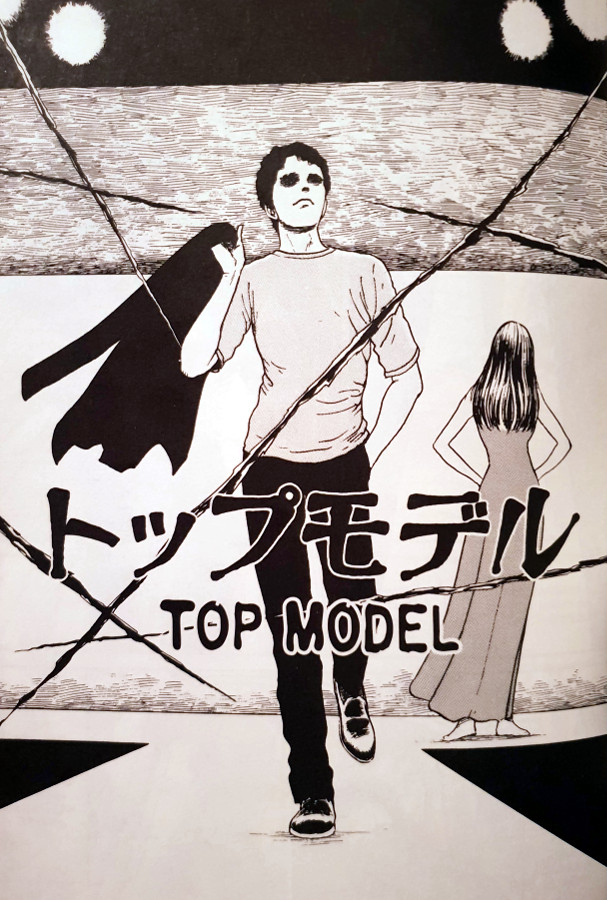

> Ah ha ha ha. At least you've a sense of humor. But compared to my beauty, you're not even on the scale.
> 
> Tomie laughs off the model's advances — Top Model

## What is Top Model about?

Ryo is the titular "Top model", who recounts his days as a successful catwalk model. Not only that, but he goes into the reason for his downfall - the young woman called Tomie.

During a photo shoot, Ryo asks his photographer if he knows any new girls on the scene. Apparently he is bored with his current partner. The photographer points him in the direction of a girl that he himself has been trying to get with. On meeting her, Ryo is immediately taken with Tomie. And going from his past romantic experiences, he expects her to fall for him straight away too. However, he gets a nasty surprise when she laughs in his face, telling him just how plain he is to her.

Ryo is at a loss as to why Tomie doesn't like him, but he wont give up that easily. After another meeting, which falls flat on its face also, he manages to offend her during an outburst he ends up having. This is the moment where he seals his doom forever. Whilst walking down the street the next day or so, a stranger asks him if he is indeed the top model Ryo. He replies "yes", and is immediately met with a deep slash across his face.

Tomie, in all of her most devious and vengeful, has arranged a guy to disfigure this cock-sure model. She essentially ends his modelling career right there on the spot. But the real horror comes when Ryo tries to enact the same revenge back at her. Ryo doesn't have a clue as to who, or what, he is dealing with. His own vengeful actions may just overstep the line and manage to send him down a path from which he may truly never escape.

## Getting their just desserts

Ryo is a complete pompous idiot in this story. He is the kind of person you just love to hate. He is so arrogant and sure of his good looks and charms, that he believes all women he desires are for the taking. At least this is the impression that I got from him and his interactions with his photographer. So to have Tomie reject him and show him up did make me smile - he deserved it after all. But did he deserve to be disfigured for simply upsetting her? Proabably not, but a small part of me thinks that he deserved that too.

This whole story is escalated by the smug nature of both of these leading characters. Perhaps Tomie felt she'd met her match with just how full of himself Ryo was at the start. Or perhaps it was simply that Ryo had already fallen for her, which is simply no fun for her. One thing is definitely for sure though - that girl sure knows how to hold a grudge.

## It all comes back around

I absolutely loved the closing pages in this chapter and how it comes back to the previous chapter "Passing Demon". We have gotten to learn how that demon came to be as such, and that snuffing out the futures of those poor babies wasn't much of a change in character for him. He's always been willing to get his own way at the expense of others after all.

The approach to the structure in this final trilogy that Junji Ito took, was a stroke of genius in my opinion. Without realising where we were towards the end of this chapter, the whole thing was revealed and it all just felt so right to me. Ito has developed so much in both his artwork and his storytelling since that first Tomie chapter.

## In Summary

Tomie is an absolute bitch in this story. Not that she is a golden girl at all other times, but here she really surpasses herself. Yes, Ryo had some kind of retribution owed to him from his attitude and life style, but I think she maybe just took it a little too far - even by her standards.

Although this is the second part in the Tomie Collection's final story arc, I think that Top Model could still be enjoyed on its own. It has some interesting dialogue between the two leads and some suitably grotesque imagery. However, I would strongly recommend reading these final three stories in order, in order to get the full effect that Ito intended.
