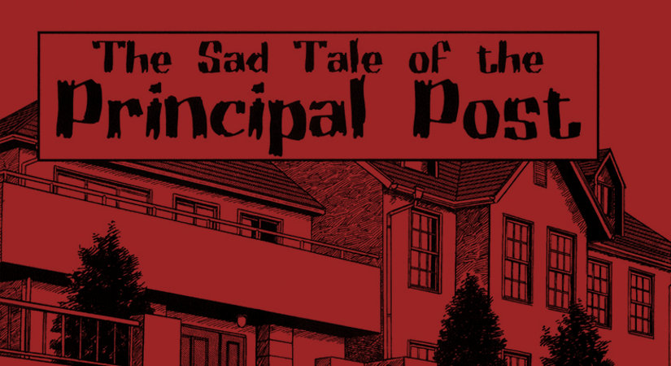

One of the shortest of Junji Ito's manga stories at just four pages. Included with his famous Gyo series is this little gem about a man who has some trouble with the supporting beam of his family's home - the principal post.

You can [read Sad Tale of the Principle post included with the excellent Gyo](https://amzn.to/33KmVVT).

Nestled at the end of Junji Ito's story \`Gyo\`, is a four page one-shot story about a man found trapped underneath the main supporting post of his family's home. As the mother and children are busy entertaining visitors to their new home, screams are heard from beneath them. And there inside the house's crawl space, tightly held beneath the Principal Post, is the father of the family.

The metaphor for this short story seemed so obvious to me, but I wanted to share my thoughts on it nonetheless.

For me, it seems that the father is literally holding the weight of the house on his back - supporting it for his wife and children. And instead of begging for help, he instead pleads for them not to move him - for doing so would risk bringing the whole building down. So for his family, he is willing to die in order to keep them warm and safe in their home.

I'm not sure if this was perhaps Junji Ito expressing feelings of his own regarding his family and his willingness to do whatever he can to help and support them. But I do like to think so.

This story does have a pretty ridiculous narrative when you think about it - the man being spontaneously trapped and the reason for it never being revealed - but I do think that this holds a nice message of family loyalty. Out of all of Ito's one-shot stories I have read so far, The Sad Tale of the Principal Post is one of my favourites.
