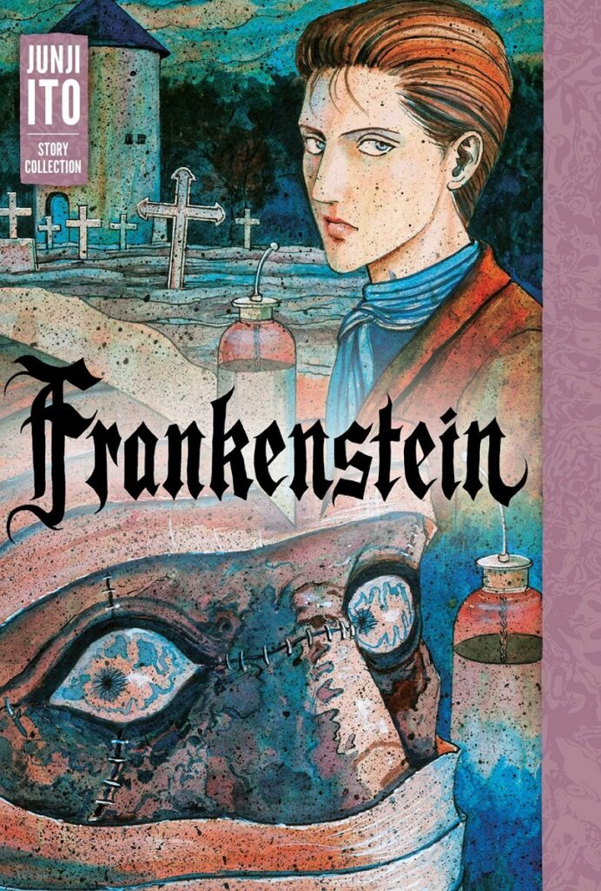

> You seek for knowledge and wisdom as I once did... it is only natural for a man to pursue knowledge. Until a few years ago, I burned with the same ambition as you.
> 
> Victor Frankenstein begins to tell his story — Frankenstein

Mary Shelley’s [Frankenstein](https://en.wikipedia.org/wiki/Frankenstein) is perhaps one of the most well-known horror novels ever written, if only by name. In his horror manga of the same name, [Junji Ito](https://en.wikipedia.org/wiki/Junji_Ito) tackles the mammoth task of bringing this novel into his disturbingly visual world.

Frankenstein is such a huge part of popular culture, however, I have to be honest and say that I have never read Frankenstein the novel; Ito’s version is my first time experiencing the story itself. I knew the rough story – the Doctor creating the monster, but I needed to check the major plot points on the novel’s Wikipedia page after reading this manga, just to see how close it was. 

I am happy to report that Junji Ito’s version of Frankenstein stays very true to Mary Shelley’s novel. Even the narrative structure of telling the story from the perspective of the ship’s captain is maintained. But I can’t give a full comparison as I am not familiar with the source material.

## What is Frankenstein about?

During an expedition to the North Pole, in the pursuit of fame, the captain and his crew see the towering figure of a stranger in the distance. This is followed by them finding a man out in the freezing cold all alone and in need of shelter — a man by the name of Victor Frankenstein. Victor is in pursuit also, only his pursuit is of something far more tangiable than fame. His pursuit is of a creature he decsribes — the figure that the crew saw previously.

Suffering from exhaustion and cold, Victor tells the captain his story and how he came to be out here in the wilds of the North Pole. We learn of Victor’s childhood and family, and his growth into the scientist he became. He also recounts the terrible deeds he performed in the pursuit of greatness in his unique field of study.

He goes on to tell the Captain of his creation, the Frankenstein’s Monster, and how it came to escape and ultimately wreak havoc on his family. We bear witness to the awful deeds that the monster does, and Victor’s seemingly never-ending pursuit of it. Victor’s story ultimately brings us back to the current time on board the trapped ship and to the final moments of realisation of both the monster and the creator alike.

## My thoughts

As I said before, this was the first time experiencing the full story of Frankenstein. I mean, I’ve always known about the characters and the creation of the monster through parodies and tv series tie-ins like [Penny Dreadful](https://en.wikipedia.org/wiki/Penny_Dreadful_(TV_series)) and [Carry On Screaming](https://en.wikipedia.org/wiki/Carry_On_Screaming!), but never the original story.

I am glad, in a way, that reading Junji Ito’s interpretation of it was my first taste. It meant that I got to experience all of the story’s twists, turns and moments of horror, only via the expert artistry of the horror mangaka himself. That’s not to discount Mary Shelley’s talents; I’m just saying that this was a very different way to be subjected to it for the first time.

I thought that the intricacies of the monster himself were put across very well too. It’s moments of horrific brutality; it’s moments of love towards the family whose home he hides in; and the moments of vulnerability where he pleads for his creator to build him a mate – a mate who won’t cower and scream at the mere sight of his face. Someone he can love — and receive love in return.

I can’t say that this is my favourite Junji Ito story, but nonetheless I thought he did a great job working within another writer’s world and the limitations that it can bring. His artwork is on point as always, with the depiction of both innocence and horror so expertly portayed, sometimes through the same character.

I’ve heard said before that if you are going to remake or cover someone else’s creation, whether a film, song or whatever, you should either strive to improve on the original or at least make it different. Whilst I can’t say whether or not he improved it, I do think he brought something completely different. Perhaps even bringing this classic horror story to the eyes of people who may never have ended up reading it — like me.

## In Summary

Whilst I can’t recommend reading this version of Frankenstein before the original, nor should I, I do feel that it is definitely a Manga worth reading at some point. I’m not sure about any different experiences I may have had, had I have read the novel first. The big difference that _does_ spring to mind is that all of the visuals would have been created in my imagination – making it even more scary perhaps?

But as a standalone horror manga, regardless of the source material, Junji Ito’s Frankenstein is a great read in my opinion and worthy of your time.
