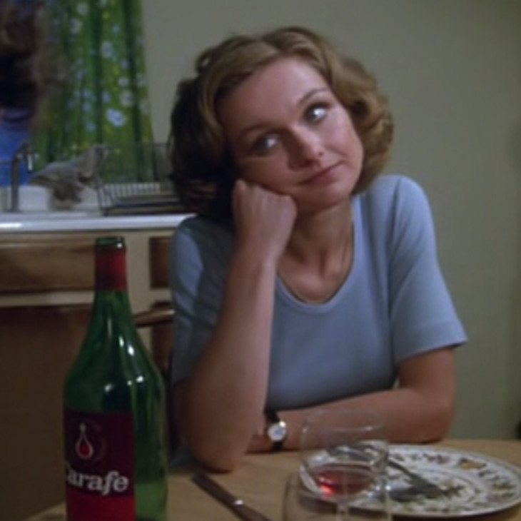
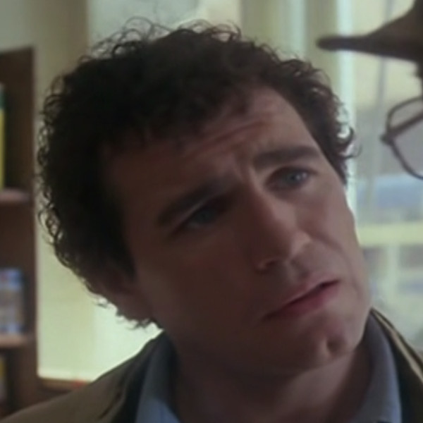
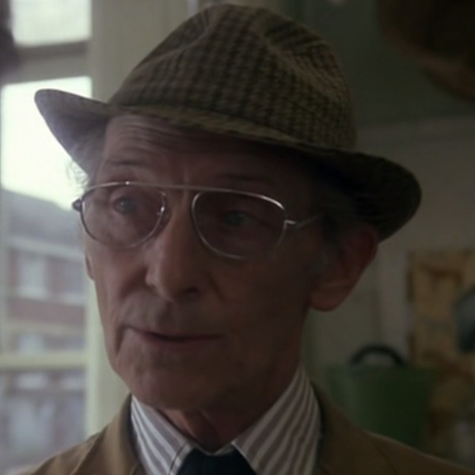
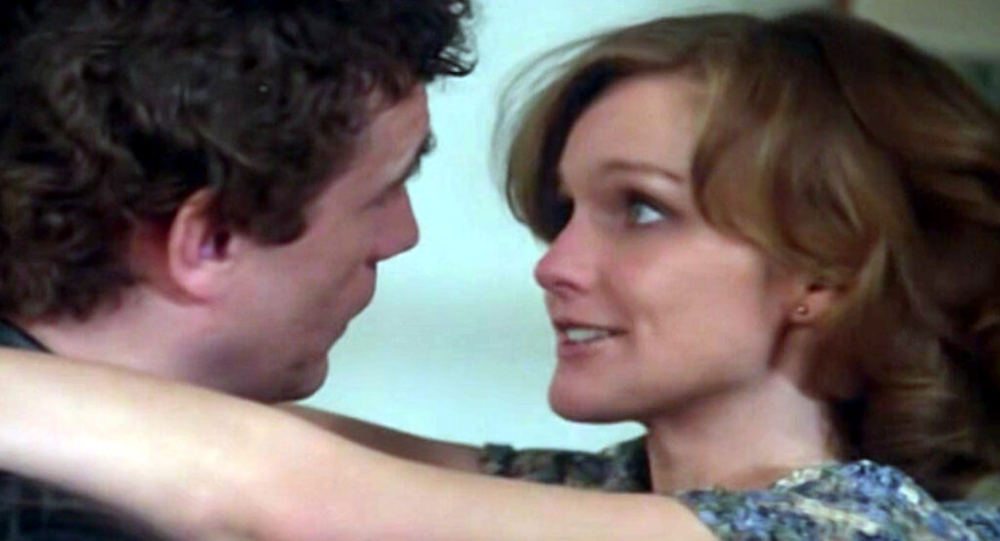
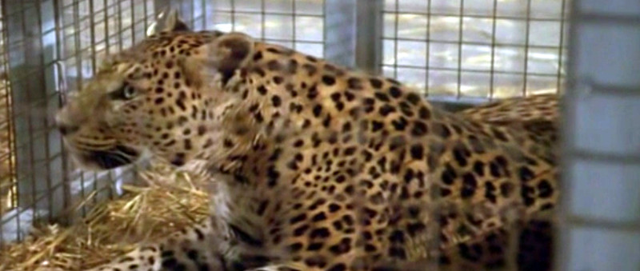

> Lay the right bait, and almost any creature will walk in of its own accord.
> 
> Martin Blueck to Chuck Spillers

The Silent Scream may be one of my favourite episodes from the [Hammer House of Horror](/tag/hammer-house-of-horror/) series. It doesn't contain any deaths - not of people anyway - and doesn't really have much in the way of gore. But where this episode excelled for me was on the psychological level.

Plus, escaped nazi war scientists always bring with them a particular brand of horror for me. Memories of [American Horror Story](https://en.wikipedia.org/wiki/American_Horror_Story:_Asylum)'s Dr. Hans Grüper.

## Main Characters

Annie Spillers

Chuck Spillers

Martin Blueck

## What is The Silent Scream about?

Chuck Spillers, played by the excellent [Brian Cox](https://en.wikipedia.org/wiki/Brian_Cox_(actor)), is fresh out of jail and back into the loving arms of his wife, Annie - played by TV actress [Elaine Donnelly](https://en.wikipedia.org/wiki/Elaine_Donnelly_(actress)). Whilst in prison he was visited regularly by an older man, Martin Blueck - played by the ever-charming [Peter Cushing](https://en.wikipedia.org/wiki/Peter_Cushing). Blueck would talk with him and give him money for his time. Although this initially seemed very generous, it is soon apparent that this was just bait; grooming him for what was to come later.

True to his word, the day after his release Chuck goes to visit Blueck at his place of work - a pet shop in the centre of town. He goes to say thank you to this old man whom he now considers a friend. Blueck then offers Chuck a job, only in a secret back area of the shop.

In the back is a large warehouse where Blueck keeps all manner of dangerous and exotic animals in cages. These include Lions, Tigers, Panthers and Baboons. What is perhaps more surprising for Chuck, is the fact that the cages all have their doors _open_.

Blueck explains his ambitions to create zoos without bars, where animals can walk freely and still be of no danger - something that Chuck sees the benefit in having just been released from jail. These animals have been conditioned to know that the open doors do in fact contain an electrical field that will instantly kill any who attempt to pass through. Only after the power is turned off, and the loud buzzer is rang, is it safe to briefly step out to get their prepared food.

Chuck dutifully tends to the animals each day whilst Blueck is away, as he is paid to do. However, Chuck's attention is continually drawn to a safe housed in the wall on the second floor of the warehouse. He knows he has the skills necessary to open such a safe and obtain the potential fortune within. But his greed may well be his undoing.

## Prisons without bars — my thoughts

Imprisonment is a big theme in this episode: Chuck has just been released from jail, where he found the confinement particularly hard to cope with; the animals being housed in their open cages with fear of death on exit in Blueck's warehouse; and even the limitation of locations in the episode. For the most part we are either in the Spillers' kitchen or Blueck's shop.

On writing this it even occured to me that perhaps the prisons that these character's carry within them are of importance too. The way that Chuck's desire for more leads him to crack open the warehouse safe, causing his own imprisonment by Blueck.

A Leopard sits in its cage

Or even the way that Annie is still bound to Chuck with love, even after his greed and criminal actions lead directly to his being imprisoned. And her being bound to him, attempting his rescue, leads to her own capture by Blueck.

And finally Blueck himself. His desire to experiment on Chuck and Annie, to create a prison without bars, ultimately leads to the overlooking of his most dangerous captive animals - sealing his own fate

I found this episode to have a good amount of tension — the most poignant moment just has to be _that_ scene with the puppy. Although not gory, it still manages to leave it's trace across the rest of the episode. I didn't find the lack of blood and conventional Hammer Horror deaths to be a thing I particularly missed either. I mean, a bit of gore can be fun alot of the time, but in this story the suspense and tension were balanced enough to carry it on their own.

The ending was suitably nightmarish for me, although I could see it coming a mile off. This was simply due to a previous scene with Blueck driving away from a location in his car. It was a shame, because had it have been edited in a slightly different way, I believe that the closing scene could have been much more of a surprise twist.  

## Summary

I loved this episode. The over-arching theme of imprisonment and being beholden to the desires we carry within us was an interesting one. Some of these episodes can be a bit hit and miss for me, but there are enough good quality episodes, like The Silent Scream, that really hit the mark.

I enjoyed seeing the legendary Peter Cushing in the role of Blueck. I was so used to him portraying the side of good, like as Van Hellsing in the [Dracula](https://en.wikipedia.org/wiki/Dracula_(1958_film)) films and Sherlock Holmes in [The Hound of the Baskervilles](https://en.wikipedia.org/wiki/The_Hound_of_the_Baskervilles_(1959_film)). So it was a real treat to see him in such a dark role.

(I know he played Grand Moff Tarkin in Star Wars too, but I'm only thinking of the more horror-themed films here)

Also Brian Cox playing Chuck Spillers. He has one of those faces that I knew I recognised - I just couldn't remember from where. Then I read his filmography and saw, amongst many other entries :

<table><tbody><tr><td>1995</td><td>Braveheart</td><td>Argyle Wallace</td></tr></tbody></table>

Instant recollections of the opening scenes from [Braveheart](https://en.wikipedia.org/wiki/Braveheart) hit me. _That's_ where I know him from!
