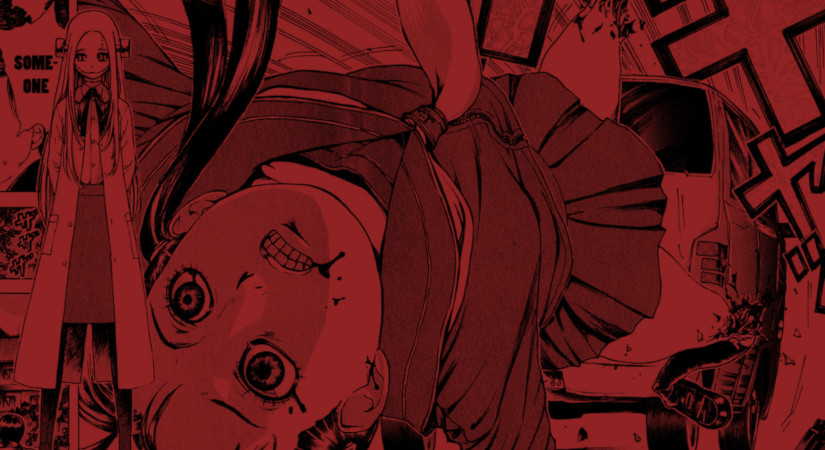

Fran shows us what she will do to help the love of others, especially when she feels responsible for their pain.

## What is Franken Fran Chrysalis about?

A young man confesses his love to a beautiful young woman. Despite the gentlemanly way of showing his intentions, she knocks him back telling him its because of his looks. Not one moment after she has destroyed this boy's feelings, she herself is destroyed as a lorry ploughs headfirst into her at high speed.

If she were anywhere else but a stone's throw from Franken Fran's mansion she'd be gone for good.

How lucky for her.

As it turns out, the lorry was actually delivering supplies to Fran and so she, being of the kindest of nature's, immediately takes full responsibility. She makes it her mission to bring this girl back from the dead and reunite what she assumes to be a loving couple.

## Learning from insects

Fran's approach to surgery is unorthodox to say the least. This is never more apparent than when the girl wakes up from her surgery in Caterpillar form. Here I was introduced not only to Fran's knowledge of extreme surgery, but the author's creativity in crafting unique stories.

Obviously each chapter going forward will be centred around her helping people with some form of surgery. But this chapter showed just _how_ creative these adventures promise to be.

Out of such harsh circumstances love can blossom too. It was nice to see characters learn of real love through the course of Chrysalis. And not only that, but the last page's gruesome punchline is to die for!

## In Summary

Chrysalis is the second chapter in the Franken Fran series. It brings us back into the familiarity of Fran's mansion, only this time with an emergency surgery - not the plotted deception of the opening chapter.

It displays Fran's compassion for others, her skills in the operating theatre and the almost comical side effects of her out-of-the-box thinking that were perhaps not anticipated by her.

I was really happy that the author decided to make Franken Fran into an anthology of sorts. I'm already loving her world and I'm only two stories in. I'm looking forward to her world being fleshed out more and more as I work through the stories.
