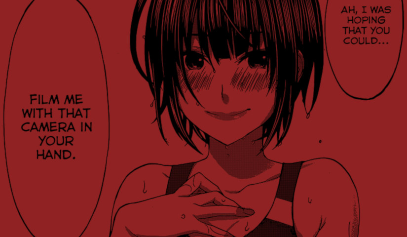

I'd heard whispers of this Horror Manga; about its gore and originality. But nothing quite prepared me for what I discovered in this first chapter of Dead Tube.

## What is Dead Tube Take 1 about?

In it's opening chapter, Dead Tube's two central characters are introduced. These two people are Machiya Tomohiro - a second-year student and cameraman for the school film club, and Mashiro Mai - a second-year student and avid swimmer.

In the opening pages Mashiro asks Machiya to film her none-stop for two days. He accepts her invitation and begins filming her. It starts off innocently enough with him filming her during her normal swimming session. However, the extent of the filming starts to become apparent when she has him follow her to the bathroom and continue to record as nature takes its course.

After filming her sleep at her request, they both step out into their second day of filming. Here she has him record every moment of her date with her apparent boyfriend. The big payoff then comes at the end of the day.

This is where Machiya discovers his film subject's true intentions.

The date's final climax.

## Voyeurism and well-placed humour

This chapter is such a big tease throughout. It teased and teased, building up excellently to it's big climax. I will not spoil the details of which here.

We are shown the story from the perspective of Machiya as he films constantly at Mashiro's request. Many of the panels are very provocative too - very suggestive as to the high degree of sexuality coursing through this manga and its characters.

There were times when I felt I shouldn't be looking, like when she is being filmed whilst sat on the toilet. There are many things in this life that we keep private, or at least try to, and this is definitely one of them. But the playful tone of the story, along with the interesting contrast of the extroverted Mashiro and the heavily-introverted cameraman Machiya, kept pushing me through to the next pages.

And my gosh am I glad that I kept turning!

Not knowing this story at all, I was not ready for what would come in their second day of filming. But I have to say that the chapter's ending completely blew me away. I could now tell that this was going to be a stunning Horror Manga series.

The humour was nice and subtle too. I remember Machiya seeing her undress in the locker room, revealing her body slowly to him, only to show that she's already wearing her swimming costume beneath. Even this humour is tied to the story's over-arching theme of voyeurism. Whilst not laugh-out-loud funny, the story did raise smiles in the right places.

## In Summary

This opening chapter had me hooked on Dead Tube straight away. Its voyeuristic and playful tone touched parts of myself that feel shame, intrigue and excitement. The authors seem to have an expert handle on their story and know exactly the kind of story that they want to tell. I feel they will have an excellent grip on their readers' emotions too.

This is going to be a story that wont let a single page or panel go to waste. I can tell.

I can't wait to experience this journey in full over the coming weeks. And I really can't wait to see how these characters develop further - especially cameraman Machiya.
