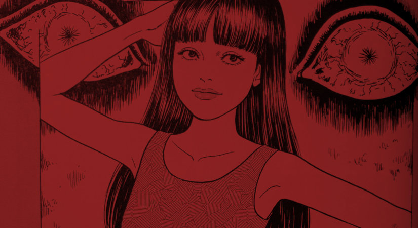

> Ever since I was little, I've been afraid of having my picture taken. Or more precisely, of my body being fragmented by photos.
> 
> Amy is a fresh young model with a strange phobia — Fashion Model: Cursed Frame

In this bonus story from his Shiver collection, [Junji Ito](/tag/junji-ito) delivers an incredible depiction of a woman's strange fear made flesh. And in the most iconic of ways too. One of the things about Junji Ito that is so great, is his big reveals that he often gives us. More often than not I don’t expect them. However, in hindsight they seem to be the only logical outcome.

Logical in Ito’s world at least.

## What is Fashion Model Cursed Frame about?

In Fashion Model: Cursed Frame, we are reunited with a favourite amongst Ito's Characters - Fuchi. Fuchi is the shark-toothed, seven-foot-tall [fashion model](https://horror-manga.com/fashion-model-by-junji-ito/) with a taste for human flesh.

The modelling industry in Junji Ito's world is very cut-throat indeed.

Amy is a new model on the scene, who agrees to work for a company on a single condition - that they only ever photograph her full body. Never head or body shots. The idea of having parts of her body missing from photographs completely freaks her out.

It is the kind of fear that feels right at home in Junji Ito's world. And I could just tell it wasn’t going to end well for her.

But how will Amy cope in a profession where people don't stick to their word. An industry that is often depicted as being ruthless and super-competitive. Not to mention the demonic Fuchi lurking about; on the prowl within those choppy waters of the fashion world.

## In Summary

Cursed Frame is only seven pages long and comes as a bonus in the back of the Junji Ito Shiver Collection. But despite its short length, it packs so much into those pages in a concise, and suitably violent way.

I was really impressed at how he gave us a character with a very specific fear - and one I'd never heard of before either - and managed to bring her story full circle to face that fear head on. I thought Fuchi was an excellent conduit for the idea too - her presence alone brings a sense of dread and foreboding.

I really wish Fuchi was more of a long-standing character - she’s so much fun to watch.
