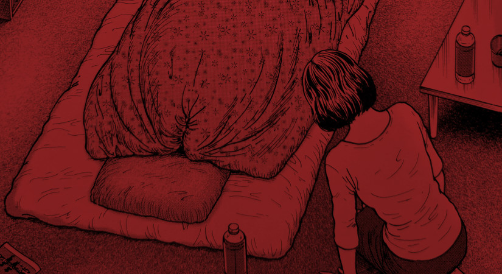

Futon is the first, and shortest, story in the Fragments of Horror Collection. It centers around a man who refuses to come out from under his blanket, for fear of the invisible spirits around him.

## What is Futon about?

This is a very short Horror Manga story. It shows a young couple who live in a small apartment together. The Husband, Tomio, refuses to come out from under his blanket on his futon. The Futon is his bed.

He warns his wife of what he calls the "Dark Nature Spirits" in the room. She believes none of it until she actually gets a similar experience for herself.

But are these visions simply a manifestation of some extreme anxiety that Tomio is experiencing? Or are they as literal as he makes them out to be?

## Short and Sweet

The story is very much to the point, yet no less charming than Ito's other tales. Futon doesn't try to fill out unneeded pages just to increase the count. Junji Ito has created a short horror story and isn't afraid to just let it be what it is.

I absolutely love the big ceiling reveal that shows the monsters that Tomio is convinced he is seeing. The detail in that double-page spread is so great and a testament to Ito's gorgeous horror style.

I was fine too with the vague back story that Tomio gives to his wife about the apparent witch. Some eerie tales can stand up for their strangeness alone, without the need for a comprehensive explanation. I think Futon is one such story.

## In Summary

Despite it's super short length at just eight pages, this is one of the Stories by the legendary Horror Mangaka that I remember more often. That double page spread is one that lives in my memory as vivid as the page itself.

I just hope I never get to see such visions _off_ the page.
