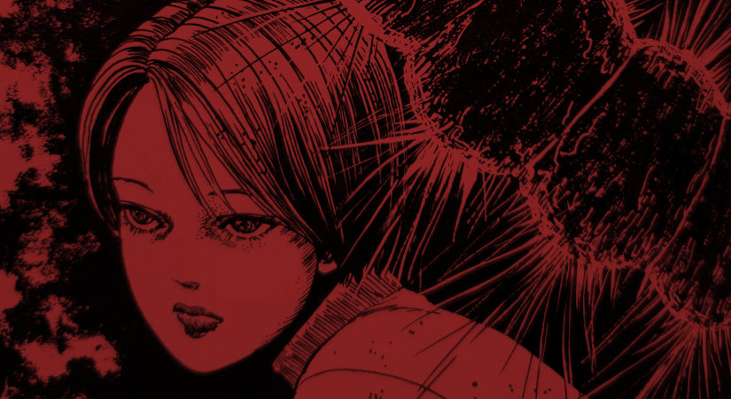

Honouring the memory of one's ancestors is something that most people try to do - at least I like to think so. So it seems fitting that in Honoured Ancestors, Junji Ito should take this very human trait and turn the dial up to “weird” and give us a flesh and blood representation of ancestry.

## What is Honoured Ancestors about?

We join a young couple as the boy, Makita, is walking his girlfriend Risa back to her house. Risa has recently lost her memory and nobody can work out how. She then begins to get increasing anxiety, along with nightmares of a giant caterpillar invading her bedroom at night.

Perhaps something in her lost memories can give a clue as to the origin of these disturbing visions?

Makita seems almost happy that Risa has lost her memory because, as he puts it, they can experience all of the “first times” they had together once again. One such “first time” that they relive is them both going round to Makita's home, where he lives with his sick father. However, upon meeting the father, thoughts and feelings begin to stir within her.

It is in this house where the mystery of her lost memories will be unravelled. And there will be one such “first time” that she will wish would never happen again.

## Head to head with the past

In the author's notes for this story, Ito explains how he saw the big reveal of this story in his mind before any of characters or plot came to him. This is a very interesting way of working, starting with the imagery and working back from there, and I wonder how many other stories of his began this way.

Honoured Ancestors is one of those stories that has so much more going on underneath its surface than what we see. We are shown the current generation of the family, Makita, along with the end of his father's life. But what about the many ancestors that came before? How did they all trick their partners into marriage and carrying on this family line in such a twisted way?

I really enjoy how many of Ito’s stories like this one trigger these thoughts in me. I love wondering about events that happened so completely out of the scope of the current story, yet would still have had an effect on the story's world.

## In Summary

I enjoy this story a lot. While not being a favourite of mine, it still holds a high place for me. I find myself imagining the lives of those ancestors and just how they came to begin the connection to their past in this way.

You should definitely pick up Junji Ito's Shiver Collection and read this story - see what thoughts it sparks in your own imagination.
