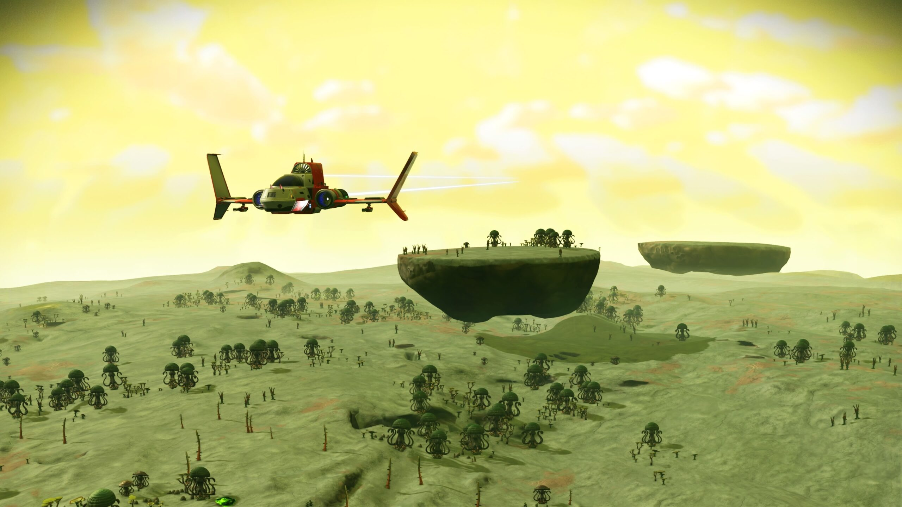
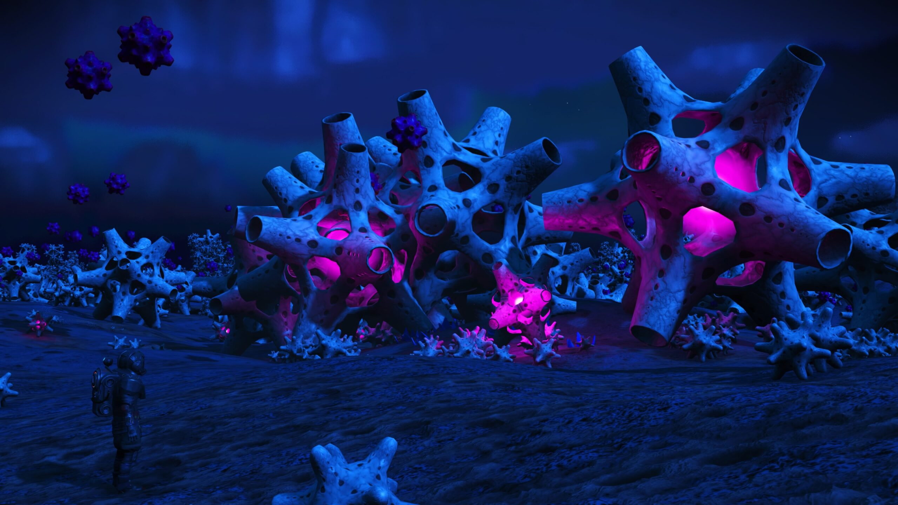
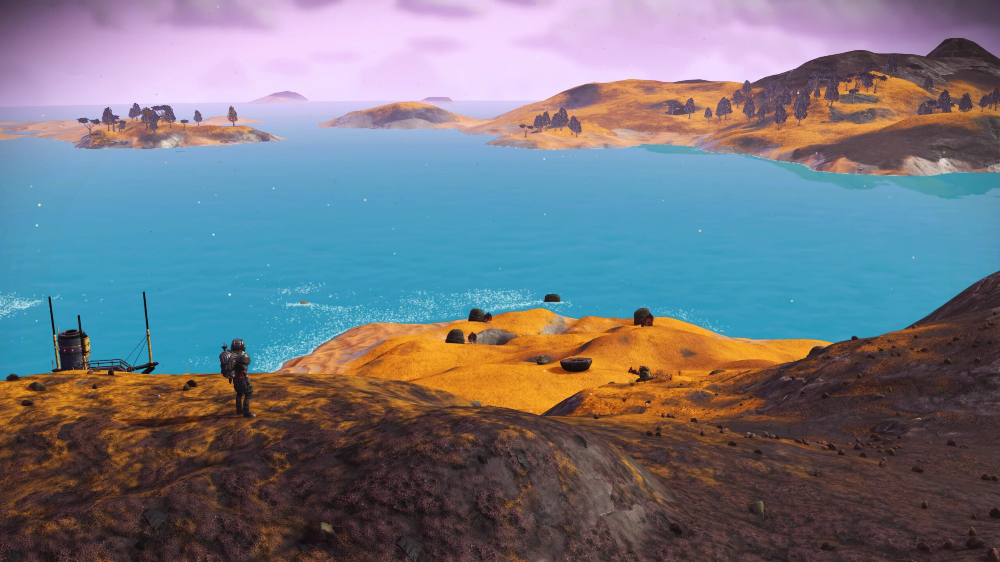
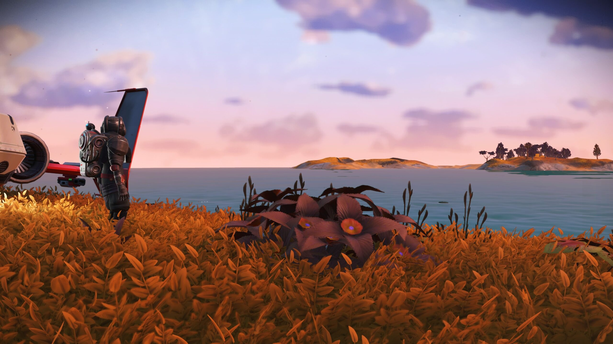
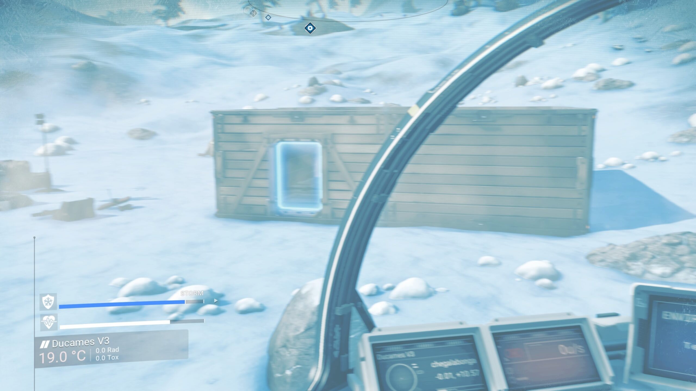

No Man's Sky\_20190619115001

No Man's Sky\_20190619133139

No Man's Sky\_20190619150405

No Man's Sky\_20190619153255

I am absolutely loving No Man's Sky. The planets I've visited are absolutely stunning!

My first base is on a snowy planet I discovered. I called the planet "Ice Bonga". The cold storms get pretty nippy on there.

No Man's Sky\_20190616153347

After warp driving to a neighbouring star system, I found another new planet. This is probably my favourite planet yet so have decided to set up camp.

I have named this new planet "Plush Bonga" and have begun the base building.
