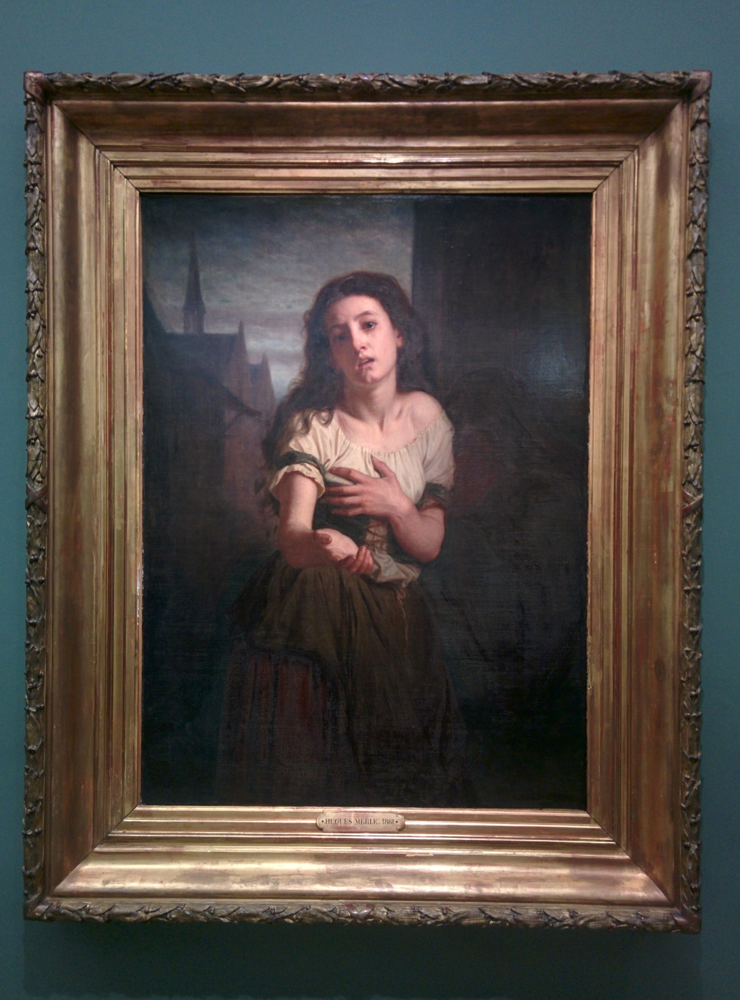

During our trip to Paris a few years ago, my girlfriend and I visited a fair number of art galleries. Although I saw a lot of paintings that stood out to me, this one — A Beggar Woman by Hugues Merle — was one that grabbed me the most.

I'm not even sure what it is about it that spoke to me. I just found myself imagining stories within the world this woman lived in.
