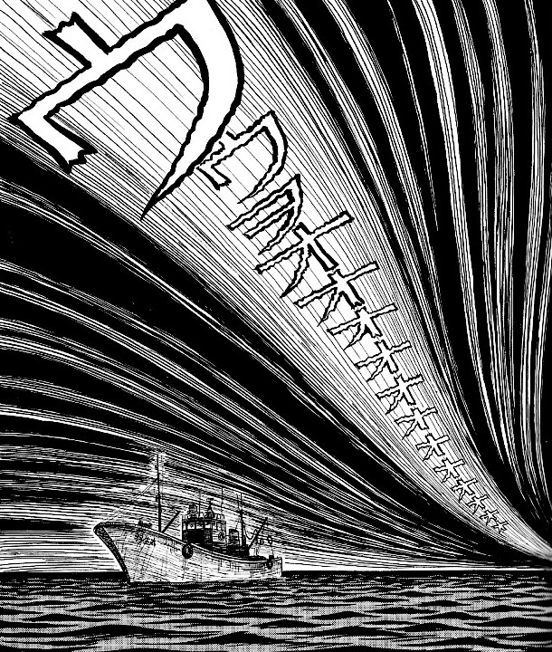
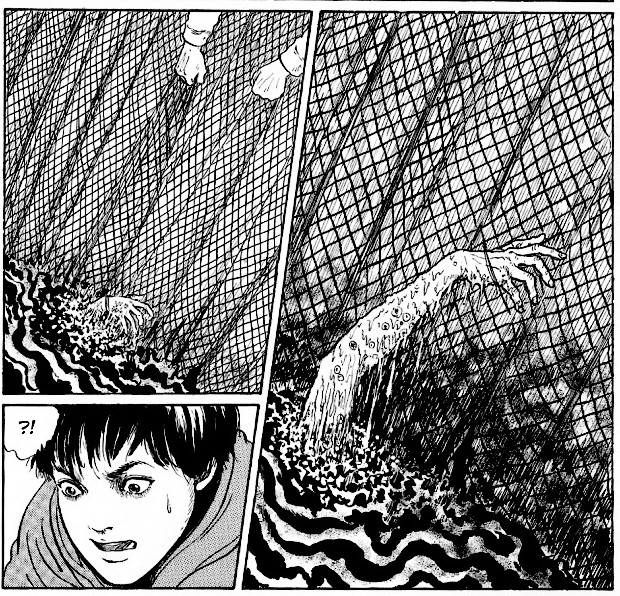

> Maybe it's not a siren at all... maybe it's the cry of a demon.
> 
> The voices begin to scare the crew — Demon's Voice

## Demon's Voice — synopsis

Somewhere out in the middle of the ocean, a group of fishermen are scouting the open seas for a decent catch. It's been a while since they have had a really good catch, but they continue on nonetheless — determined.

One night, whilst sailing across the deadly waves, a shrill cry is heard by the crew - what sounds like the voice; the voice of a demon. Luckily for one crew member, Koji, he happens to be inside the cabin with sea sickness when the voices begin.

The very next day, seemingly out of nowhere, the crew obtain the catch of their lives. In the nets they see masses of tuna; the biggest catch they could have ever imagined. Koji, however, sees what is really in those nets: a huge pile of rotting corpses pulled up out of the sea bed.

The crew, it seems, have started hallucinating - all except for Koji. The obvious cause seems to be the strange sounds from the night before. With Koji being ill in bed, he had failed to hear them. But what will happen once he hears them too? Once all of the crew are affected by those wailing sounds, what else will they end up dredging up from the ocean's bed?

## Characters

Koji

Mr Takada

The Ships Crew

## Thoughts on Demon's Voice

A real mystery this one - a warning to sailors.

This seems to be inspired by the legends of the Sirens of the rocks - at least to me. The beautiful women who would lure sailors to their doom by sitting naked and playing sweet music. But in true Junji Ito style, we switch the sweet music for piercing night howls and naked ladies for rotting, horrifying corpses.

I always find the stories that are set in a single location interesting. It's good to see how a writer crafts an engaging tale when working within a self-imposed limit like that. And Ito is as equipped as any of the best in doing so. The claustrophobia of the boat can be felt throughout, as can the imposing nature of the sea around them.

The idea of a small group of people being out on the open seas together is already a thought that could bring fears of isolation and the worry of having nowhere to turn for privacy. But when you throw in the idea of pulling up a load of old decaying corpses from the ocean floor, suddenly the great big ocean doesn't feel so big any more.

More voices across the waves

A strange catch

A very strange catch indeed

The Voices on the ocean

## Summary

Demon's Voice is another short one shot story from Ito. The story is pretty straight forward and succinct. And like a lot of his shorter tales, packs a lot into its few pages.

He creates a world that could easily be further explored: What happens to this, and presumably other, crews? Where is this voice coming from? Why is there a malevolent force at work that is preying on innocent sailors.

I was reminded of another manga i'd read recently called "Mountain of Gods Precipice of the Unknown". That too deals with an unknown force that is targeting a specific group of people. And for reasons unknown.

All in all, Demon's Voice is a nice little story about the sirens in the ocean. Sail on.
