[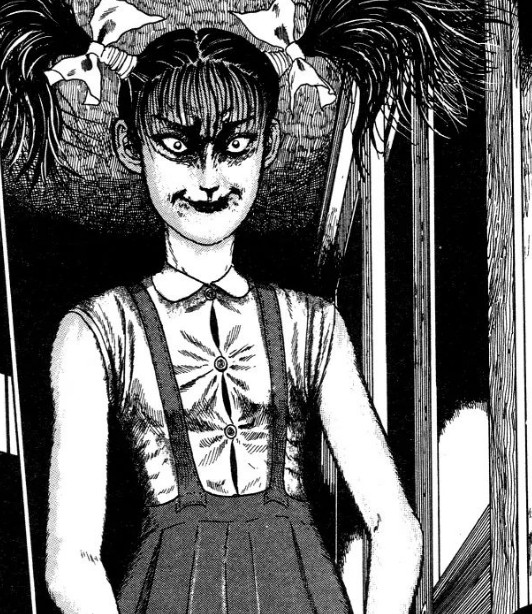](https://davidpeach.co.uk/wp-content/uploads/2023/04/Kuriko-The-Bully.jpg)

The Bully is one of those rare Junji Ito mangas that features no physical horror or gore. Instead, it's horror is depicted through the bullying inflicted by the central character, Kuriko.

## Synopsis: What is "The Bully" about?

In The Bully we follow Kuriko and the boys around her who end up suffering in one way or another. From the manga's opening pages we are led to believe that she is a sweet woman who only wants to be honest with her husband-to-be.

We join Kuriko and her soon-to-be-Husband Yutaro at a local park, where they once played as children. She tells him how she wishes to confess details to him of her "dark past", as she puts it. Kuriko tells him, and us through a flashback, of how she was once entrusted to look after a young boy, called Nao, when she was just a young girl herself.

But the trust put in her for that little boy's welfare was misplaced, it seems. Kuriko goes on to reveal how, when Nao would start becoming too clingy with her, she would start bullying him. She started lightly with just screaming in his ear, but the story soon escalates her abuse into some pretty harsh scenes.

As the story of The Bully moves into it's second half, it shows us how those earlier events have affected those people in the present day. We learn where those people are now in life and ultimately how Kuriko's volatile nature affects each and every one of them.

## Main Characters

[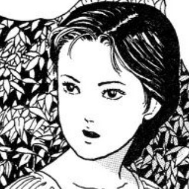](https://davidpeach.co.uk/wp-content/uploads/2023/04/Kuriko.jpg)

Kuriko

[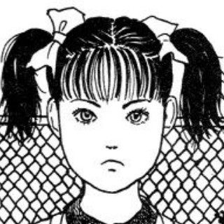](https://davidpeach.co.uk/wp-content/uploads/2023/04/Young-Kuriko.jpg)

Young Kuriko

[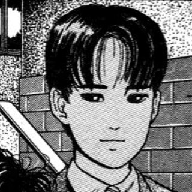](https://davidpeach.co.uk/wp-content/uploads/2023/04/Nao.jpg)

Nao

[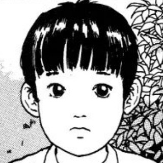](https://davidpeach.co.uk/wp-content/uploads/2023/04/Young-Nao.jpg)

Young Nao

[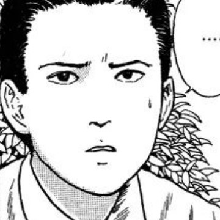](https://davidpeach.co.uk/wp-content/uploads/2023/04/Yutaro.jpg)

Yutaro

[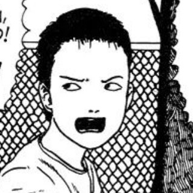](https://davidpeach.co.uk/wp-content/uploads/2023/04/Young-Yutaro.jpg)

Young Yutaro

[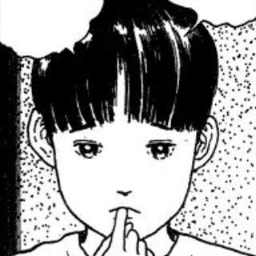](https://davidpeach.co.uk/wp-content/uploads/2023/04/Hiroshi.jpg)

Hiroshi

## A tough read at times

When we talk about horror with regards to Junji Ito, we often talk about the body horror aspects more often than not. We discuss slug-people, Spirals, and a certain girl who can not die. But in The Bully, Ito has crafted what I believe to be one of his most successfully-unnerving horror stories to date.

Although Kuriko is the main character here, I couldn't help but empathise with Nao in those flashbacks. Where he was made to drink dirty water; where he was made to confront the scary dog "Devil"; and where he is beaten with a stick.

How Ito manages to bring to the page the horrors of being bullied is impressive. The innocent character of Nao was a perfect vessel in which we can put all of our hope and caring natures in to. Kuriko, on the other hand, was the perfect vessel for evil.

Although...

[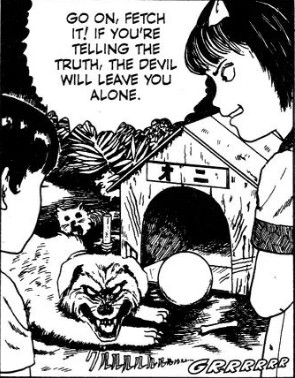](https://davidpeach.co.uk/wp-content/uploads/2023/04/Kuriko-is-a-bully-to-Nao.jpg)

Kuriko is a bully to Nao

## Kuriko is an interesting character

The fact that our introduction to Kuriko is at a point in life where she seems settled, and is opening up about her past, gave me a positive feeling about her. And just as negative first impressions can colour our image of people, I think positive ones can too.

Because of this, I found myself never really hating her, save for the dog scene and the beating. I found myself not liking her actions, but thinking about how we aren't the same people as we were when we were younger. This doesn't excuse those actions, but she is confessing through an apparent weight of guilt.

Of course in the story's closing panels we do get to see her character transform into what she was perhaps destined to be. That closing panel of The Bully is one of the most frightening I have come across. Ito has always had a good eye for a great closing image that can haunt you, but this takes the prize.

[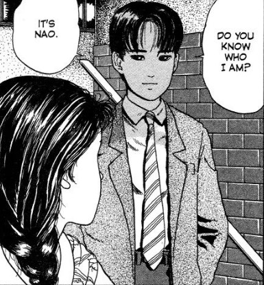](https://davidpeach.co.uk/wp-content/uploads/2023/04/Kuriko-and-Nao-meet-again.jpg)

Kuriko and Nao meet again

## History repeats itself?

When stories take on the heavy subject of abuse, there are often times when the one who was abused later becomes the abuser to another. The cycle of violence. But something that I found very intriguing in The Bully, was that Junji Ito seemed to turn those ideas on their heads.

Kuriko seemed to have a nice family upbringing from what I could see in the flashbacks and yet something in her snapped at a young age. Then after being bullied relentlessly by her, Nao seemed to actually grow up to become a well-adjusted adult. He had a solid job and actually reminisced about his younger days with a kind of fondness. Love is blind, it seems.

But the story's big reveal doesn't show this violent nature being passed on to her child, but instead — and ultimately more terrifying — it shows Kuriko relapsing and unleashing a scarier version of her buried self.

Not only do we know what she was capable of as a child, but we know she is now a fully grown woman with the added strength that brings. And we know she is mentally unstable — mistaking her young son for the once-young Nao. But what we don't know, is what ends up happened to her new victim. With it ending with a walk to the park, perhaps the real horror will live on in our minds trying to imagine what will happen next.

[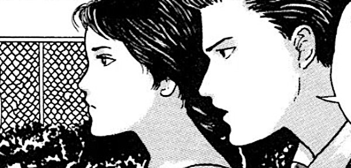](https://davidpeach.co.uk/wp-content/uploads/2023/04/Kuriko-and-Yutaro.jpg)

Kuriko and Yutaro

[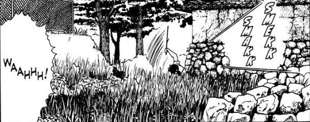](https://davidpeach.co.uk/wp-content/uploads/2023/04/Kuriko-beats-Nao.jpg)

Kuriko beats Nao

Kuriko - The Bully

## In Summary

The Bully has been getting recommended to me for a while now, and I never got round to reading it until recently. Now I see what all the fuss is about. This story is one of Junji Ito's crowning achievements in my opinion. The way that he has developed each of the characters and gone against what you would perhaps have guessed would happen with them, is a stroke of genius.

Ito never takes the easy way out; he always pushes up to the boundaries and often past them. Despite him being one of the most accessible horror manga artists of our time, he remains one of the most terrifying and creative too.

If you want to jump into the deep end of horror manga but without all of the blood and guts, then Junji Ito's The Bully is literally the perfect example of a story to read. It is also a self-contained one shot, standing at just 30 pages. So you could read this in one short go.
