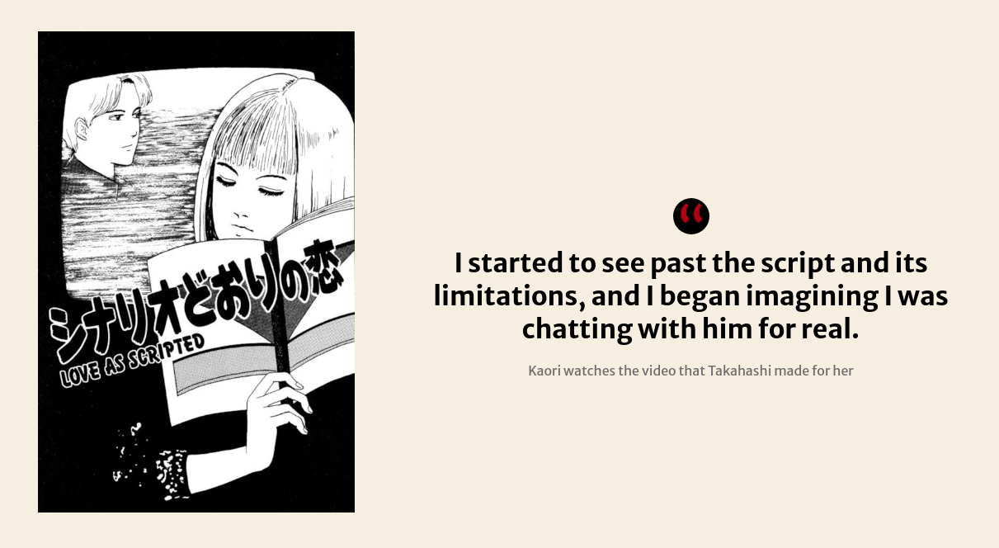
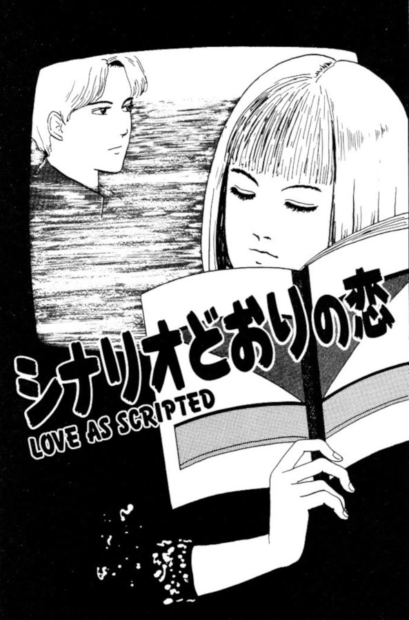
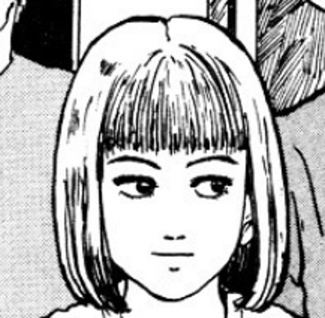
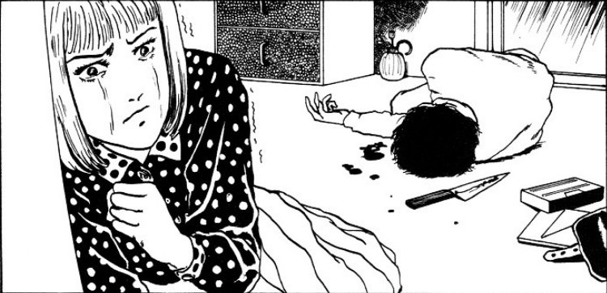
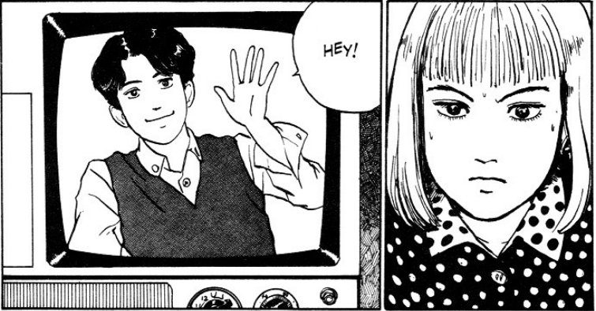
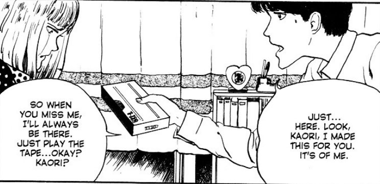
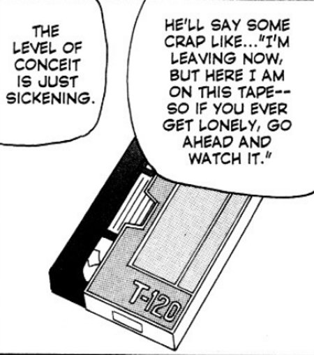

> I started to see past the script and its limitations, and I began imagining I was chatting with him for real.
> 
> Kaori watches the video that Takahashi made for her

## Love as scripted -- Synopsis

We join the story in the throws of an argument between a couple. Their names are Kaori and Takahashi. Kaori is very upset due to her boyfriend (Takahashi) telling her that he's leaving her. In the heat of the row, Takahashi does something very unusual — he gives Kaori a video tape of himself to play whenever she misses him. The way that Ito draws him, makes me think that there is no evil intent in his actions; he seems sincere in his gift.

But Kaori, after having apparently been warned about him before, lashes out with a large kitchen knife. Then just as that knife is coming down towards him, we flashback to some time before they were together.

Kaori

Takahashi

We go back to when Kaori was a new recruit in her [theatre troupe](https://en.wikipedia.org/wiki/Theatrical_troupe) and the screenwriter for that group was none other than Takahashi. When we see the beginnings of a romance start to blossom, she is warned off him by a friend in the group. But love is blind it seems, as she moves forward into her new relationship without regret.

We soon catch back up to the present day, where the results of her violent actions are revealed. But instead of worrying about needing to dispose of Takahashi's body, she instead decides to play the video tape that he had gifted her. What this video contains is something very odd indeed, and may even be the reason why she could possibly fall in love with him all over again...

## Video killed the...

This was an enjoyable read with little to no real body horror within, save for a single stabbing. Instead, Love As Scripted is more of a psychological look at love and what it possibly means to love someone.

Despite her actions, I found myself feeling sorry for Kaori — indeed all girls that Takahashi had presumably dumped in a similar way. I mean, technically there is no crime against dumping girls one after the other, but the way in which he does so can definitely be thought of as malicious.

And that is the key thing I wanted to explore here — the interpretation. Although I don't condone how he seemed to mess these girls about, I couldn't help but dig a little deeper into some of his possible motivations.

Kaori does a terrible thing

## Man with a camera

Here we have a man who never really comes across as malicious in how he treats these ladies, at least not when he's with them. Instead he seems to almost fall in love with each one in turn. Then the fact that he writes and records hours and hours of what is essentially a personal monologue, along with spaces for the video recipients to converse with the recording, makes me think that he is sincere with that gift. The way that Ito draws him also seems to support that theory.

Odd, yes. But sincere.

Maybe Takahashi suffers from a crippling inability to commit. Or perhaps he believes himself to be no good for these women? Maybe that's why he goes to the trouble of making all of these recordings? Again, I'm not looking to condone any of his actions, I'm just trying to look at those actions from fresh angles.

But then he could always just be a complete bastard with zero regard for others' feelings.

## A predictable love

The real sadness in Love as Scripted, at least for me, was the conclusion of Kaori's story. It's a shame how her love, and anger, for Takahashi drove her to stab him. She pretty much seals her future with that fateful blow. It is also a shame how she realises just how much she loves him through the medium of the video that set the attack off.

Kaori isnt impressed with Takahashis video

But that video will never be self-aware. It will always be exactly the same tomorrow as it is today. It will never offer anything new by means of conversation and will never surprise her. But she seems content in this predictable love.

What I found perhaps most sad with her was that even when she realised what she had done, and is then offered a chance to save him, she just passes it up. She knows that her new Takahashi will never leave her; will never cheat on her; and will never upset her.

But ultimately it will never be able to love her either.

## In conclusion

Although this is one of Junji Ito's shorter stories, I found Love As Scripted to have lots of charm. Despite it being a sad, more psychological piece than others, I found myself enjoying what I was looking for between the pages.

Takahashi gives Kaori a video tape

The Video Tape

Perhaps I am looking too deep into it. Maybe [Junji Ito](https://junjiitomanga.com) just thought of a weird idea for a relationship and just ran with it? Perhaps he had no real intentions of exploring deeper themes. But I like to believe that he knew full well all of the themes he was exploring.

I think that this story could be enjoyed thoroughly as an introduction to Junji Ito as well. And while it gives no indication as to depths he goes to with his more graphic depictions of horror, it does give you an introduction to his work and his excellent story telling.
