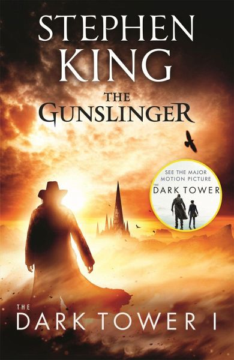

Some thoughts of mine after finishing the first book of Stephen King's epic series 'The Dark Tower'.

(_Image by_ [_Michael Whelan_](https://www.stephenking.com/darktower/artist/michael_whelan.html)_._)

It took me to my second attempt to actually read this book to completion. And although it started off as a bit of a chore, by about a third in I found myself drawn in to the Gunslinger and his pursue of the Man in Black.

I found the story to be a slow burn — an ongoing pursuit interspersed with necessary backstory of the titular character. And I mean that in a good way. I have the feeling that this is going to be a build up over a long time — especially knowing that how many books there are now in this series.

I found it really intriguing how the Gunslinger and the boy he finds, Jake, interact. Their relationship seemed to be building into an interesting one and really hope that it can _somehow_ be explored further. Somehow.

And Jake's history too. His origin that spoke of New York in some other world, or that's what I presumed. Yet the world in which we follow the Gunslinger seems to be in some post-war-ravaged, desolate future of the very same Earth.

Whatever ends up happening, and however this crossing at the nexus of realities is explored, I'm looking forward to the ride it brings.
