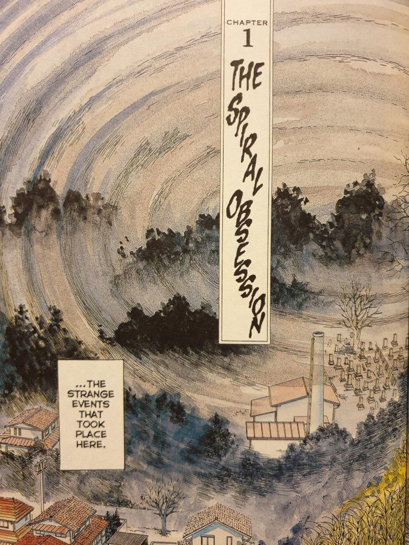
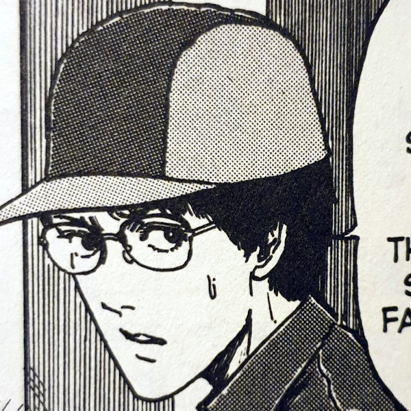
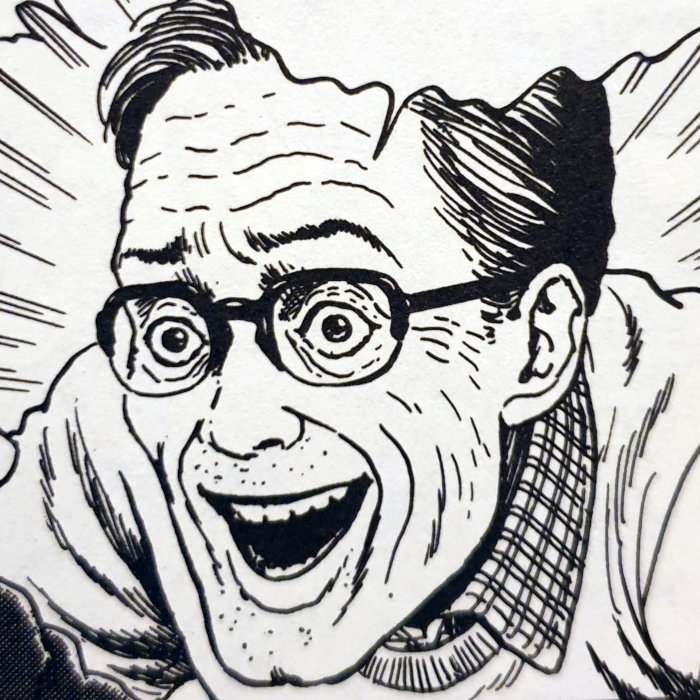
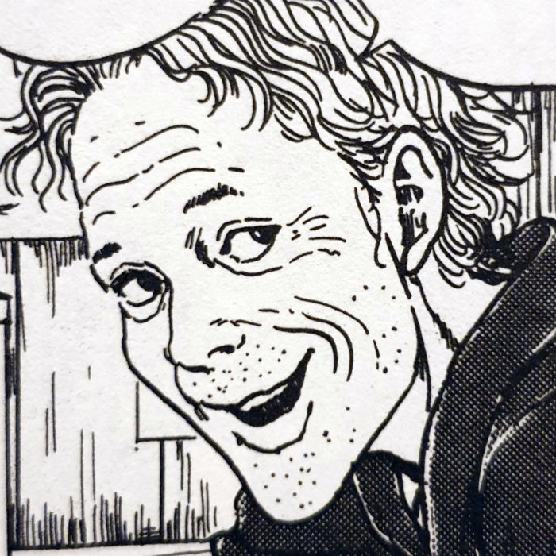
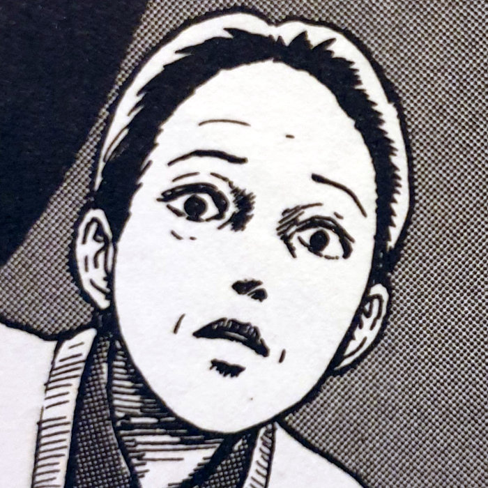
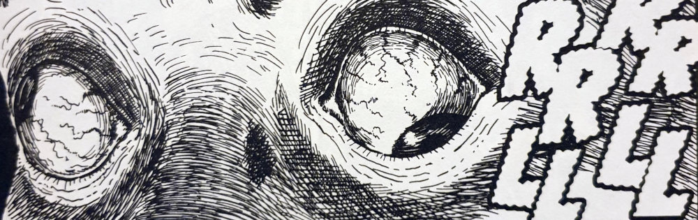
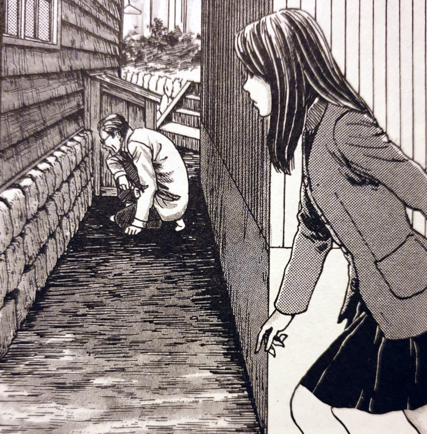
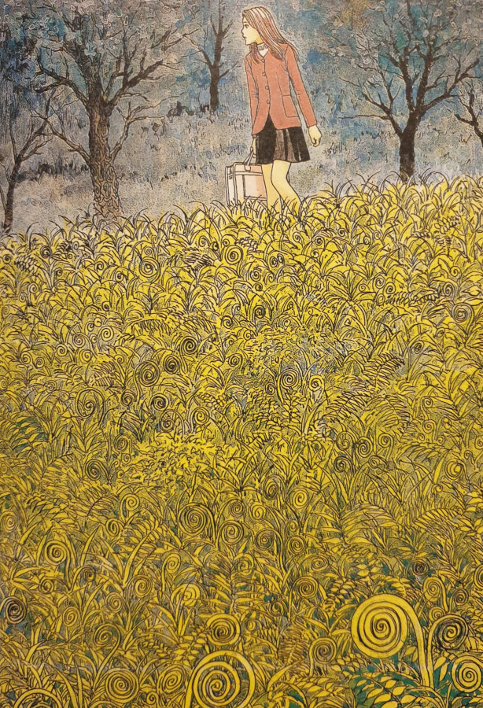
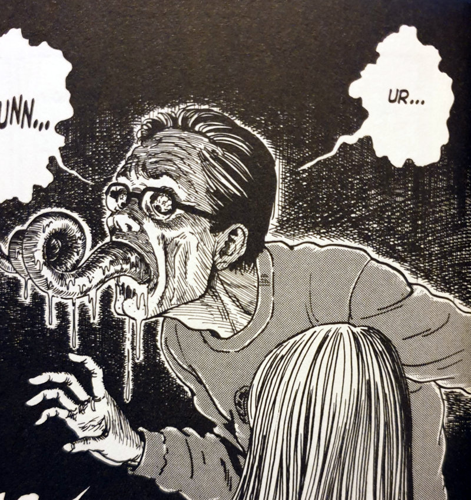
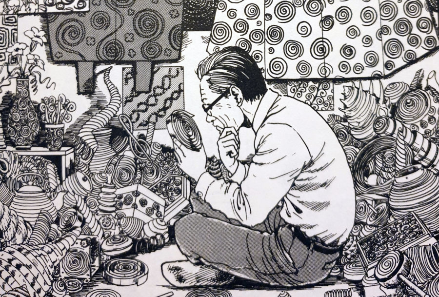

> You'll see! You can express the spiral through your own body!!
> 
> Shuichi's father's obsession is getting out of hand.

You can [buy Uzumaki here](https://amzn.to/2NClvXB).

## Synopsis — The Spiral Obsession part 1

In this opening chapter of [Uzumaki](https://junjiitomanga.com/uzumaki-by-junji-ito/), we are introduced to the two central characters who we will follow throughout our spiral adventures. These two are Kirie Goshima, who is telling us the story, and her best friend Shuichi Saito.

Kurouzu-cho is a small coastal town that is home to both Kirie and Shuichi, as well as their respective families. Shuichi, however, does not go to school in the town — he goes to the nearby city of Midoriyama-shi instead. The reason for this is unknown, but his time spent outside of Kurouzu-cho has helped him realise something that all the other residents seem blind to...

Kirie Goshima

Shuichi Saito

Shuichi's Father

Kirie's father

Shuichi's Mother

...that something is very wrong with this place. Shuichi shows Kirie the strange spiral patterns in the water gutters around the town. They also cross paths with a few small whirlwinds that seem to pass by pretty often. But our real introduction to the horrors that the spiral is slowly bringing down upon them, is through the actions of Shuichi's father.

## A Father's obsession

Shuichi's father is the vessel for our first steps into this world of terror that Junji Ito is building up. Kirie first notices him in a small dark alleyway, his face up against a wall, transfixed by the pattern on a snail's shell. This spiral obsession of his, however, is greater than just those found in nature.

Shuichi explains about the strangeness of his father's new hobby, and his unhealthy interest in the spiral shape. He explains about the obsession that has stopped him from going to work or even coming close to leading a normal life. He even explains to Kirie of his father's body slowly changing ‐ his eyes specifically being cursed by this evil pattern.

The spiral is slowly consuming him...

The eyes of Shuichi's father

## Tail end of the spiral

This is a perfect introduction to Uzumaki. We get up and running with an understanding of the central characters pretty quickly, considering this first chapter is only 45 pages long. I loved how Junji Ito hasn't gone all out with the body horror here either. He eases us in gently for the most part, lullying us into that false sense of security no doubt. Yes, there are some moments of disgust, especially the big 2-page-spread reveal at the end. But he is surprisingly tame as he leads us on to his spiral path.

The characters in Uzumaki are your quintessential Ito characters. Kirie is the cute young woman who seems to have it all together; who is ultimately heading towards a scare that could either make or break her. And Shuichi is that troubled person with slightly darkened eyes who knows something is wrong. He's a young man with a darkness weighing over him.

But what's interesting here is, is that this darkness is weighing over _all_ of the town's people. It's just that Shuichi seems to be the only one who notices it. I can't wait to journey deeper into the cursed shape and find what lies at its heart.

Kirie finds Shuichi's father in the alleyway

Kirie in a field of spirals

Shuichi's father rolls his tongue

Shuichi's father studies a spiral

## In conclusion

Uzumaki is one of the most well known, and highly regarded horror manga titles. Junji Ito really created something special with this 20-part story. His artwork within it is some of the best he's even produced in my opinion, and the first part of The Spiral Obsession shows this off perfectly.

The opening colour panels are beautiful - especially the title page with Kirie looking out over the town from the hill above. The details later on really impressed me too. I loved the delicate details that Junji Ito put into producing what we discover inside the wooden tub at the end of this chapter. Despite the huge obsession that Shuichi's father shows towards spirals, it is evident that Ito has at least that amount of obsession over his own perfection ‐ and it really pays off.

I would recommend every person and their dog to read this series. If you aren't into horror then you probably aren't going to find joy here. But if you are, or are just a little bit curious about what horror manga is all about, then this should be one of the very first places you go to.
