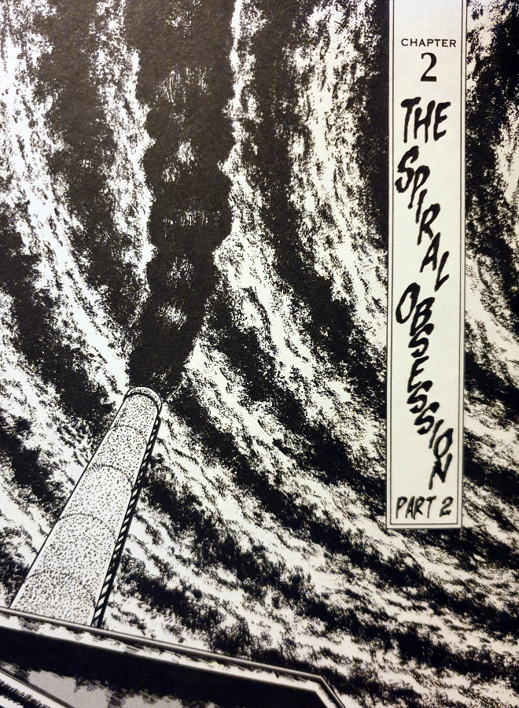
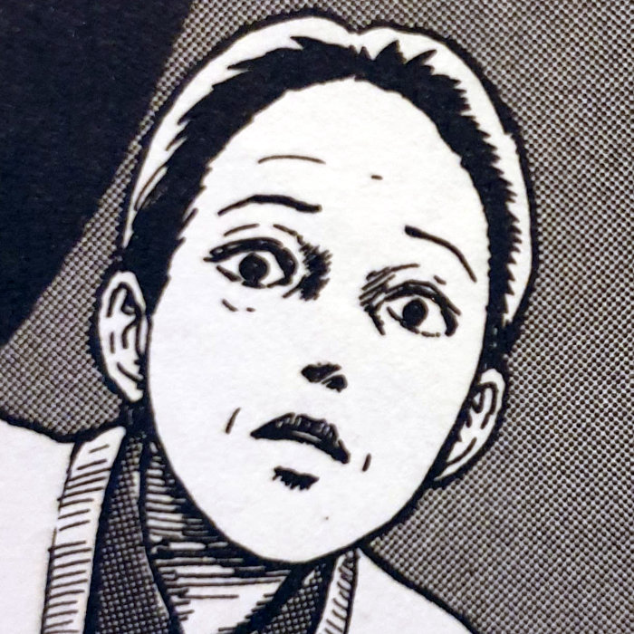
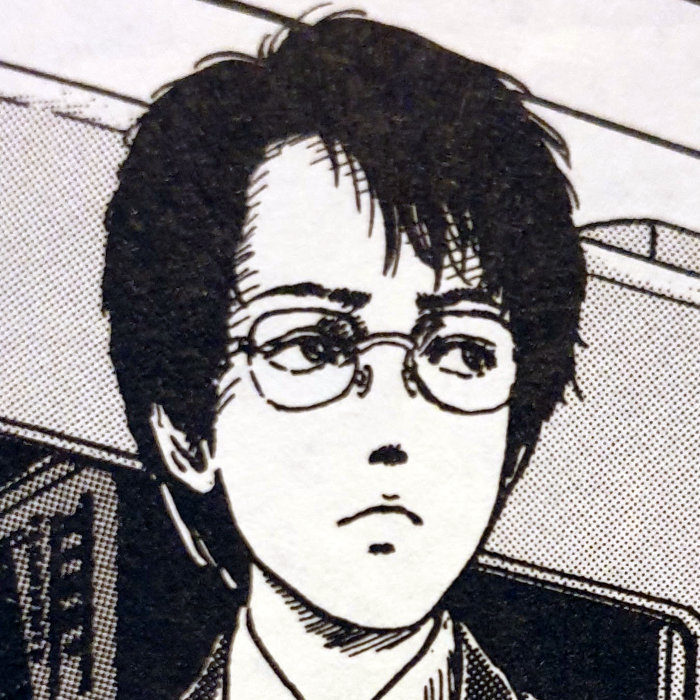
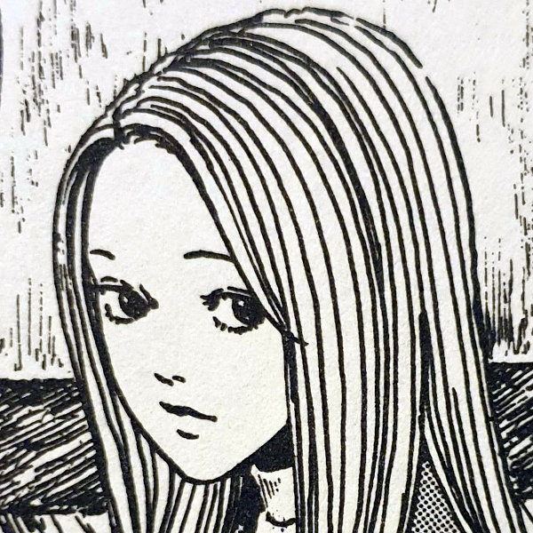
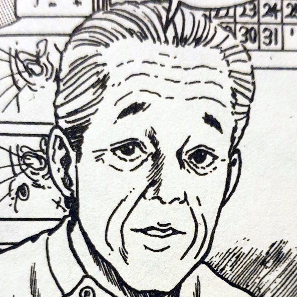
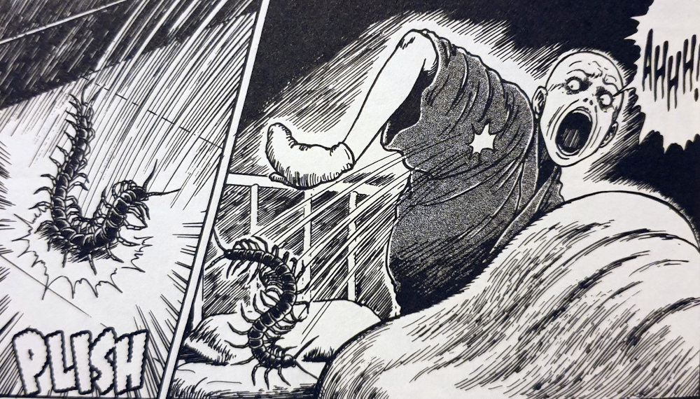
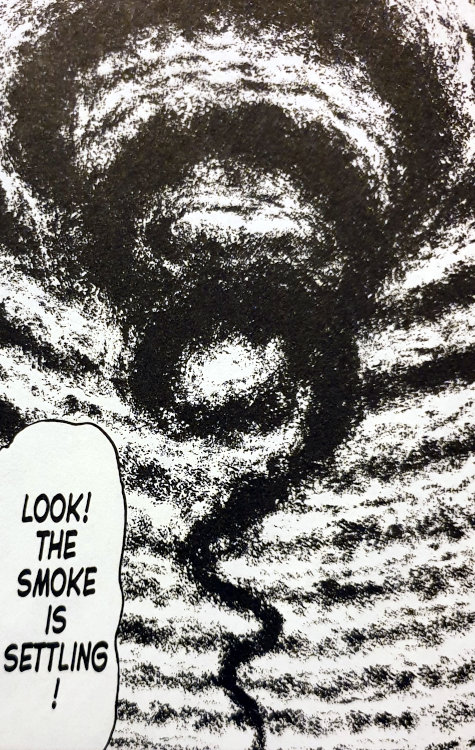
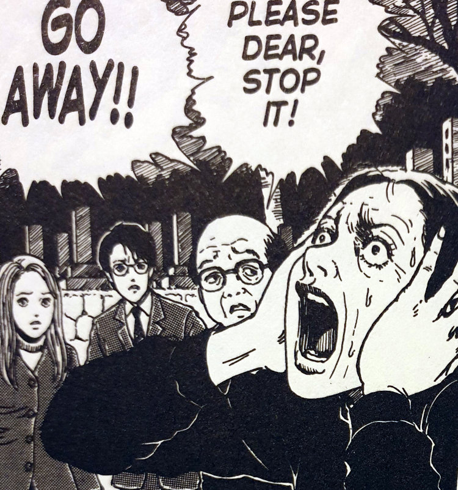
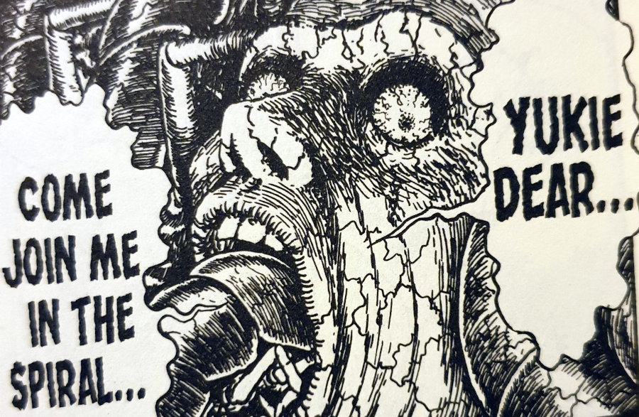

> What's inside... the human ear? Don't tell me... there's a spiral.
> 
> Mrs Saito becomes increasingly tormented by the spiral.

You can [buy Uzumaki here](https://amzn.to/2NClvXB).

## Synopsis — The Spiral Obsession part 2

High over the sky of Kurouzu-cho sits a blanket of spiral-shaped smoke, with what seems to be the face of Shuichi's father coming out of it. This strange vision seems to be the last straw for Mrs Saito's sanity though. She quickly suffers a breakdown and is immediately sent to a nearby hospital to monitor her fast-declining mental condition.

Mrs Saito soon becomes afflicted with the same cursed obsession as her husband before her - the Spiral; Uzumaki. She starts noticing the spirals all around her, as well as the natural spirals of the human body. This only serves to drive her further over the edge and further out of help's reach.

Shuichi's Mother

Shuichi Saito

Kirie Goshima

The Doctor

But where the father would be embracing these spirals, she is instead physically repulsed by them.

After some disturbing nightmares, and some ungodly acts she performs on herself, she becomes convinced that there are spirals hidden away _within_ her body — places she can't get to with ease. But just how far will she go to rid her world, and herself, of the spiral shape that seems to be haunting her?

## Searching for spirals

I found it interesting to be able to follow this first story line of the spiral through to see how it actually affected those left behind. Normally we are served an eye-watering final reveal by Junji Ito, only to be left to imagine the following events in our own minds. Think about the majority of stories in the [Tomie Collection](https://junjiitomanga.com/tag/tomie-collection/). Although I love a good cliffhanger to think over, I also love staying with these characters. I love exploring what comes to those affected _after_ those big reveals.

This is what Uzumaki allows us to do here.

Nightmares of Centipedes

Although the actions of his father were weird and somewhat shocking at times, there were no real gross-out images in that [first chapter](https://junjiitomanga.com/the-spiral-obsession-part-1-uzumaki-part-1/) ‐ save perhaps for the final state of the father and, of course, _[that](https://junjiitomanga.com/the-spiral-obsession-part-1-uzumaki-part-1/#jp-carousel-33957)_ [tongue](https://junjiitomanga.com/the-spiral-obsession-part-1-uzumaki-part-1/#jp-carousel-33957). However, nothing could have prepared Shuichi, or me for that matter, for what would become of his mother.

## Effects of the Spiral

What was especially interesting to me was how the spiral seems to trigger different emotions in different people. Where the father would embrace the spiral, even being somewhat excited by it, the mother is disgusted and horrified by it.

Perhaps for the father the spiral was a path of wonder to journey to its secret centre. Whereas maybe the mother saw nothing but the inevitable dizzying descent into death and madness. Different interpretations of the same pattern could be a metaphor for how we as people can interpret the same events in life in vastly different ways.

Shuichi's family has been torn apart by the spiral obsession. This has been exhibited by both of his parents now and I hope things start getting better for him. It seems somewhat ironic that the only person who seemed to feel something was wrong in Kurouzu-cho, Shuichi, is also the one most directly affected by it so far.

The smoke is settling

Shuichi's mother cant take much more

The Father appears to the Mother in disturbing visions

## In Summary

If the first part of the spiral obsession was the somewhat calm introduction to Uzumaki, then this second part is the foot-to-the-floor, visceral continuation.

No longer is Junji Ito sugar-coating the effects of the spiral. No amusing curling tongues or cute pieces of pottery. He's now showing us violent, nightmare-inducing images of what this obsession can actually do to people. God help the rest of the citizens in Kurouzu-cho.

I can't wait to see where he takes us next...
