[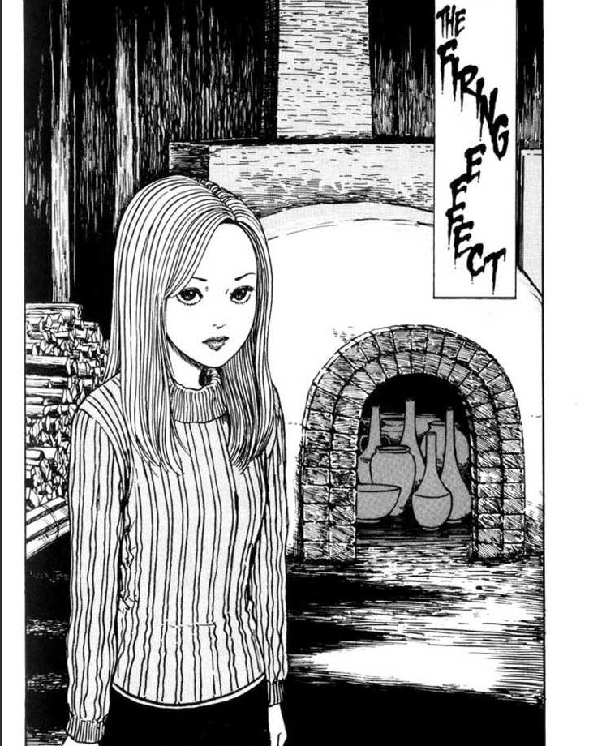](https://davidpeach.co.uk/wp-content/uploads/2023/04/The-Firing-Effect-Uzumaki-part-4.jpg)

In The Firing Effect, Kirie's father is producing some very strange, twisted pottery. This isn't surprising when we find out where he gets his clay from ...

You can [buy Uzumaki here](https://amzn.to/2NClvXB).

## The Firing Effect — Synopsis

Kirie's father, the pottery maker, has been producing some very strange pieces recently. What were once clean, solid pieces of hand-crafted clay, come out of his kiln all twisted and spiralled out of shape. They also bare strange markings — not only the hypnotic pattern of the spiral, but the faces of the recently deceased too.

After some investigation it is discovered that the father has recently been getting his clay from the neighbouring pond of water — Dragonfly Pond. This is the very same pond that seems to have been absorbing the smoke and the ashes of the dead on the day of their cremation. It looks like the spiral has found its next victim.

[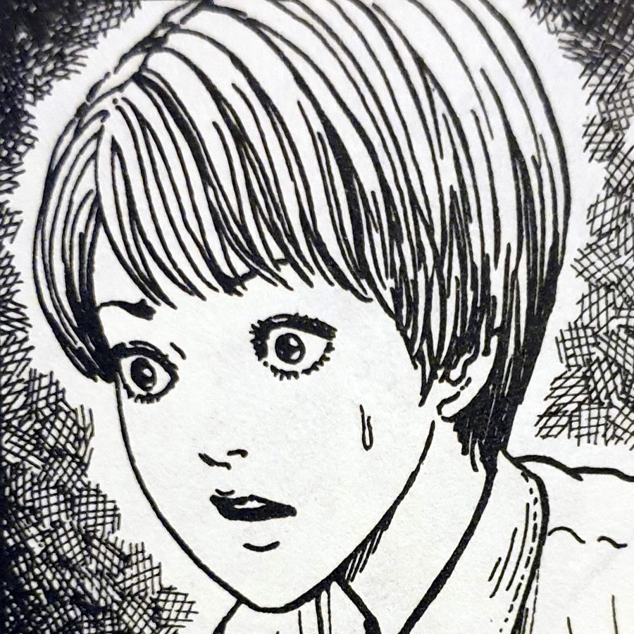](https://davidpeach.co.uk/wp-content/uploads/2023/03/Kirie-1.jpg)

Kirie

[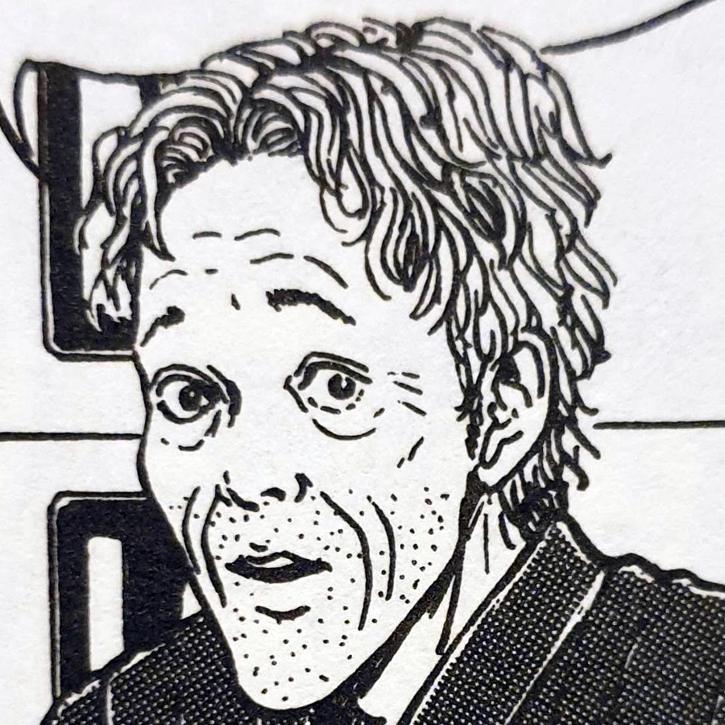](https://davidpeach.co.uk/wp-content/uploads/2023/04/Mr-Goshima.jpg)

Mr Goshima

[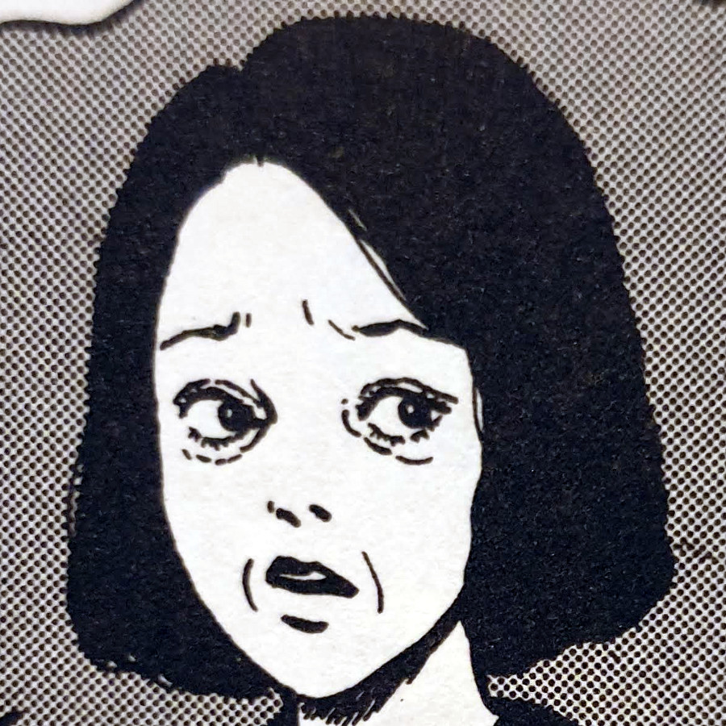](https://davidpeach.co.uk/wp-content/uploads/2023/04/Mrs-Goshima.jpg)

Mrs Goshima

[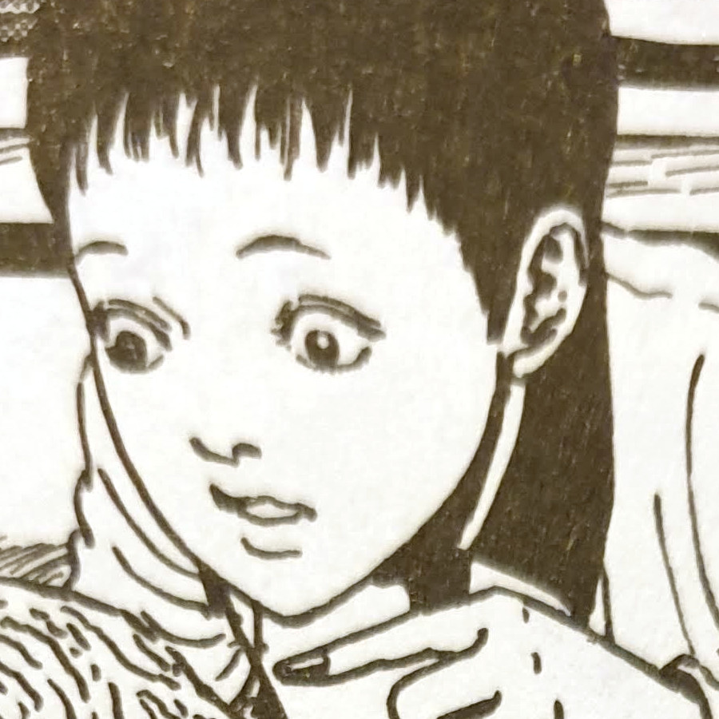](https://davidpeach.co.uk/wp-content/uploads/2023/04/Mitsuo.jpg)

Mitsuo

[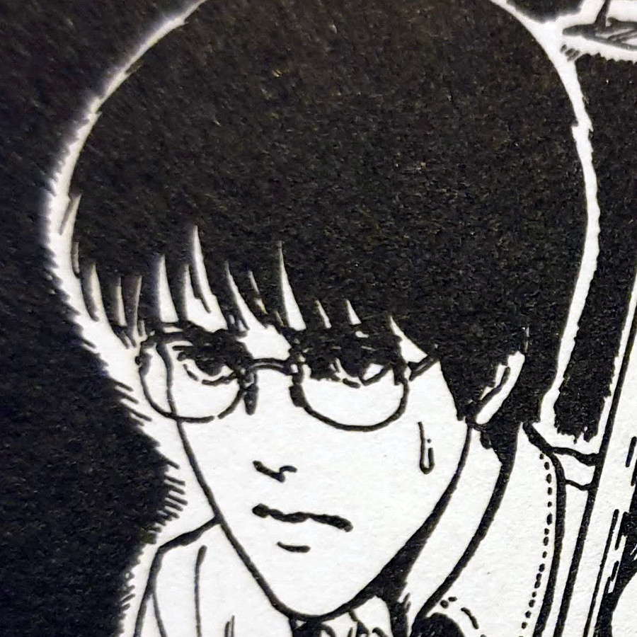](https://davidpeach.co.uk/wp-content/uploads/2023/04/Shuichi.jpg)

Shuichi

Throughout The Firing Effect, Kirie's father seems almost obsessed with his kiln and will not leave the cooking clay alone. He even panics when others try to go near it. Kirie decides to do some digging one evening to try and get to the bottom her father's strange movements. However, nothing could have prepared her for what she finds inside her father's kiln.

## Like a phoenix from the flames

Just when we thought we'd heard the last of Shuichi's parents, it seems they were never too far away after all. In any usual place the cremation of the deceased is a sure-fire way of disposing of the body. Whether they are human, vampire, zombie, whatever. Complete incineration normally does the trick. But this is Junji Ito we're talking about.

With Dragonfly Pond seemingly sucking in the dust and smoke of the town's cremations into its centre, it seems that the spiral is never really done with its victims. This made me think — perhaps Kurouzu-cho is a form of purgatory for the people who live there.

[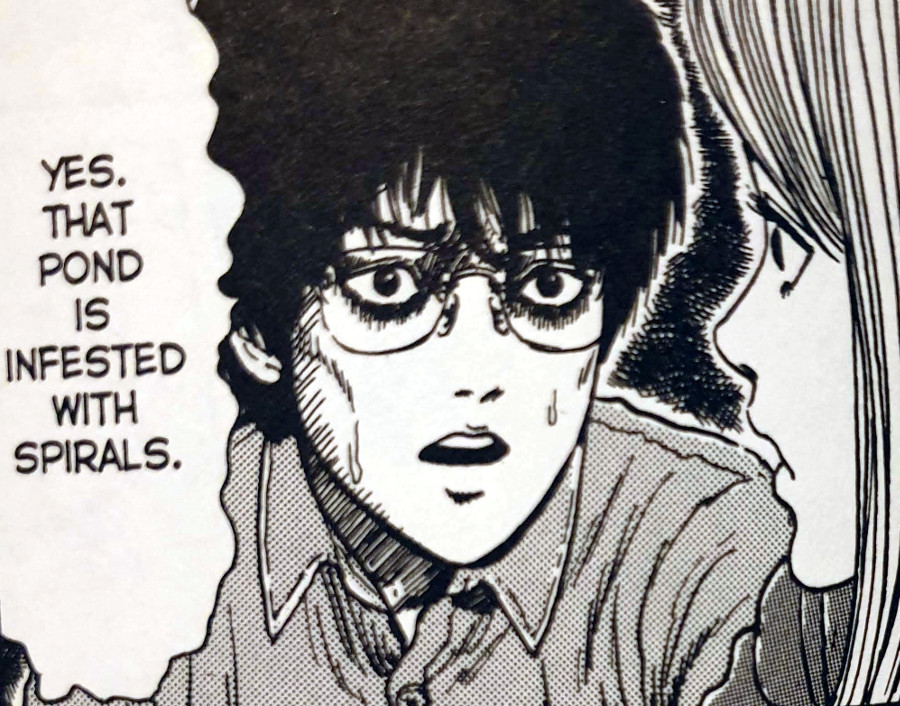](https://davidpeach.co.uk/wp-content/uploads/2023/04/Shuichi-knows-that-Dragonfly-Pond-is-infected-with-spirals.jpg)

Shuichi knows that Dragonfly Pond is infected with spirals

When we finally get a glimpse inside the kiln we see, and later hear, Shuichi's parents screaming in pain for help. They seem to be reliving their cremations only being fully aware of the heat and the pain it is causing. However, we had already seen their faces imprinted on pottery earlier in the chapter.

Maybe their souls are forever trapped in Dragonfly Pond. Are they destined to forever be burned again and again? Or are these just phantoms of the spiral simply using the images of the dead to torment those still living in mourning?

## More drama for Shuichi

Although he hasn't been a central character for the last couple of chapters, Shuichi's presence is always felt. This is no doubt due to his seemingly mystical connection to the spiral. That shape seems to follow him everywhere and just wont leave him in peace. He also seems to be the one most in tune to its effects.

When it is later revealed that the father's clay is being dredged out of Dragonfly Pond, Shuichi instinctively responds by stating that the pond is infested with spirals. He seems to have a sixth sense when it comes to this evil pattern, as demonstrated in [the opening chapter](https://junjiitomanga.com/the-spiral-obsession-part-1-uzumaki-part-1/). If this _is_ some kind of purgatory for the folks in Kurouzu-cho, perhaps Shuichi is the one at its centre? Perhaps he is the key to unravelling this mystery?

[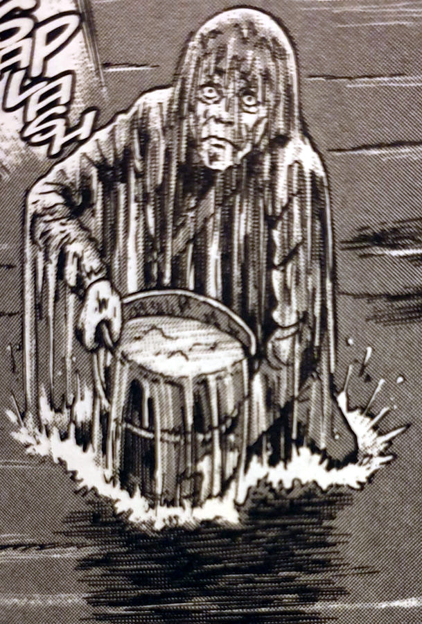](https://davidpeach.co.uk/wp-content/uploads/2023/04/Mr-Goshima-getting-his-clay-from-Dragonfly-Pond.jpg)

Mr Goshima getting his clay from Dragonfly Pond

[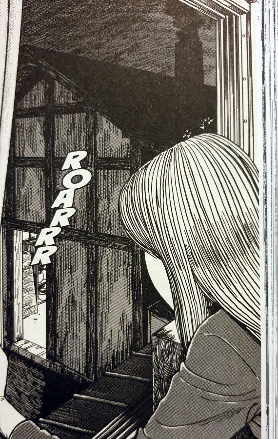](https://davidpeach.co.uk/wp-content/uploads/2023/04/Kirie-investigating-into-her-fathers-kiln-barn.jpg)

Kirie investigating into her fathers kiln barn

[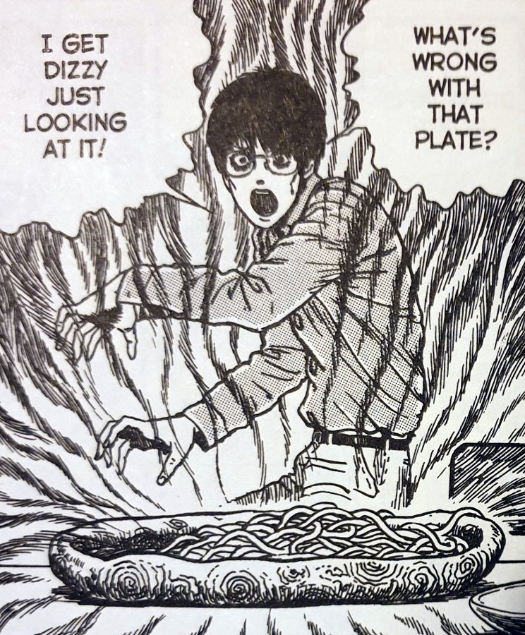](https://davidpeach.co.uk/wp-content/uploads/2023/04/Shuichi-and-his-spiral-plate.jpg)

Shuichi and his spiral plate

It felt good to see him being able to fight back against this deadly shape as well. Although destroying the kiln is a small action on the grand scheme of things, a little destruction may be just what he needed. Perhaps that was what Shuichi needed in order to lay his demons to rest — both figuratively and literally. Hopefully his parents can now be free from their eternal flames and escape this cursed town. But something tells me this wont be the case.

## In Conclusion

I started to feel Kurouzu-cho was a kind of twisted second home for me after reading this chapter. The characters were now firmly etched in my mind and I even felt like I knew them somewhat. I am really enjoying digging deeper into this town and getting to know these people as the time goes by.

One thing that stood out to me in The Firing Effect was the complete lack of violence. Despite the disturbing images that certain characters see inside the kiln, they are only really shown to us as ghostly apparitions and shadows.

[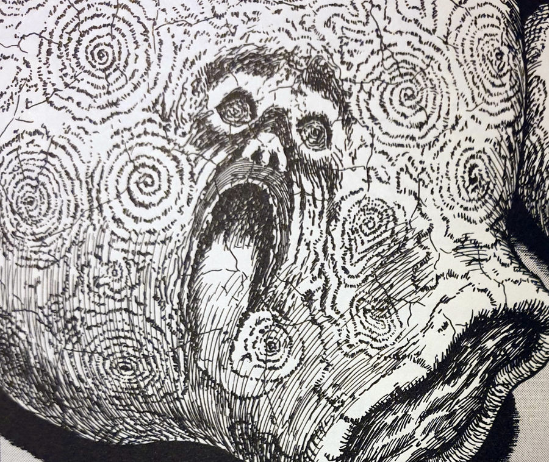](https://davidpeach.co.uk/wp-content/uploads/2023/04/Faces-appear-in-the-twisted-pottery.jpg)

Faces appear in the twisted pottery

As I have mentioned before, it is good to have these relatively calmer chapters as a kind of breathing space for us readers. If it was crazy body horror all the time, I think I would just get desensitised to the shock and maybe even a little bored.

What I am finding though, is I'm anticipating a crazy chapter very soon. Something to knock me out of my chair as the opening chapters did. I feel something dark and grotesque is coming soon, and I hope I'm not kept waiting too long. :)
