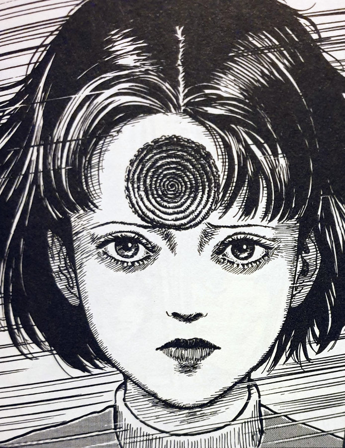

> There's something mesmerizing about her. It's like looking down from a high place... like vertigo...
> 
> Shuichi doesn't like the vibes that Azami is giving off.

## The Scar — Synopsis

Azami Kurotani is a girl who attends Kurouzu high school with her friend, Kirie. You will remember Kirie from the opening chapters of [The Spiral Obsession](https://junjiitomanga.com/the-spiral-obsession-part-1-uzumaki-part-1/).

Azami has a very strange power over the boys in the school — they all seem to fall in love with her. She even has the reputation for making these boys fall for her before dropping them like dead weights. Does this sound like another Junji Ito character we all know and love? Yes — she reminded me of [Tomie](https://junjiitomanga.com/tag/tomie-collection/).

However, whereas Tomie's power came from something dark within her, Azami's seems to originate from the crescent-moon-shaped scar on her forehead. Of course, kids being kids, there are all sorts of rumours going around about Azami and her strange power, but the truth may just end up being the most terrifying thing imaginable.

Azami Kurotani

Kirie Goshima

Shuichi Sato

Okada

After meeting Kirie's boyfriend Shuichi, (remember that he goes to a school out of town?), Azami becomes obsessed with him. This is down to the fact that Shuichi is instantly repulsed by her and, more specifically, the scar on her forehead. Only by the time she has met him, that scar is no longer moon-shaped, it has begun circling in on itself to reveal a very recognisable and terrifying shape.

Azami can't believe that Shuichi hasn't fallen in love with her, and she wont let it go either. It isn't until the story's closing pages that her obsession takes her over completely...

## The girl that was a spiral

The first two chapters of Uzumaki dealt with the spirals around the people that were haunted by them — even the spirals _within_ their bodies. But this is the first time that a spiral has begun to actually _take over_ a person, as it seems to be with Azami. But what is so special about her? And why did the spiral seem to choose her?

What is left unanswered is perhaps most interesting here. Only after her accident as a young girl did the boys start noticing her — after she obtained that scar. But she had presumably lived with that scar for many years since — it was only when she'd met Shuichi, and he had noticed that scar, that it started to become a full spiral. Maybe the spiral was lying dormant inside her all of this time, waiting for Shuichi to meet her? Or maybe it had always been growing from a slight cut, to a moon shape and continuing on into the spiral? Perhaps the timing with meeting Shuichi was just bad luck for him.

A whirlwind whizzes past Azami and Kirie

Ito's closing panels in The Scar are images I will never forget too. Although not particularly gruesome in how they are depicted, they do demonstrate the great imagination of my favourite horror Mangaka. I can imagine ways that he could have added a lot more gore into those scenes. But I feel it was nice to focus on the strangeness of the devouring spiral, rather than showing loads of blood and flesh along with it.

## Obsession

I think I enjoy Junji Ito's stories of obsession the most over his other types. Uzumaki is itself a story of obsession, but I really enjoyed this _particular_ obsession between the boys and Azami; and then between Azami and Shuichi.

There were many times I was reminded of Tomie and the memories of her attitudes towards those that desired her. Tomie has a power over men and was never afraid to use that power to get exactly what she wanted — she was pretty much evil through and through. And it was a nice touch of Ito's to include a character like her within Uzumaki — whether that was the intention or not.

However, with Azami, I got the impression that she wasn't an evil person. I felt that she was just another victim of the spirals that are haunting Kurouzu-cho. And interestingly, the catalyst for her extreme ending seems to me to be her meeting with Shuichi.

This is now three central people to become cursed by the spiral that have a connection to Shuichi. His Father; his Mother; and now Azami. Maybe he has a connection to the spiral that we are yet to discover?

Azami was one of those pretty reserved girls

Shuichi can feel the spiral is close with Azami

Azami's spiral scar gets out of hand

## In Summary

The Scar is probably one of my favourite chapters from the Uzumaki series. Although I don't remember reading a bad chapter (I have read it once before a couple of years ago) this is one that always sticks in my mind. Along with the _Jack In The Box_ chapter. (More on that one in the coming posts).

This one is pretty light on the gore too. There are no scissors in ears or the cutting off of one's own fingerprints in this chapter. Junji Ito always has a good sense of what is needed within a given story. What I mean by that is, there is never gore for gore's sake. He isn't trying to include more and more shocking or violent events with each new chapter. He seems happy to only include those images that will serve his story. And I'm very happy with that.

Don't get me wrong, I don't believe we have seen the most violent after-effects of the spirals just yet. But I also believe that along the way we will have these relatively softer chapters that will let us catch our breath a little. If you can consider being devoured by a spiral soft. :)
