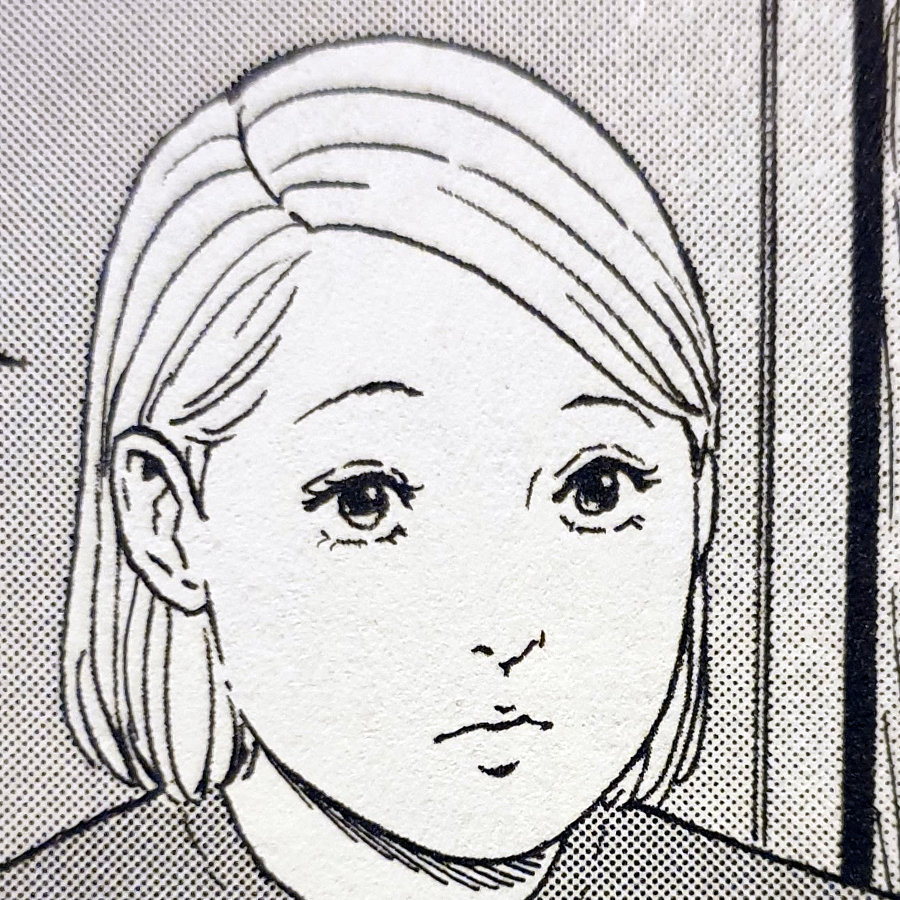
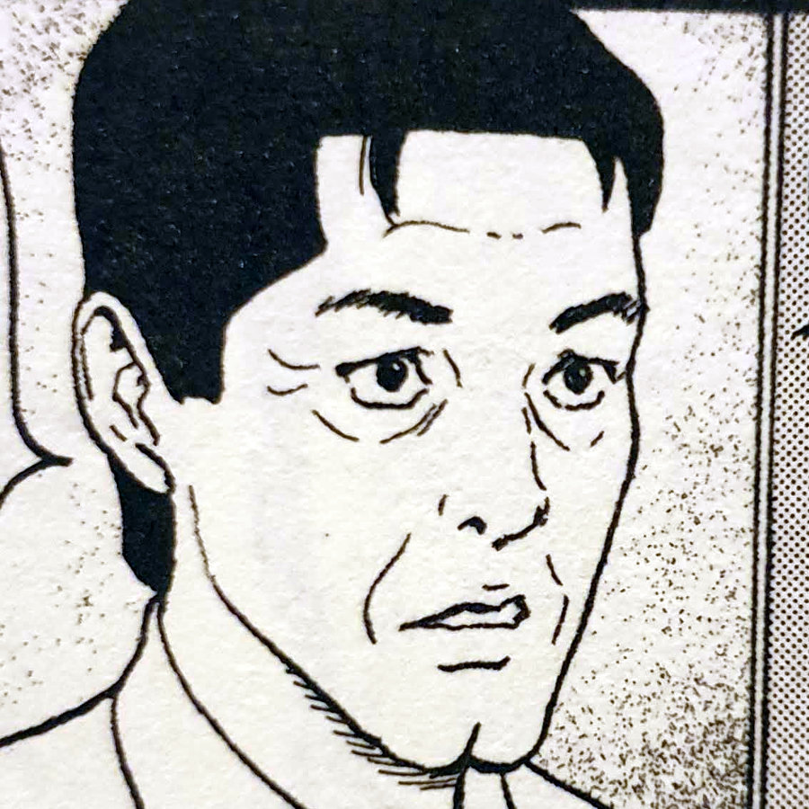
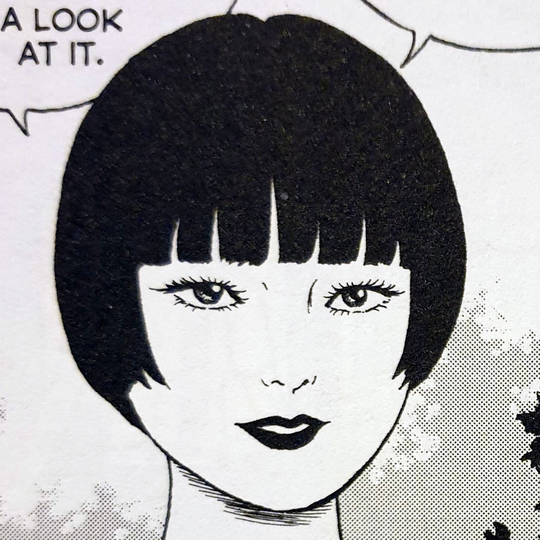
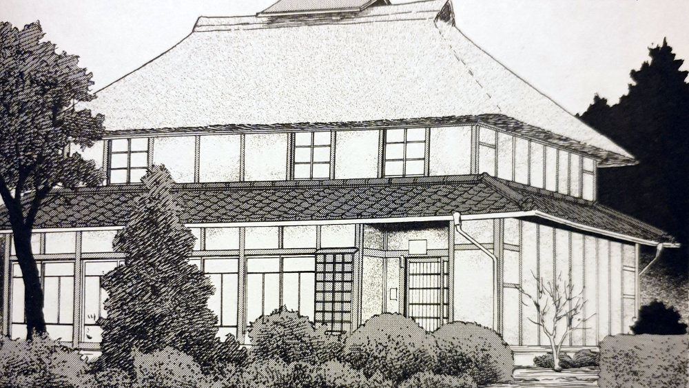
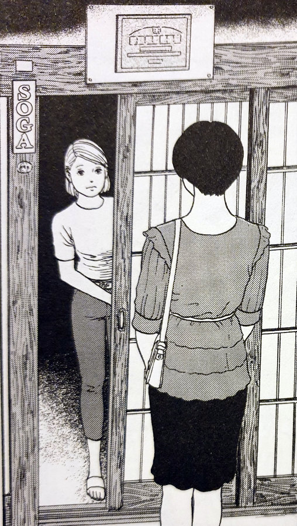
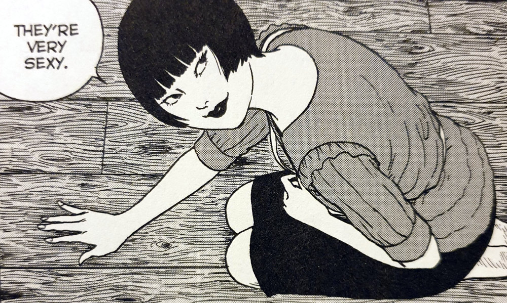
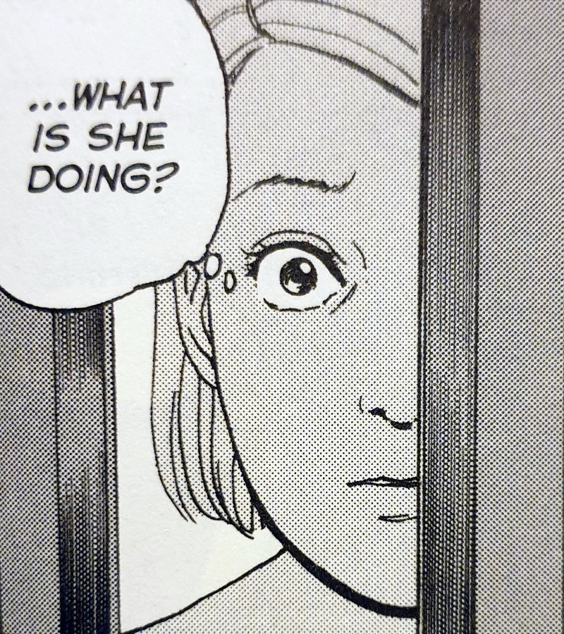
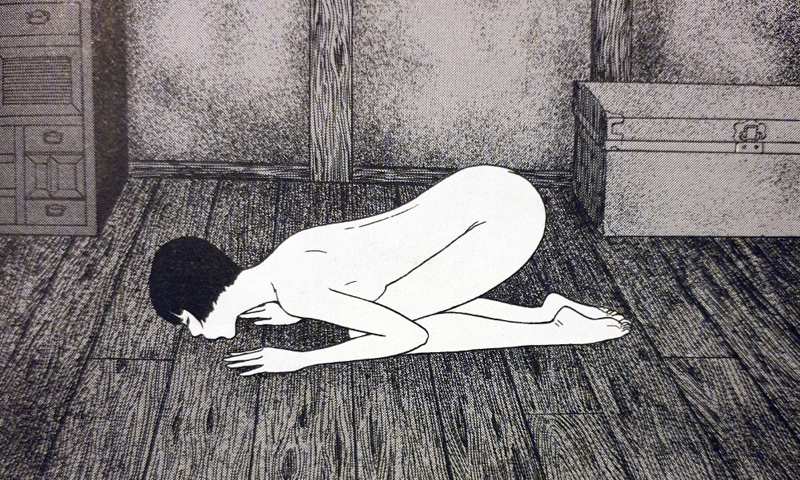

In Wooden Spirit, Junji Ito takes us on a strange journey of love. Specifically, the love between one woman and a house that she finds desirable...

## Wooden Spirit — Synopsis

In Wooden Spirit, we are introduced to Megumi and her father. They live together in an old wooden house that has recently gained cultural recognition. Despite them being the only ones who live there, the house has eleven rooms to its name. And they take very good care of each and every square inch.

In the story's opening scene a woman knocks on their front door and asks to take a look inside the house. This woman, Manami Kino, immediately falls in love with this house. And when I say "falls in love with it", I really mean it.

Before long, she and Megumi's father become an item and she eventually moves in.

What is most strange here though, is Manami's behaviour towards the house itself. This woman takes house proud to a whole new level. But just how far will she go with her strange antics?

Megumi

Megumi's Father

Manami Kino

## One with the elements

This is a house that has been given cultural status for its historic importance. And then when this mysterious woman comes by she remarks at the elegance of the wood work. She sees the walls; the floors; the joists and remarks at how "sexy" they are.

At first read of this story last year I took it at face value. I saw it simply as a woman who makes her home within this house, before beginning to make love to it. I enjoyed the read for how ludicrous it was and thought nothing more of it at the time. However, on revisiting it with my new appreciation for Junji Ito, I am seeing deeper into the material.

## One wild theory

Later on when she reveals herself for the demon she is — with an almost wood-like appearance — I came to an interesting thought. What if she was some kind of tree spirit? Yes, I know the story is called "Wooden Spirit", but I thought I'd dig a bit deeper. What if her love for this house is not as a result of the building, but of the materials instead? Could her love towards the walls and the beams come from them being made from a former partner of hers when they were once _both_ trees?

Megumi and her Father's house

My theory does take a few leaps in imagination, but that is precisely one of the biggest things I enjoy about Ito's work: the new connections he helps to form in my brain. Yes, this is a bit of a crazy theory, but is it so unbelievable within the world of Junji Ito? I don't think so.

I loved how the story ended too. It felt almost poetic for me after I'd been on this theoretical journey in my mind. Let's think for a moment how the wood has been taken from its natural place: the forest, and forced to become something fit for humans: a house. From this idea we could suppose that what this demon / spirit woman is doing in the end, is herself turning the wood back into something that she could then love again — flesh and blood.

Manami arrives at the house

Manami really likes the flooring of the house

Megumi catches the strange woman in the act

Manami kisses the floor

## In Conclusion

Wooden Spirit is one of Junji Ito's strangest stories when taken at face value, as I once did. But when I began asking myself questions about its world, I managed to build up that world even more in my mind's eye.

Whether Ito had any similar thoughts behind this story as the ones I have discussed here, I'll probably never know. But what I do know is, is that no matter what physical images someone sees on this story's pages, his stories have the power to create unique and interesting visions in the minds of those readers... if you'll let them.

As the second story in his [Fragments of Horror](https://junjiitomanga.com/tag/fragments-of-horror/) collection, Wooden Spirit will open you up to new experiences within Ito's work. To a very unorthodox and, dare I say it, beautiful love.
