

> That's right. Just let yourself go limp. Turn yourself over to the puppeteers.
> 
> Yukihiko enticing his siblings to his way of life.

## Marionette Mansion — synopsis

In Marionette Mansion we follow Haruhiko — a boy from a travelling entertainment family. Him and his family move from town to town putting on their puppet shows for the townspeople. Because of this, Haruhiko is unable to settle down and make any lasting friendships.

Whilst staying in one particular town, he befriends a girl before having to move on again. Whilst they have their short time together, he shows her his family's travelling home and the puppets that they work with. One puppet in particular creeps the girl out, causing her to knock it to the floor out of shock. This puppet's name is Jean Pierre — more on him later.

Years later, after his older brother had left and the father had passed away, Haruhiko and his young sister Natsumi are living a simple life together. No more travelling from town to town. Everything is fine, when all of a sudden he bumps into the girl he had befriended all those years earlier. With them now both adults and seemingly settled in their lives, they start to grow closer. But this is a Junji Ito story, and you know that their story doesn't just end there.

[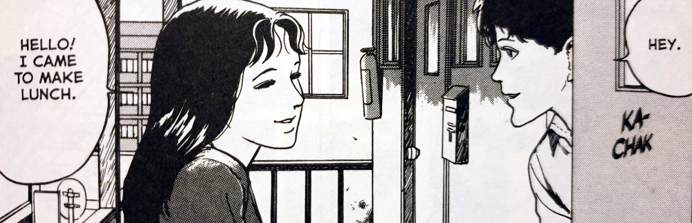](images/Kinuko-and-Haruhiko-renew-their-friendship.jpg)

Kinuko and Haruhiko renew their friendship

Haruhiko discovers that the brother who had left the family years earlier, has in fact been living close by for some time and urges him and the young sister to visit.

They accept their older brother's offer.

To Haruhiko's and Natsumi's surprise, the door is answered by none other than Jean Pierre. Yes that's right — Jean Pierre the puppet. They discover how the older brother and his new family live the lives of puppets on strings — quite literally. They seem to be getting controlled by some unseen entities in the ceiling above, the strings being lowered through a system of grids.

But how will Haruhiko adjust to not only getting back in touch with his brother, but also getting used to their very unconventional way of living? And how is he going to keep his little sister safe from the danger that is sure to be near?

[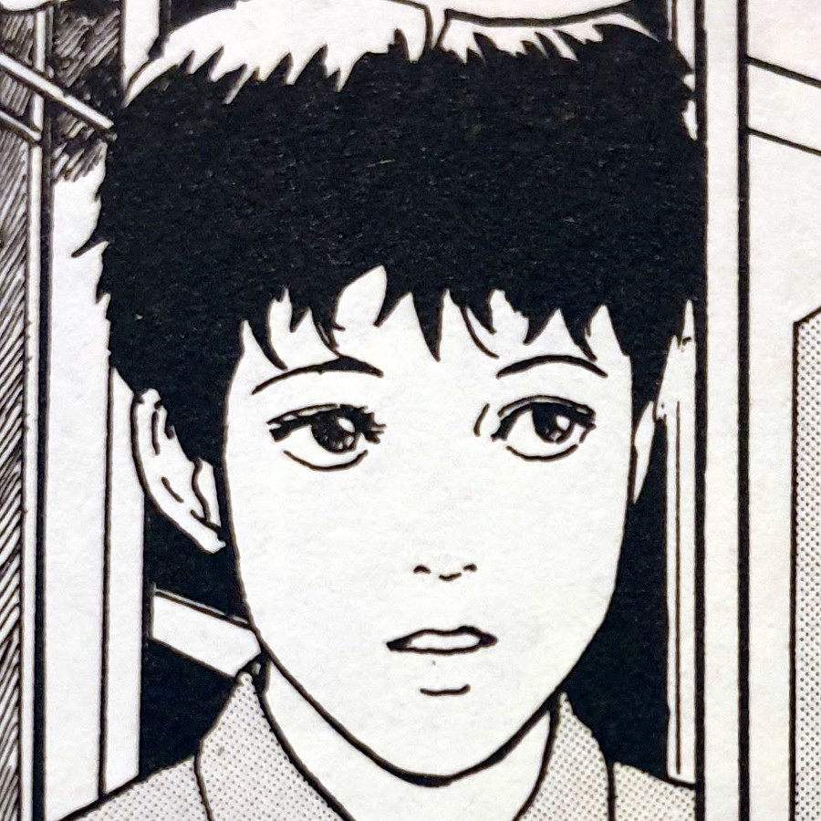](images/Haruhiko.jpg)

Haruhiko

[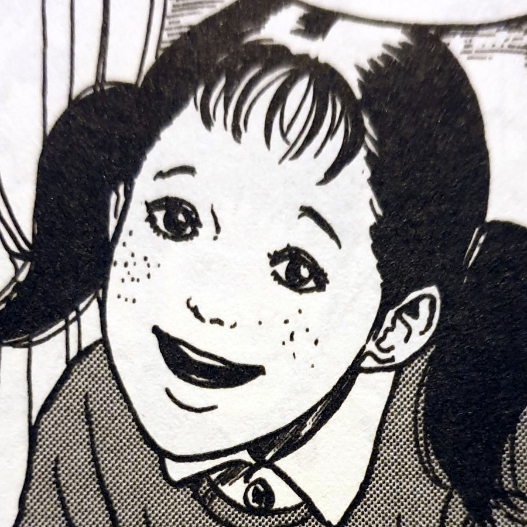](images/Natsumi.jpg)

Natsumi

[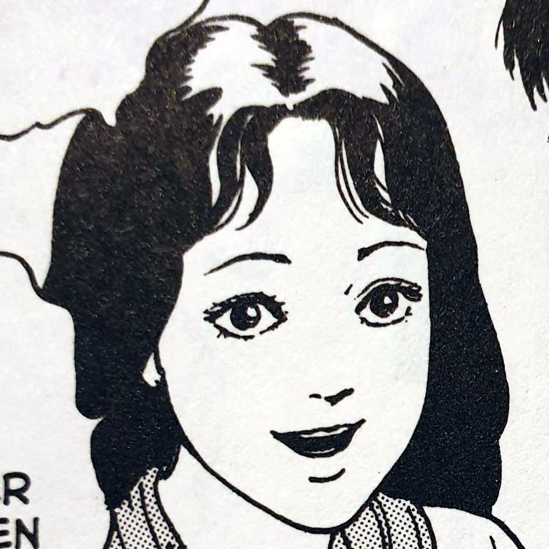](images/Kinuko-Hadaka.jpg)

Kinuko

[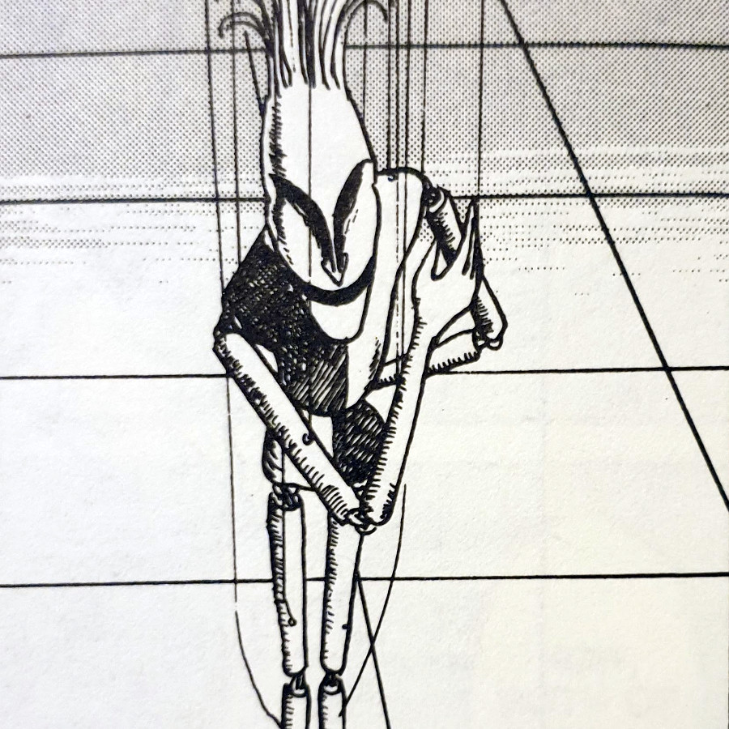](images/Jean-Pierre.jpg)

Jean-Pierre

[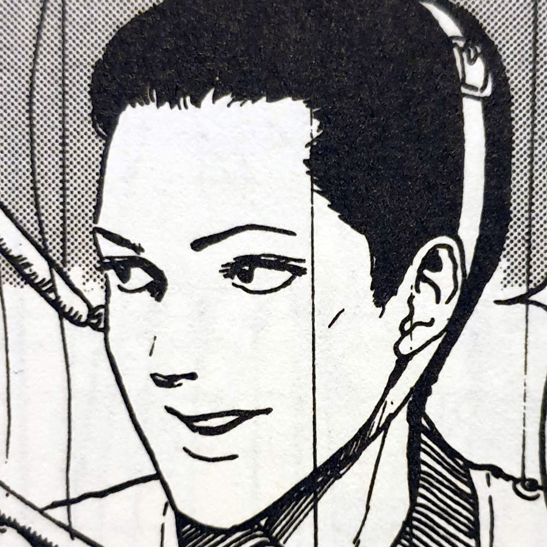](images/Yukihiko.jpg)

Yukihiko

[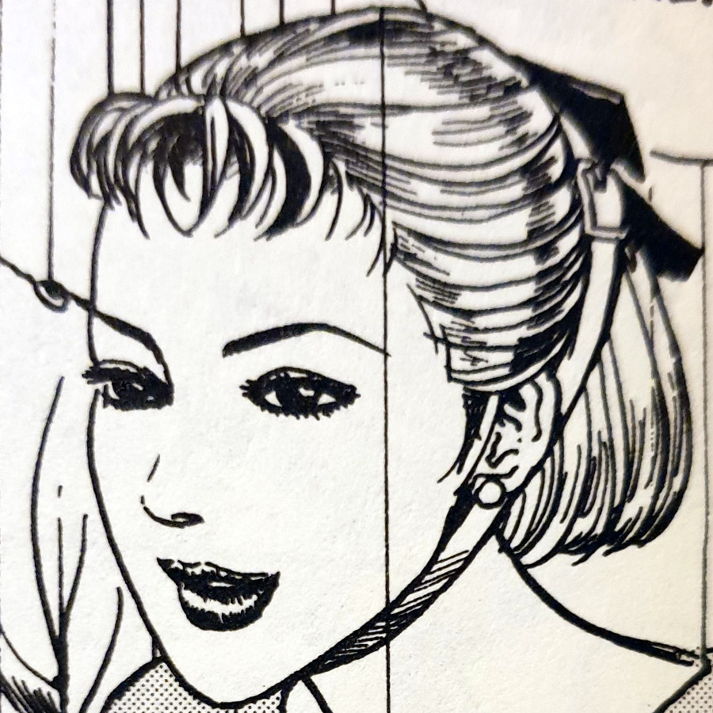](images/Sumire.jpg)

Sumire

[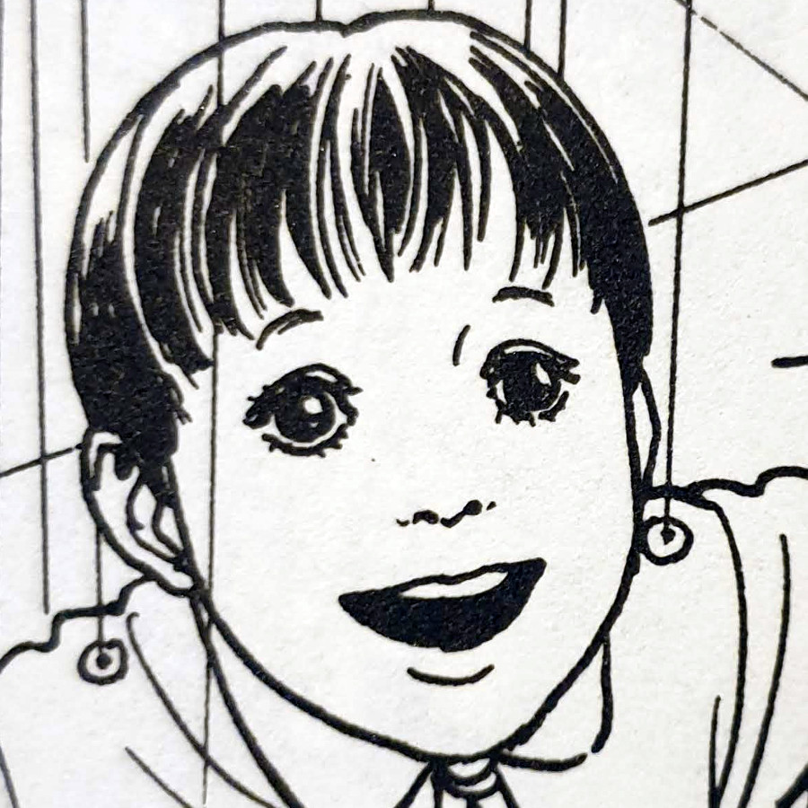](images/Ayao.jpg)

Ayao

## Who's pulling the strings?

This is without a doubt one of the weirdest stories of Junji Ito's that I've read for a while. It raises the question "Who is pulling the strings". Of course, the family at the start literally pull the strings of the puppets in their travelling show. But in the later years of the siblings' lives, that role is reversed.

The fact that Jean Pierre - a seemingly inanimate puppet - welcomes them at the door, let me know that this was going to be an odd one. I realise that Junji Ito is known for how strange and infinitely imaginative his mangas tend to be. But in Marionette Mansion there seems to be a sense of whimsy to the whole thing. Like he is simply having fun playing with these characters and literally pulling their strings for his own, and by extension our, enjoyment.

After reading this in the [Shiver Collection](/tag/shiver-collection/), I also read the accompanying backstory of the manga that comes with each chapter. In it, Junji Ito says:

> ...I'd like to hang my upper body from the ceiling. How lovely would it be to leave my body like that and get the work done? This story came from thoughts like these…
> 
> Junji Ito talking about the origin of the story for Marionette Mansion

## Interpretations

Despite Ito's explanation of the story's genesis, I still can't help but try to find extra meanings. I thought that the "family on strings" was an interesting metaphor for not being in control of one's own life. From the start the siblings had no choice but to travel with the family and their puppet shows. Then later the older brother, although the first to leave the family, still relys on his strings being pulled for him.

[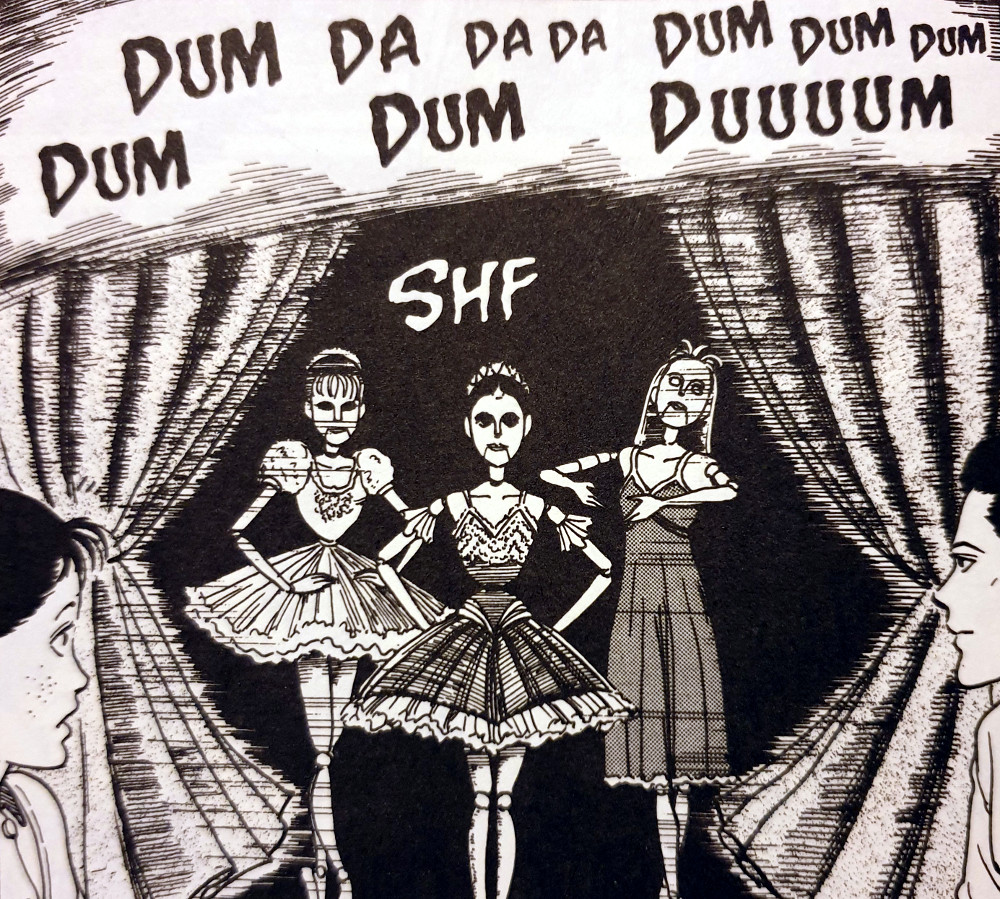](images/The-Wooden-Ballerinas.jpg)

The Wooden Ballerinas

The welcoming of Haruhiko and Natsumi into the house presented a danger to their way of life. This danger is especially true for Natsumi, who is still very much young and impressionable. Although Haruhiko comes across as being very headstrong and wishing to be in control of his life, Natsumi perhaps wont see the long-term effects of having one's decisions and movements made for her.

I think of Marionette Mansion as a tale about fighting the urge to have everything in life done for you. To fight against handing over responsibilities to others for the sake of living an "easy" life. And to always strive to be your own person — not imitating or relying on others for your own sense of self.

[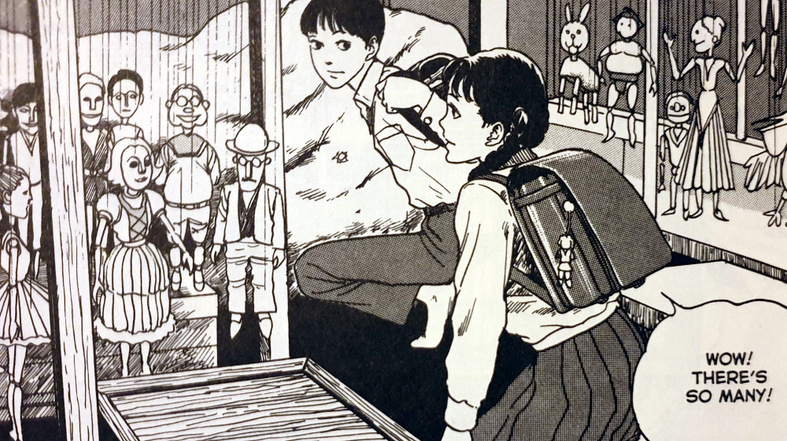](images/Haruhiko-and-Kinuko-as-children.jpg)

Haruhiko and Kinuko as children

[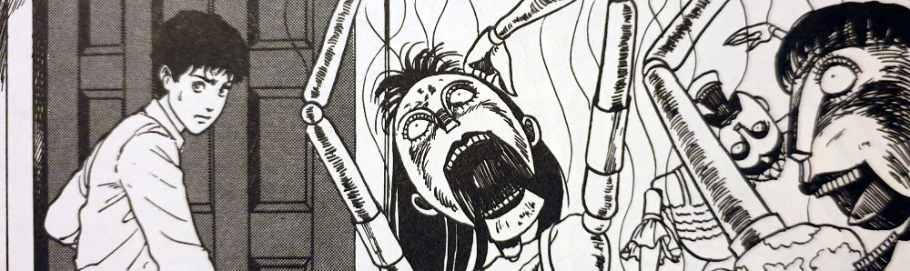](images/Haruhiko-and-the-Wooden-Ballerinas.jpg)

Haruhiko and the Wooden Ballerinas

[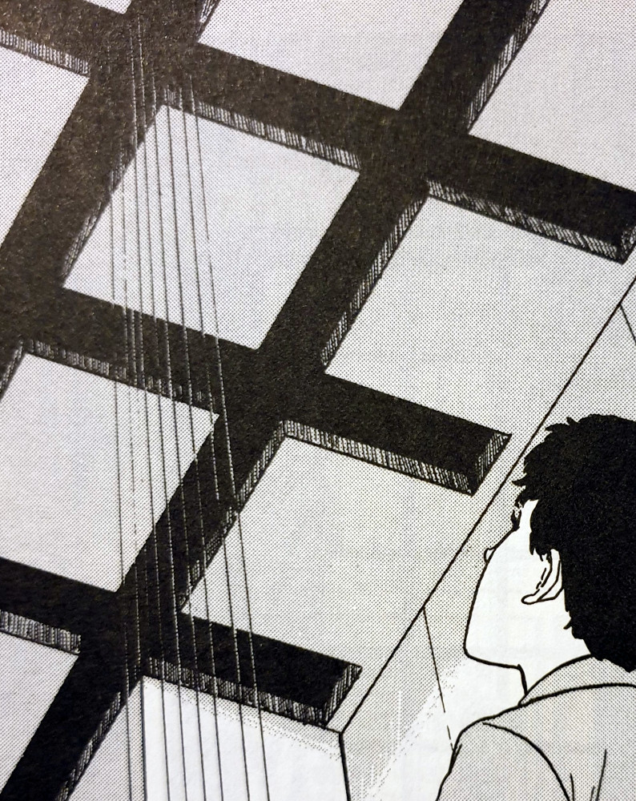](images/Haruhiko-notices-the-grids-in-his-brothers-ceiling.jpg)

Haruhiko notices the grids in his brothers ceiling

[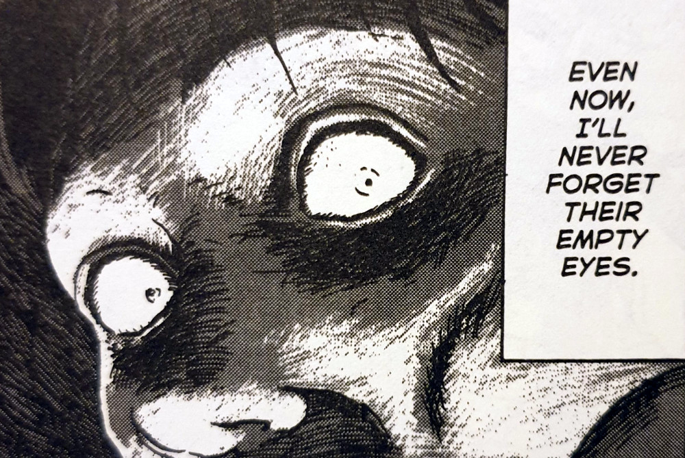](images/The-eyes-of-a-Puppeteer.jpg)

The eyes of a Puppeteer

## In Summary

This is an enjoyable story that came across as a lighter read than other mangas in Ito's large body of work. Nothing in this story made me want to look away in disgust. However, there are still some nice gruesome moments to keep your pallet salivated.

I loved how the main character fought his side of the argument and does his utmost to protect himself and Natsumi, no matter what pressures get placed on him. He is a great conduit for the lessons that I believe we can learn from this story:

Never be afraid to be yourself and always be willing to fight for your independence and dignity.
