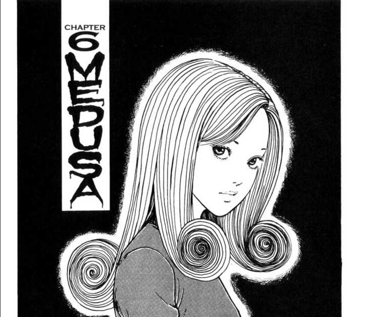
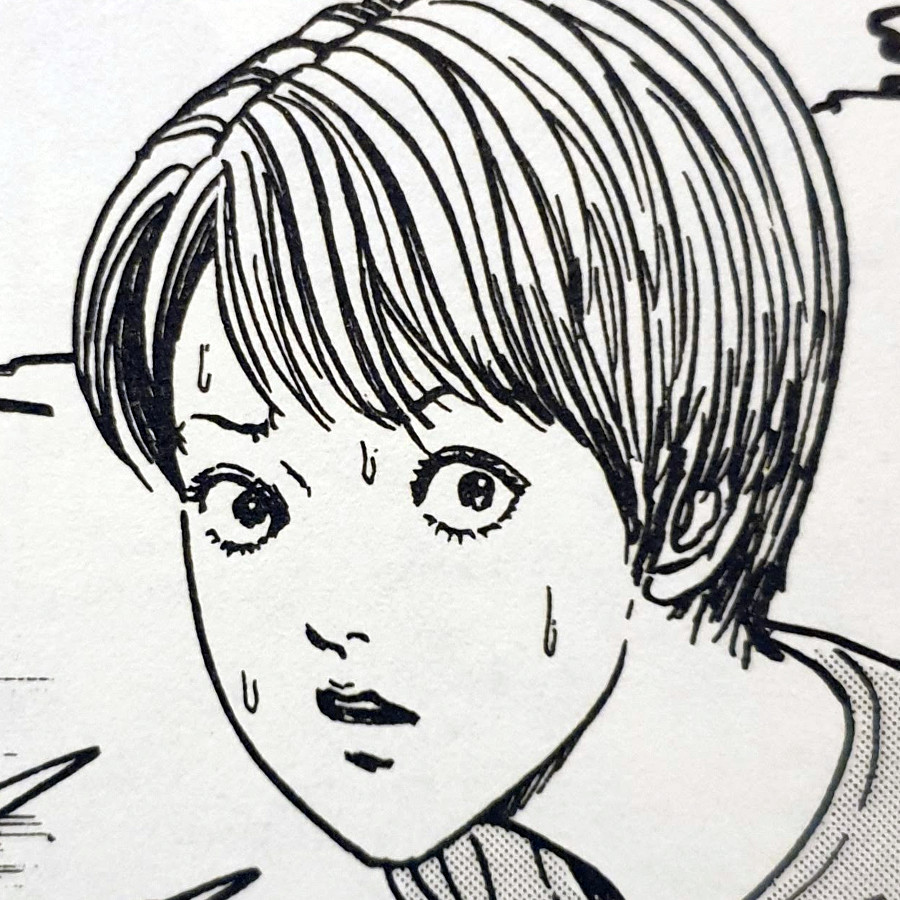
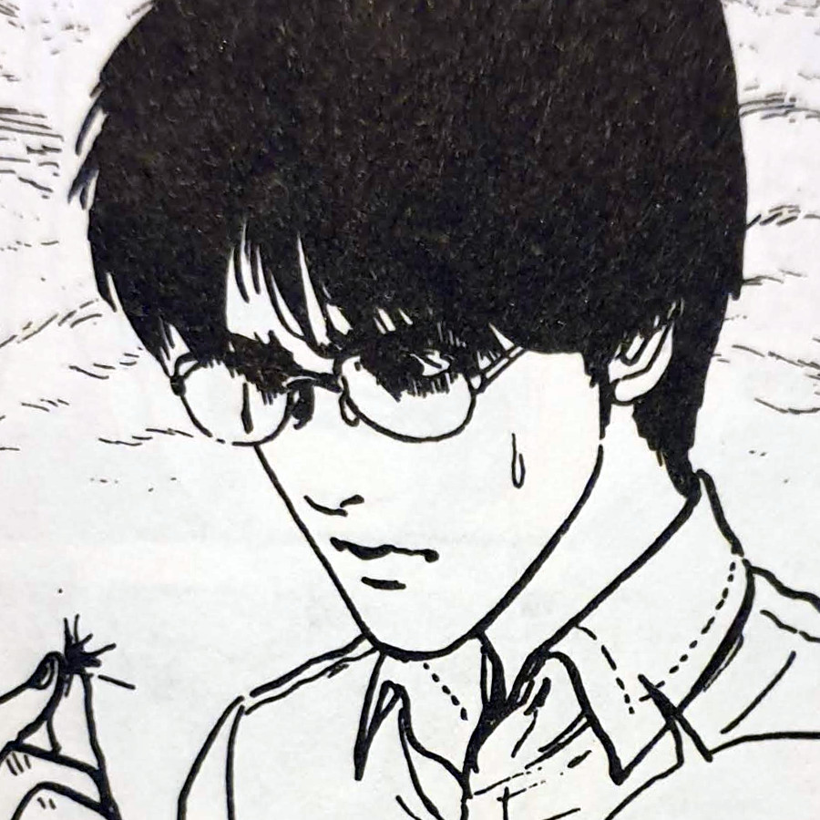
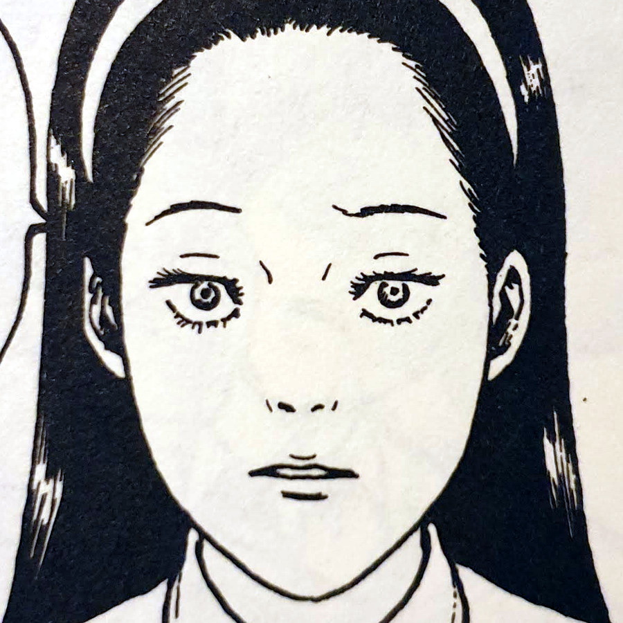
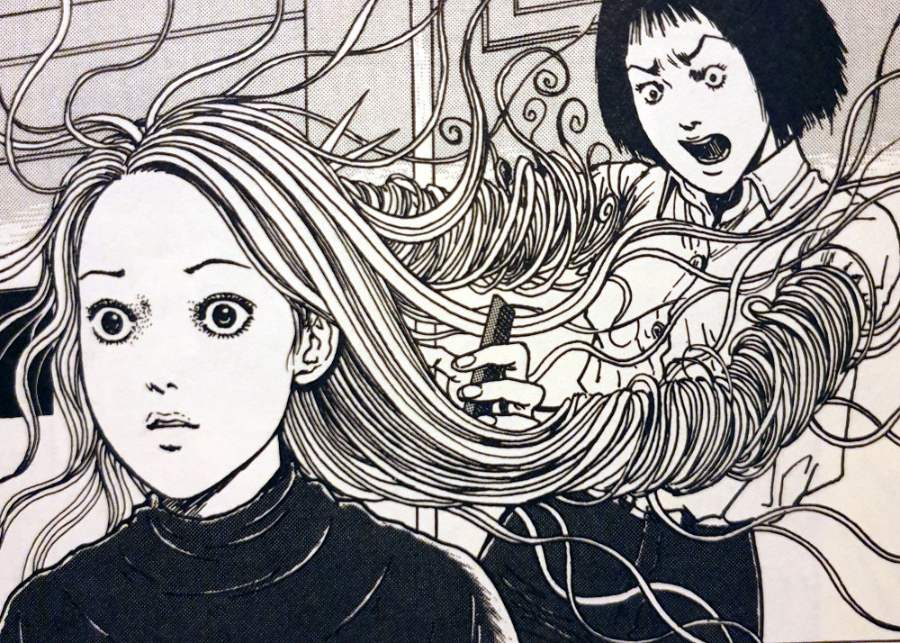
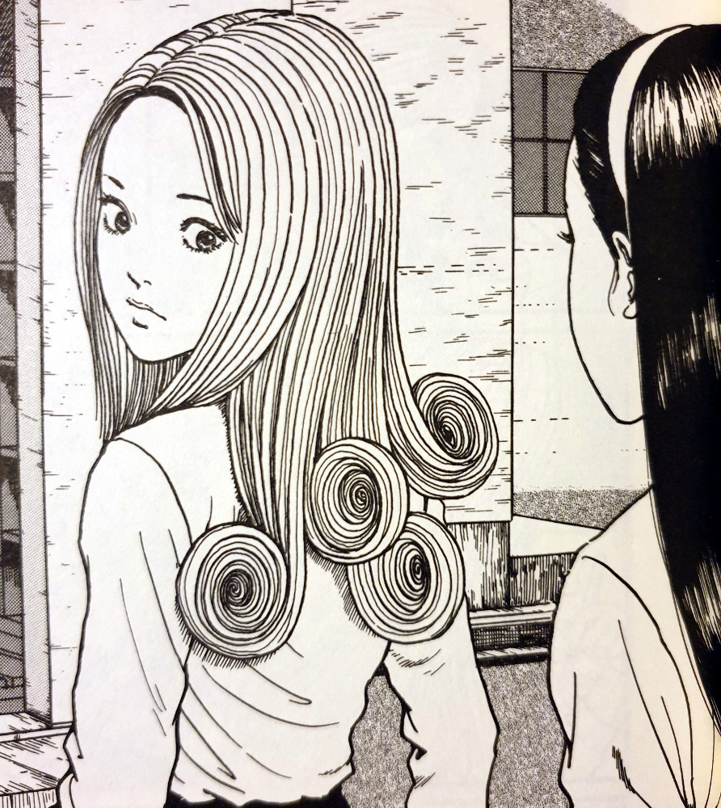
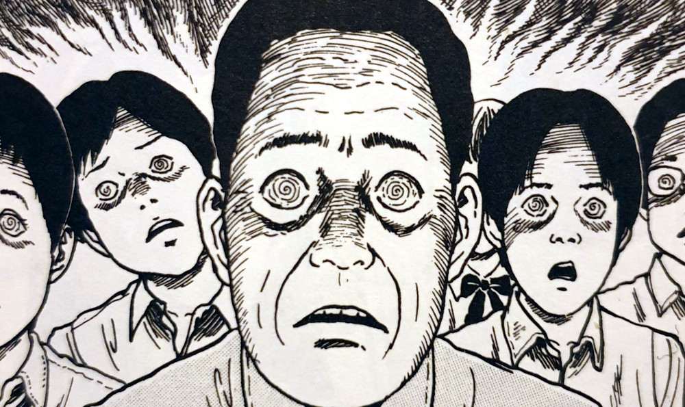
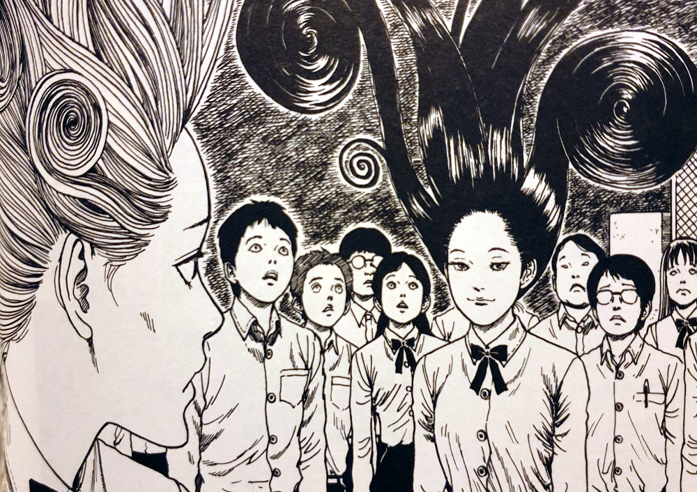

> You should know I take this as a challenge... I'll stand out too... you wait and see.
> 
> Sekino gives Kirie a thinly-veiled warning about her new hair.

You can [buy Uzumaki here](https://amzn.to/2NClvXB).

## Medusa — synopsis

Up until now, the Spiral has been affecting the people around Kirie Goshima. Her boyfriend Shuichi's parents; her own father; a friend at school. But in Medusa, the Spiral is finally catching up to her and has it's sights set directly on a particular part of her body — her hair.

After a school boy's death and some discussions with a friend over people's sudden desires to be noticed, Kirie's hair begins displaying the cursed Spiral in its curls. This seems to have happened out of nowhere, after a sudden growth of her hair. Will she now finally fall victim like so many before her?

When the curls in her hair are threatened, they begin to take on a life of their own — the spiral protecting itself. The hair grows faster than is naturally possibly and even physically fights back against those that would do it harm. But when a school friend of Kirie's see's these ever-growing curls as a threat to her own dominance, that friend decides to challenge her in one of the craziest showdowns I've ever seen in a manga.

Kirie

Shuichi

Sekino

## A hairdresser's nightmare

The subject of hair in Junji Ito's body horror is something that you may have seen before. In his [Tomie](/tag/tomie-collection/) chapter "[Hair](https://junjiitomanga.com/hair-tomie-part-11/)", characters attach strands of Tomie's hair to their heads in order for them to obtain her beauty. But in Uzumaki's Medusa, the Spiral is drawing these people's own hair out of their heads in order to seduce and mesmerise those around them.

The idea of parts of one's own body being out of ones control is a scary one. These have been explored in horror before, whether it's the classic "arm transplant but the arm is that of a murderer's" or "an eye transplant that lets you see ghosts". But the idea of using _hair_ against the person who owns it is a fresh one to me.

I loved how the hair became so flamboyant and ridiculous as to lure in those around it. But what I found even more effective was how the hair, whilst growing at such a fast rate, took its toll on the owner. You could see it in Kirie's eyes as the hair lusted after a bigger audience. But it wasn't until the closing pages that you see its true effect on a host.

Kirie's hair fights back against the hairdresser

## The spiral effect grows

We've seen pretty isolated cases of the spiral at work until now. Limited to families and those closely related. Even the episode with Shuichi's mother in the hospital could be written up as a woman's madness on the doctor's report. But the actual encounters with inexplicable spirals has been limited save for those involved.

In Medusa, however, the hair that grows from Kirie, and later her friend Sekino, is so unnatural that it just can't be explained away. No amount of hair spray could have kept those curls up. It would have been plain to all that this is some unnatural force at work. Could it be that the Spiral curse is ready to show itself more widely now? Is it no longer content with appearing in the corners of Kurouzu-cho and instead now wants a larger audience for itself?

Interestingly, the Spiral only seemed to target Kirie after she had been clear to her friend about not wanting to stick out. She was content with just moving along in life. The idea that her friends' obsessions with being noticed was intrinsically linked to the spiral's presence, seemed to be confirmed when she was made the centrepiece of the Spiral's plans within the Kurouzu-cho school.

Kirie's hair becomes infected with spirals

People become mesmerised by Kirie's hair

The showdown of the hair

## In Conclusion

The image of the woman with the large curls floating over her head is a common one from Uzumaki. When seeing images from the manga or even clips from the Uzumaki film, it is a pretty staple image. Indeed it does represent both how incredibly inventive and at times ludicrous the world within Kurouzu-cho becomes.

Medusa is a calmer story than most from Uzumaki with absolutely zero gore. The goriest image is that of a girl whose life is visibly drained from her face; her skin and eyes sunk back. But nothing more than how you would expect a mummy to look in a museum. In fact, the story is home to more humour than gore. Granted it is a particular kind of humour, but it is there nonetheless.

This story seems to be opening up the Spiral to a wider array of people within the town. Many more are becoming affected by it, and it's only a matter of time until the Spiral's full force is released. I think Kirie will still serve as the central character, but the curse looks to be spreading its wings wider and wider from here on out.
