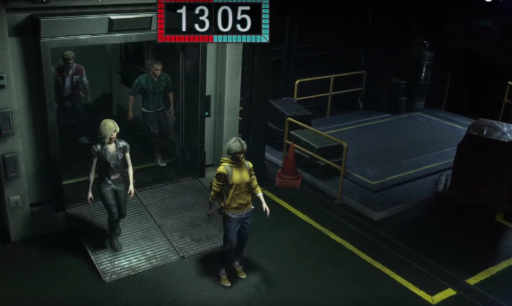

I couldn't believe how lucky I was to open my email two weeks ago and find an invitation to the upcoming multiplayer game Resident Evil: Project Resistance. I had heard it referred to as "Resident Evil but done like Dead by Daylight". But I'm here to tell you that it is so much more than that.

I've always loved the classic Resident Evil games (from the original through to Code: Veronica - I haven't played any more till Resident Evil 7: Biohazard). Resident Evil 7 rekindled my love of horror games and the Resident Evil 2 Remake rekindled my love of Raccoon City specifically. So when I had heard about an upcoming multiplayer game set in this world I jumped at the chance to enter into the closed BETA access ballot.

I still can't believe I got in.

## What is the aim of Project Resistance?

You choose from one of two sides when entering into a game — you can be either one of four survivors, each with their own unique traits, or the Mastermind, who is trying to stop them from escaping. I found both sides fun in their own way, but the clear winner for me was playing as the Mastermind — especially when I got to jump into the skin of the Tyrant twice in each game (more on that later).

### Survivor goals

As one of the four survivors your goal is to make it out of the match with your allies. This means fighting your way across three separate areas of the game map and out of the exit gate, all while the Mastermind throws everything at you from Lickers to Zombie Dogs.

Each time you deal damage or complete objectives you get additional seconds added on to your team's time to escape. And believe me when I say that every second counts. Each area has a simple puzzle to solve, which essentially involves exploring the environment for each part of a puzzle to unlock the next door.

The survivors enter the last area

Each area has a safe room where you can buy extra weapons, ammo and herbs with credits found within the map. These safe rooms can also be used as breathing spaces — The Mastermind is unable to send enemies in there after you.

### Mastermind goals

As the lone Mastermind, your job is to stop the four survivors from making it through those three areas and out of the exit. You can throw anything at them that you have at your disposal, but there is a slight caveat.

The Mastermind builds up a points gauge, about 1 point per five seconds I think. Those points can then be spent to play "enemy cards". You see, each enemy you can place down in the map is represented by a card within your "deck". Decks can be chosen before the match but the BETA was limited to a single selection. Those cards then become available on a rotation, allowing you to build up a good varied selection of enemies for the survivors to fight through.

A Zombie dog for example takes 2 points to place down. It is a weaker enemy, but more can be placed down in succession. A Licker on the other hand is worth 7 points but is much stronger. So it will take slightly longer to build up to the points to place one of those down. So it's all a bit of give and take.

Downtown map view

Another power gauge that builds up over time, separate from the card points gauge, is the ultimate weapon metre. The only Mastermind that was available to play in the BETA was "Daniel", whose ultimate weapon is The Tyrant from the Resident Evil 2: Remake. The Tyrant card pops up once its metre is filled, after which you can place it for free. Once placed, you actually take control of the trench-coat-wearing machine!

If you manage to keep the survivors occupied enough through the match, and their timer runs to zero, a gas will be released killing them all. If this happens then you have won the match.

## What I liked about Project Resistance

I have to say that I pretty much liked everything about this game. Even though it was a BETA test, it felt really polished and I noticed absolutely zero bugs whilst playing. Capcom are one of the leaders of the pack when it comes to video games right now, at least in my opinion. I think a lot of what made this game feel so polished for me, was the use of their proprietary engine introduced in Resident Evil 7: Biohazard and continued in Resident Evil 2 Remake — the "RE Engine".

I felt there was a good push and pull between the survivors and the Mastermind. Some games I would absolutely destroy the survivors, whilst in others they would escape with 8 minutes or so remaining. It will be interesting to see how this game gets altered, if at all, after they have sifted through all of the feedback from the testing weekend.

An example of the cards to put enemies down

## What I disliked about Project Resistance

As I said above, I pretty much like everything in this game. If I'm honest the only thing I found slightly frustrating, albeit only occasionally, was the enemy intelligence. I would sometimes see enemies just standing there whilst survivors ran around ahead of them. This happened rarely, but I assume it is one of those things that will get reviewed after testing. That's what BETA testing is for, right?

## What I'd like to see in the Full Release of Project Resistance

This was one of the questions on the feedback form and it really got me thinking about what I'd love to see in the final game. The DLC options here are almost limitless, but here are a few things I'd love to experience:

### Lots of maps.

I'd love to be able to play through a bunch of locations from the Resident Evil universe. Even the Baker House would be a cool one for me. I think you could probably get about five or six maps from each Resident Evil Game.

Some of my absolute dream maps would be:

- The Baker's Guest House from Resident Evil 7: Biohazard.

- Raccoon City Police Station from Resident Evil 2 (both versions? :))

- Different areas of the Spencer Mansion from Resident Evil Remake

- The Guest House from Resident Evil Remake

Mr X watches as the dog attacks a survivor

### Lots of enemies

Different enemies from across Resident Evil's history would be so awesome. I could imagine putting a bee hive in the corner of a room, with the lights turned off, to be very annoying to survivors. :D

Some enemies I'd love to be able to place down:

- Bee Hives from Resident Evil Remake

- Moulded from Resident Evil 7: Biohazard

- Giant Spiders from Resident Evil Remake

- "Possessed" Mia Winters from Resident Evil 7: Biohazard as an ultimate weapon

- Jack Baker from Resident Evil 7: Biohazard as an ultimate weapon

- Maybe the ability to place enemies outside of windows that would burst through when passed?

### Different Skins

I think the idea of each survivor player having to choose a different character is an interesting one. But what I'd love to see would be for players to earn, or maybe purchase?, skins. So they still play the roles as either tank, damage, hacker etc but each person can go in looking like characters from the Resident Evil universe.

Some characters I'd be super hyped to play as:

- Leon Kennedy

- Jill Valentine

- Chief Irons? LOL

- William Birkin (Imagine having a team comprised of the whole Birkin family :D)

- Mia Winters

## In Conclusion

I absolutely loved playing this game over the testing weekend and can not wait for it to be released in full. I will be buying it on its day of release.

My first thoughts when hearing about its asymmetrical structure was that it would basically be Dead By Daylight but in the Resident Evil universe. But I am happy to say that this is not the case. Project Resistance is a game that sits on its own, taking interesting elements from different games. It has the puzzle solving aspect from its own world, it then takes the asymmetrical nature of other multiplayer games whilst putting its own spin on it. Mix those with the card point system from games like Clash Royale and you've got an interesting game that I'll be playing the hell out of when it's released.

I'd like to also take this opportunity to thank Capcom for accepting me on to the BETA testing weekend. I managed to make a few friends jealous, as well as having some of the most fun moments I've had on the PS4 for a while.

## Gameplay footage — playing as Mastermind

https://www.youtube.com/watch?v=d1gtncbshIM

Me playing as Mastermind
