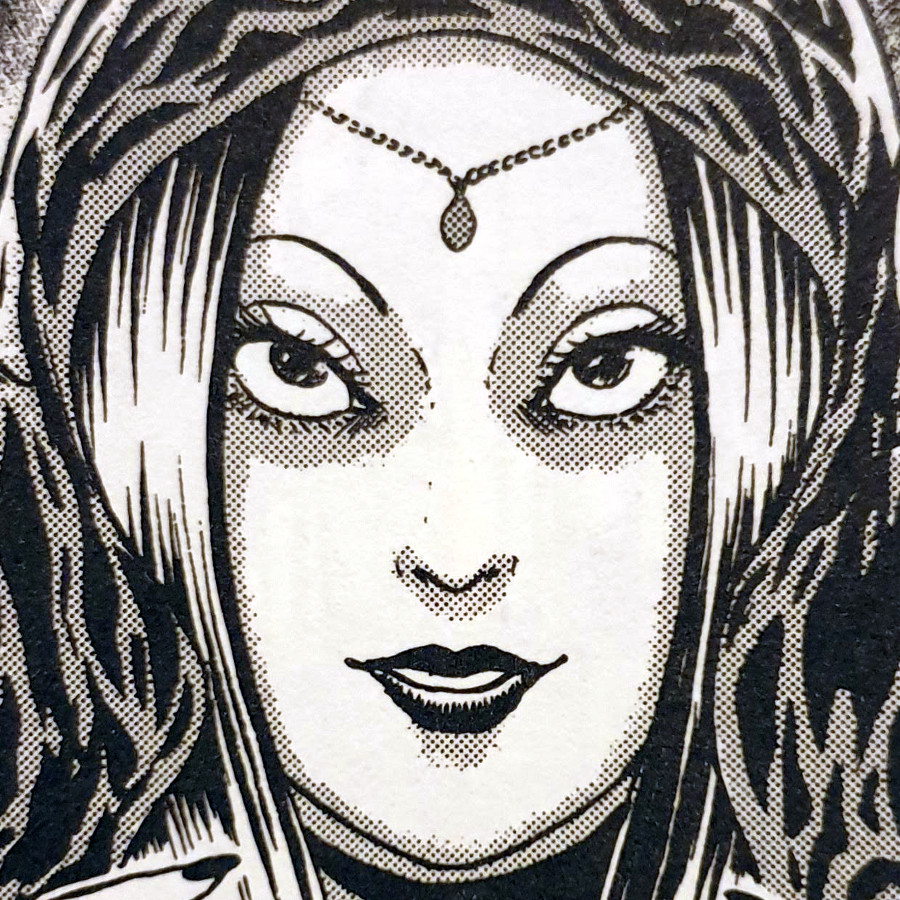
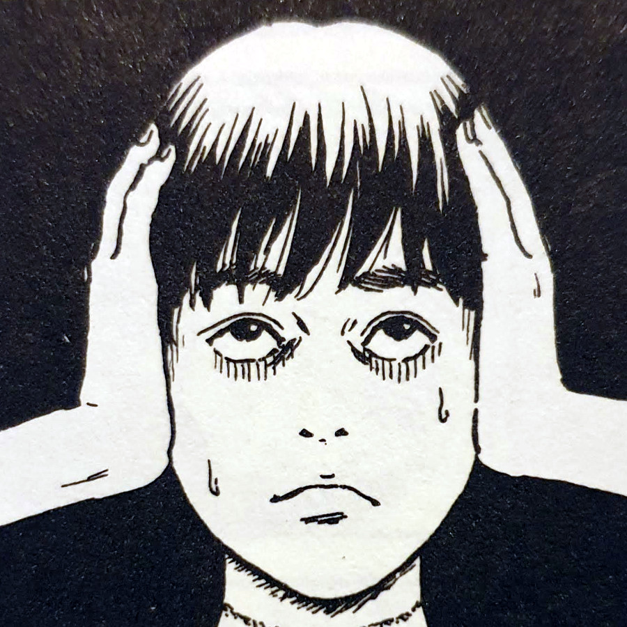
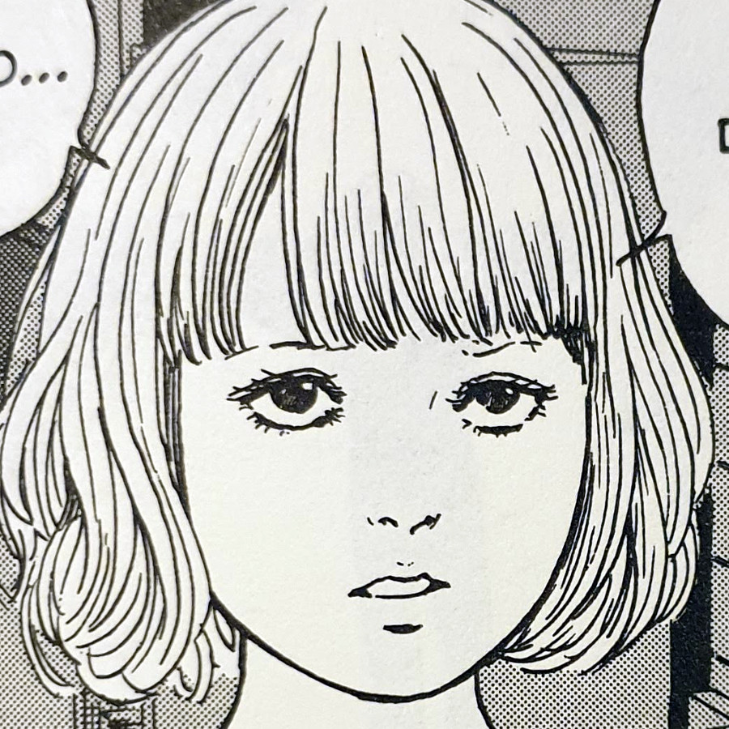
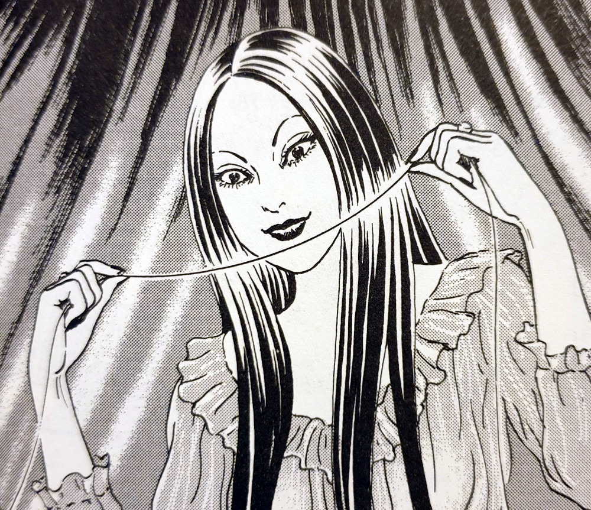
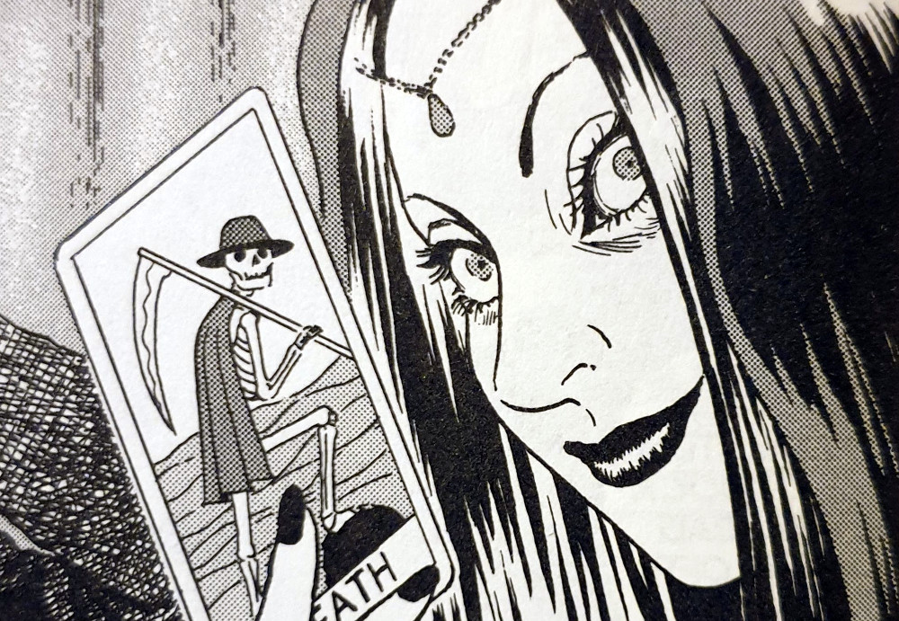
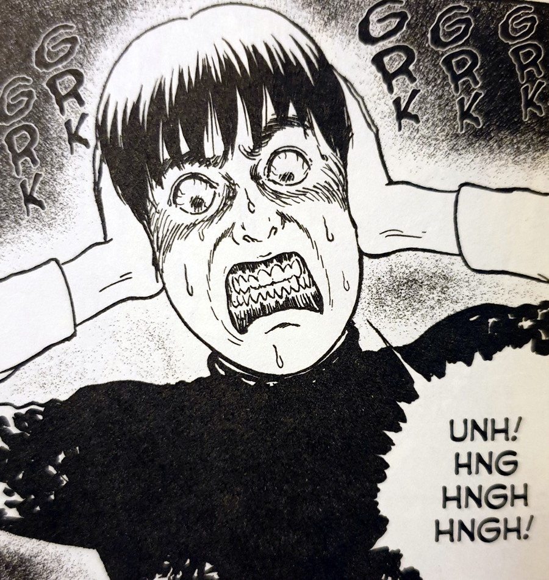
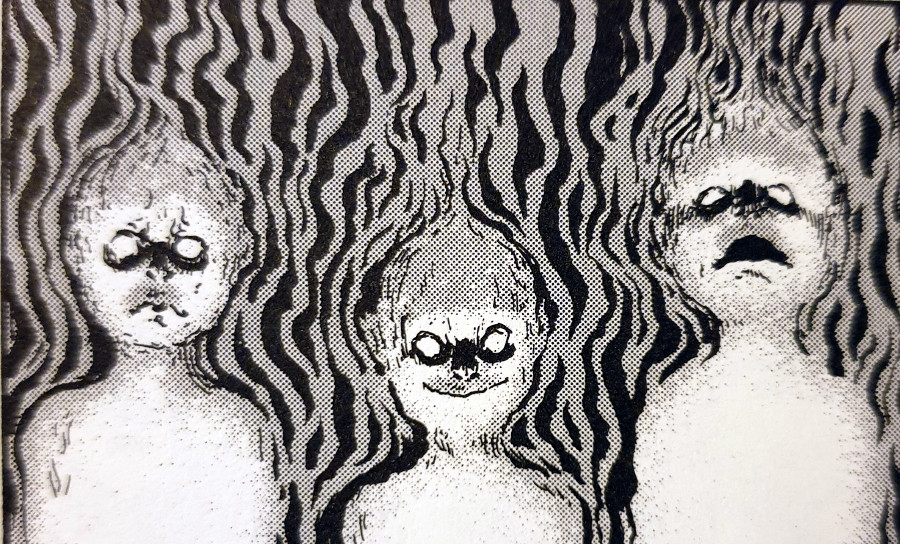

## Tomio Red Turtleneck — synopsis

Tomio Red Turtleneck is one of the more nightmarish short horror manga stories from Junji Ito, as well as being one of my favourites. Taken from his excellent Fragments of Horror collection, it tells the story of a young man dealing with a very strange injury.

We join Tomio's story as he is walking down a street, grasping at both sides of his head, looking very distressed. His eyes are fixed and his teeth are gritted together as he makes his way to his girlfriend Madoka's home. On arrival he pleads for her help, but it seems as though he's been a bad boyfriend. She tells him simply to just "go back to that woman".

Flashing back to some days earlier in this couples life, it is revealed that Tomio did in fact begin having an affair with a fortune teller. This same teller foresaw their relationship as being "doomed". But this seems to have been a fortune reading designed for one thing — to get Tomio into bed with said teller.

And it worked.

The Fortune Teller

Tomio

Madoka

However, after they had made love, the fortune teller reveals her true evil intentions towards Tomio. He has no choice but to run from her, but not before she manages to curse him.

But just what happened when Tomio and the fortune teller met up? What evil secrets does this cursed woman hold and why did she target Tomio? And just what has she done to cause him to go running back to Madoka with his head clutched between his hands?

## Strong Women

Ito has a talent for bringing strong women to the forefront of his stories, perhaps none more so than [Tomie](https://junjiitomanga.com/tag/tomie-collection/) — the immortal, self-replicating demon girl who drives men to go crazy over her. However, Tomio Red Turtleneck displays two very strong women too.

The first is the fortune teller, who manages to captivate Tomio into having an affair without any real effort on her part. Perhaps it was magic but nonetheless she had that power over him. She is an imposing figure over the story and is definitely someone not to be messed with.

The Fortune Teller reveals her true intentions

The second is Madoka. Despite being cheated on by her boyfriend, Madoka isn't saddened or feeling sorry about the situation. Instead she kicks him out in anger and is even the one to save his skin towards the end. It's unsure whether she will remain with him after this is all resolved, but one thing is for sure — she sure knows how to handle herself and wont go down without a fight.

## Monogamy

If ever there could be a horror manga allegory for not cheating on your partner, then Tomio Red Turtleneck is it. Tomio doesn't come across as a particularly nice person in the opening pages. He screams at his girlfriend Madoka that the fortune teller is "way hotter" than her, before running off to her bed. I personally couldn't wait for him to get his just desserts.

I found that the fortune teller and the affair with her was a great metaphor for, and even a warning against, being unfaithful to your partner. Tomio sees the teller and is taken with how beautiful she is. He ends up in her bed as he probably believes himself to be "upgrading" his lover in his mind. But of course, once he discovers her true intentions, and the severed heads of other men whom I could only assume cheated on their partners too, he realises he has messed up.

I don't for one second think that what he ends up going through can reconcile how he treated Madoka, but perhaps having his head almost removed is a little bit too far a punishment. Perhaps.

The Fortune Teller draws the Death card

Tomio struggles to keep calm

Children of the flames

## Children of the flames

I loved the imagery of the three children that were revealed once the fortune teller had been stabbed. Were these malicious spirits that were in control of an otherwise innocent fortune teller? Or were they in fact unborn children of hers who's presence was still felt by those around?

I couldn't help but feel sorry for Madoka and Tomio too. Yes, even Tomio. I think that the fortune teller had some kind of control over him. Whilst I don't excuse his actions, or his attitude towards Madoka, I did feel that he was a very naive person — almost child like. And while Madoka came across as more head strong, she too felt not much older than a child.

The fortune teller on the other hand seemed much older and infinitely more in control of her self. Although her motives were never revealed, she definitely had control over the situation. Of course, she did underestimate Madoka at the end. So I guess she couldn't have been _that_ much in control.

## In Conclusion

Tomio Red Turtleneck is a quintessential Junji Ito manga that I think you should definitely read. Whilst it's not in my top 5, it is definitely up there towards the top of my favourites. The imagery of Tomio stumbling down the street clutching at his almost-severed head is one of those Ito images that I just won't ever forget.

Junji Ito has created such iconic imagery through his career so far, and no-doubt will continue to do so. But I think that Tomio and his red turtleneck are, at least for me, one of the most memorable.
