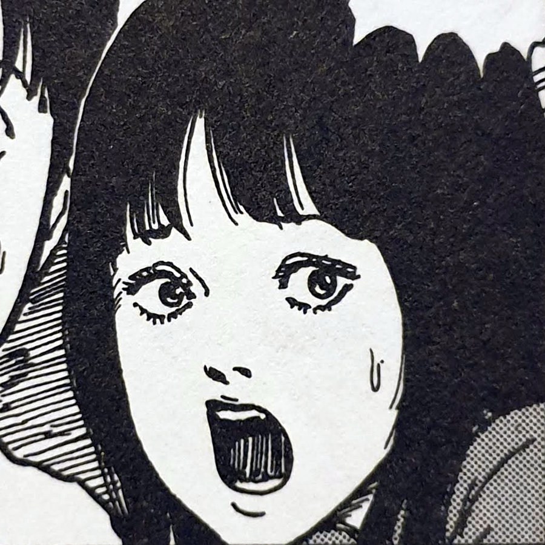

## Twisted Souls — synopsis

Yoriko and Kazunori are deeply in love, but are from two families at war. To make matters worse, these two families share the same row house within the town of Kurouzu-cho — separated only by a thin dividing wall. The row houses are long, wooden, single-level buildings that can be found throughout the town. Some are hidden away in the towns forgotten places, whilst others sit on its outer edges.

Row houses hidden in Kurouzu Cho

Each attempt that Yoriko and Kazunori make to be with one another, is ended with their families ripping them apart. They have no care for their families' age-old feud, and simply want to be able to live out their lives together in peace.

Kirie stumbles upon a fight between the families on her way home one day. She soon decides that she will help these two attempted lovers to escape their respective families and start their own lives once and for all. These controlling family members are, as Kazunori puts it, twisted souls; their hearts are bent out of shape.

However, it may be that embracing the spiral is the only way for them to escape once and for all.

## A Shakespearean tale

The focus in this story is completely removed from the previous chapters so far. The families in Twisted Souls are separate from both Kirie and Shuichi — it was only through chance that Kirie stumbled upon them. But the spiral is still at work in this story. It is obvious after reading this that the spiral is in fact all over Kurouzu-Cho.

Kazunori

Kirie in Twisted Souls

Shuichi in Twisted Souls

Yoriko

The star-crossed lovers in this chapter reminded me instantly of Romeo and Juliet. It's a pretty common Shakespeare story that influences a lot of popular fiction, but it was nice nonetheless to see it woven into the world of [Uzumaki](/tag/uzumaki/).

Junji Ito's work is often compared to the work of acclaimed horror author H.P. Lovecraft. However, I believe there will be many parallels with Shakespearean tragedy in Ito's work too. Although I can only recall this reference to Romeo and Juliet currently, I will start to look out for other references going forward.

## Red herrings

On first reading this story, when I saw what Kazunori was saying about his and Yoriko's families, I thought I'd immediately guessed how the ending would go. "Their hearts are bent out of shape", "You can't untangle them", "They shield themselves by becoming warped".

But I couldn't have been more wrong about my predictions in Twisted Souls. It was an interesting spin and, dare I say it, a relief to see the spiral being used by these people as a way for them to finally realise their own dreams.

Kirie listens to Kazunori

The fathers of each family at war

Kazunori can take no more

Arms twisting together

## In Conclusion

I very much enjoyed Twisted Souls. It was a slightly different story to previous chapters and didn't lean on much body horror at all, save for the ending. But even that felt to me like the lovers welcomed their destiny. It was their dream to be together; to become one with each other through sickness and in health. They got their wish.

For once in Uzumaki, amongst the death, horror and gore, the Spiral actually helped two people in need. And not only that, but it did so of their own free will too.
