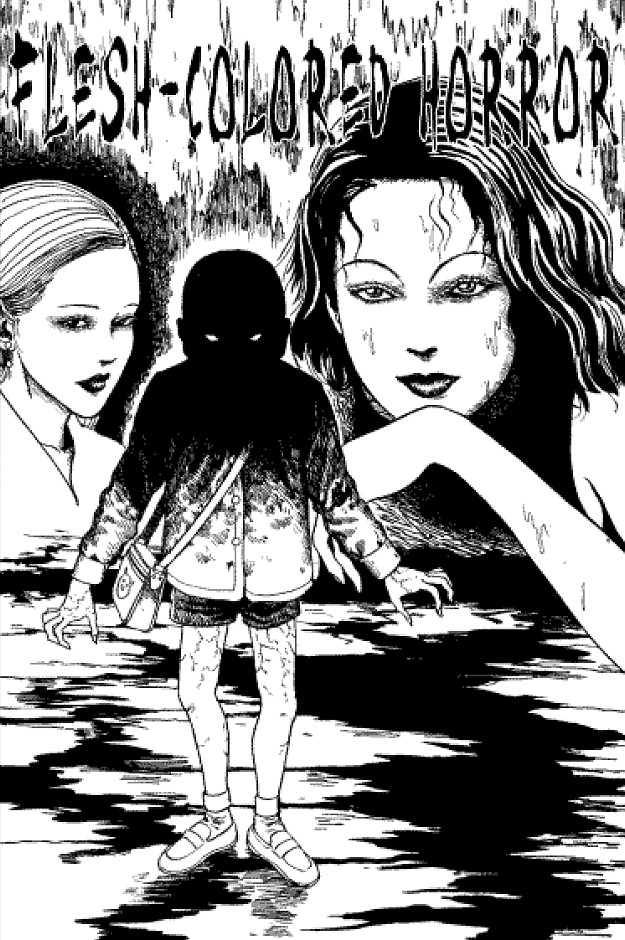
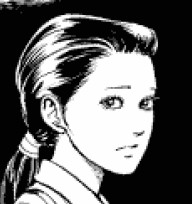
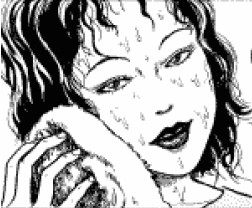
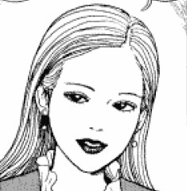
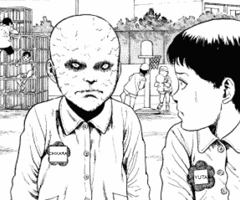
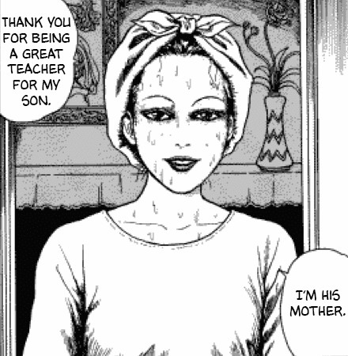
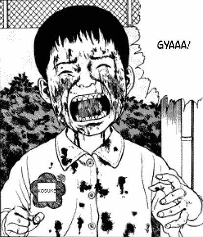
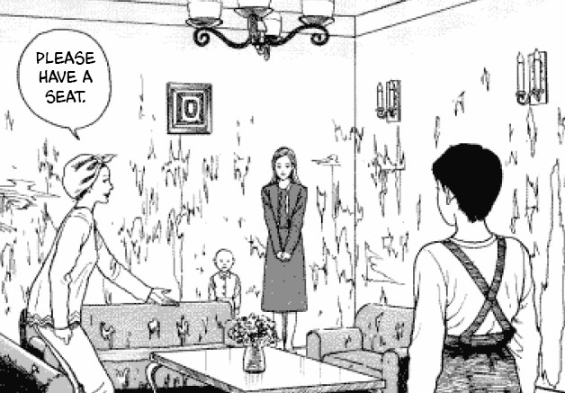
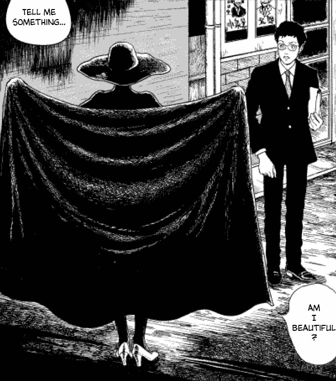

> I'm not tearing. This is the peeling...
> 
> Chikara as he destroys other childrens' artwork.

Read it here: [Flesh Colored Horror at Kiss Manga](https://kissmanga.com/Manga/Itou-Junji-Kyoufu-Manga-Collection/Vol-003-Ch-006-Flesh-Coloured-Horror?id=212547).

## Flesh Colored Horror — Synopsis

Momoko Takigawa is a school teacher who teaches young children at the Hikariyama Kindergarten school. Her students are all regular, everyday children... except for one — Chikara.

Chikara is a scary-looking child, whose veins trace dark lines over his bald head. His eyes are blank white and piercing, and his mental state is violent and unstable. Chikara often lashes out at his fellow students and is unable to form any sort of positive bonds with them.

After a bloody incident involving Chikara and another student, Kosuke, he is expelled from the school and instructed to never return. However, one day he follows his old teacher Takigawa home from the school, and she agrees to take him inside before escorting him back to his own home.

Momoko Takigawa

Chikara

Chikara's Mother

Chikara's Auntie

But when the teacher starts to become more involved in the boy's life and in his well-being, a horrifying and violent secret is revealed about the boy's family. We learn of his mother's obsession with beauty. And we learn the lengths she's willing to go, in order to give her son that beauty. All with no care as to the cost of his mental or physical well-being.

But what lengths will his mother go to, to finish what she has started? And how much can her son endure before he finally snaps?

## A tortured young boy

The subject of a child's abuse is always a delicate one to approach in fiction — and rightly so. Junji Ito has dealt with these before with stories like [The Bully](https://junjiitomanga.com/the-bully/) and the Tomie chapter [Boy](https://junjiitomanga.com/boy-tomie-part-14/). But in Flesh-colored horror, the pain that Chikara endures is on a whole new level from those — at least in my opinion.

I felt that Ito approached this subject very tastefully. He seemed to keep it grounded but still within his story's crazy boundaries. My initial feelings towards Chikara were those of disgust — the desired effect, no doubt. But by the end I was fully on his side after having learnt his story. And not only that, but it even taught me something about not judging people too quickly.

Chikara doesn't know how to make friends in the playground

Although the tearing of the school paintings was a spiteful act, it was only what Chikara had picked up from home. We see his mother's obsession causing her to peel away their home's wallpaper — a metaphor for the peeling away of skin to what lies beneath.

And when Chikara attacked Kosuke and caused his face to bleed all over, it was a dreadful thing to do. But again, although I don't condone it, this too was a learned behaviour from his mother. From all of the peelings away of skin she has forced him through.

This is normal life for Chikara, and it truly is a shame — both for him _and_ those around him.

## Skin deep

There is a saying that goes "Beauty is only skin deep", which means that a person's character is more important than how they look. This saying is no more apt than in Flesh Colored Horror — albeit in a slightly tongue-in-cheek way. I loved the insane idea of going to the extremes of trying to preserve one's beauty by removing the skin and bathing it in saline solution. Then admiring the muscles and tendons beneath as a thing of beauty. Ito definitely has a way of creating these fresh and crazy characters with very unique quirks. And he often does so by taking very normal behaviours, like using skin cream to maintain one's complexion, and turning it up to crazy.

Chikara's Mother always seems to have just gotten out of the bath

I also enjoyed the exploration of the mother's obsession with her beauty — an obsession which ultimately leads to her undoing. I believe that the loss of her husband in the way that he went, directly led to her strange form of body dysmorphia. It was just a shame that her twisted notions of beauty were then forced upon her child.

But what I found most interesting in this story, was how we initially see Chikara. We see him as violent and almost-grotesque looking. But later we learn how both his appearance and his actions are a direct result of his terrible upbringing.

And on the flip side of that, we see his mother and his auntie — both beautiful women, who initially come across as friendly — who are later revealed to be the most despicable characters in the manga.

Beauty is only skin deep.

I'm glad that Chikara got to have some kind of revenge on his mother. Burning away his mother's skin before tearing her exposed tendons with his bare hands was a hell of a way to go. But strangely enough, it felt like the logical result of what the boy had to endure. She created this viscous animal within her child, and now that very same animal is being unleashed on its creator. It is so crazy and so unbelievable, but it is so very enjoyable to read too, and definitely very Ito-esque.

Kosuke is attacked by Chikara

The walls have been peeled in Chikara's home

A strange figure approaches a stranger in the street

## In Conclusion

Flesh Colored Horror blew me away when I first read it, I wont lie. The serious tones of a child in danger drew me into the story — I knew it was going to be a thought-provoking and heavy piece. But it was it's crazy ending and visceral imagery that moved this manga up into my top ten.

This isn't one for the casual manga reader, I don't think. If you like your horror to be dark and visceral, then great. But if you prefer easy jump scares and a minimal amount of flesh and blood, then tread carefully; I don't think this is for the feint-hearted.

Any fan of Junji Ito's who hasn't read Flesh Colored Horror yet will get a real kick out of this one. And if you do enjoy it, you are sure to end up reading it multiple times.

p.s. Bonus Points to Ito for reminding me of [Hellraiser 2](https://en.wikipedia.org/wiki/Hellbound:_Hellraiser_II) with this one. The image of the woman's skin being pulled off like an all-in-one body suit immediately made me think of Julia's demise from that film. :)
