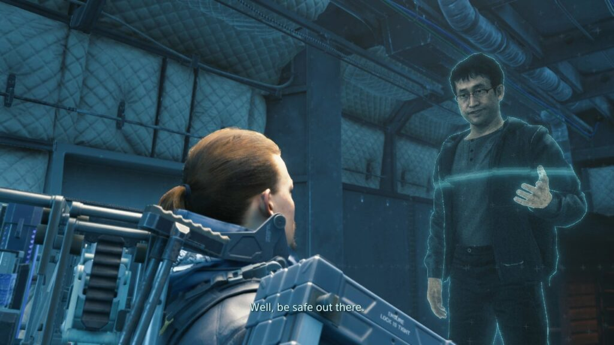
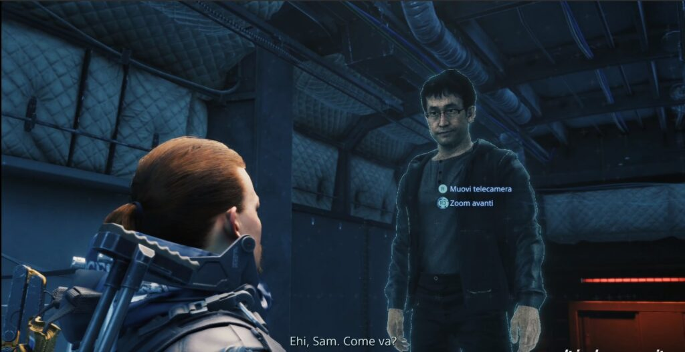
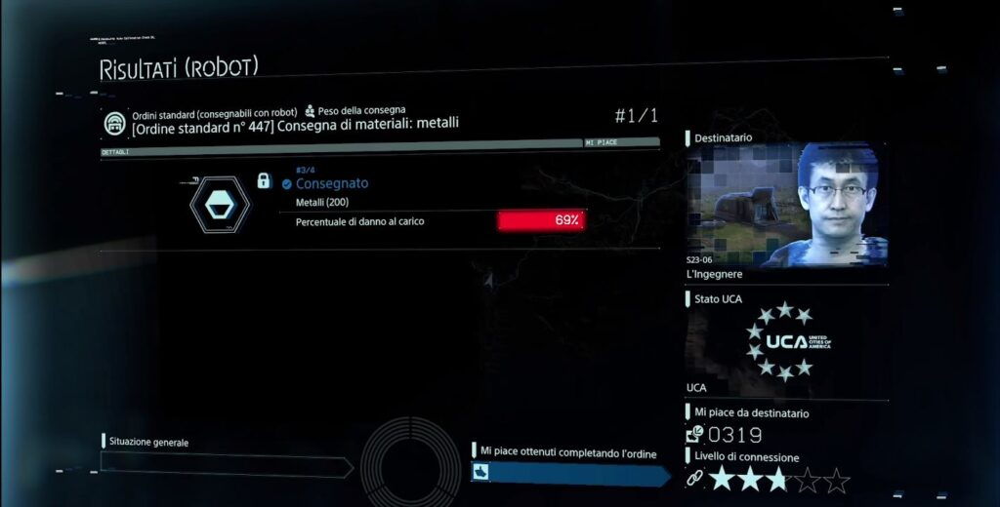

Death Stranding is easily one of the most hotly anticipated games of recent years. From the creative genius [Hideo Kojima](http://www.kojimaproductions.jp), this epic, world-traversing PS4 game is sure to push boundaries and impress in many ways.

What I discovered today, is that there could very well be a cameo by none other that Junji Ito himself. Ito had previously been working with Kojima on the now-cancelled [Silent Hills](https://en.wikipedia.org/wiki/Silent_Hills) project. (I still shed a tear at the mere thought of what that could have become). But it seems that they have remained in touch.

Here are the images I have found after somebody shared them on Facebook. I have yet to confirm these as being true, but I pray to the gods of horror that they are.

Check out [Death Stranding on the PlayStation Store](https://store.playstation.com/en-gb/product/EP9000-CUSA12607_00-00DSDLXPREORDPSN)!
