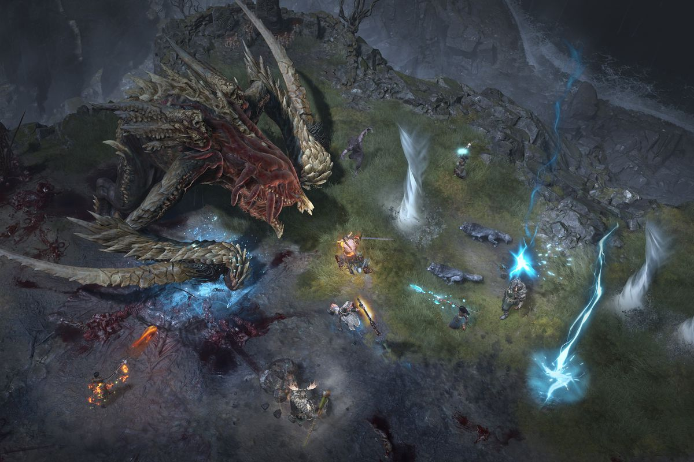

Diablo 4 gameplay preview

It looks as though Junji Ito's influence is being spread ever further, as described in [this article on VG247](https://www.vg247.com/2019/11/02/diablo-4-inspired-junji-ito-anime/). The upcoming game Diablo 4 seems to be taking some inspiration from the Horror Manga master: [https://www.vg247.com/2019/11/02/diablo-4-inspired-junji-ito-anime/](https://www.vg247.com/2019/11/02/diablo-4-inspired-junji-ito-anime/)

> Ito is a man who managed to make fish scary, creating a story where they’re being mind-controlled by a sentient bacteria. He also has a thing for triggering people’s trypophobia so expect some disgusting enemy designs in Diablo 4 to match that inspiration.
> 
> Diablo 4 inspired by Junji Ito Manga, by Kirk McKeand
