[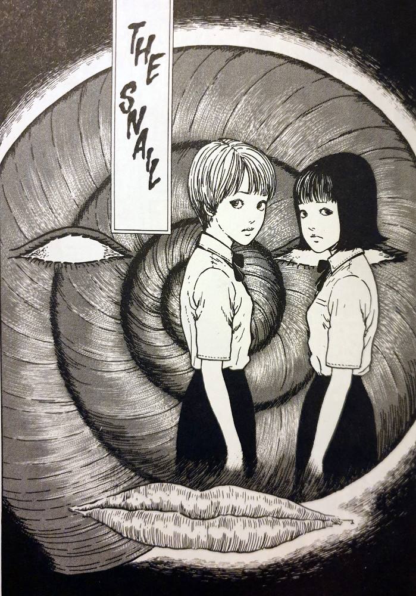](https://davidpeach.co.uk/wp-content/uploads/2023/03/The-Snail-Uzumaki-part-8-by-Junji-Ito.jpg)

> Get off my back! He's just a slug now! He's not human anymore!!
> 
> Tsumura justifies himself poking Katayama with a long stick

You can [buy Uzumaki here](https://amzn.to/2NClvXB).

## The Snail — Synopsis

Katayama is a bit of a joke amongst his classroom peers — one of which is [Uzumaki](https://junjiitomanga.com/tag/uzumaki/) main-stay, Kirie Goshima. One morning Kirie and her friend remark on how it is raining for the first time in a while, and that they predict that Katayama will come to school that day. Sure enough he walks in, late as always, and slowly takes his seat.

As each day passes, with the rain continuing, Katayama keeps arriving later. However, his appearance begins to change with each passing day. Firstly a spiral bulge becomes visible from underneath his wet school shirt. Until, by the end of the week, he has somehow managed to transform into a giant snail. Yep, the title of this chapter is very literal.

Just how will the other school students deal with this very odd turn of events? Will they attack or will they try to help? And what will happen once another one of those very students begins to display signs that they may be going down a similar path?

[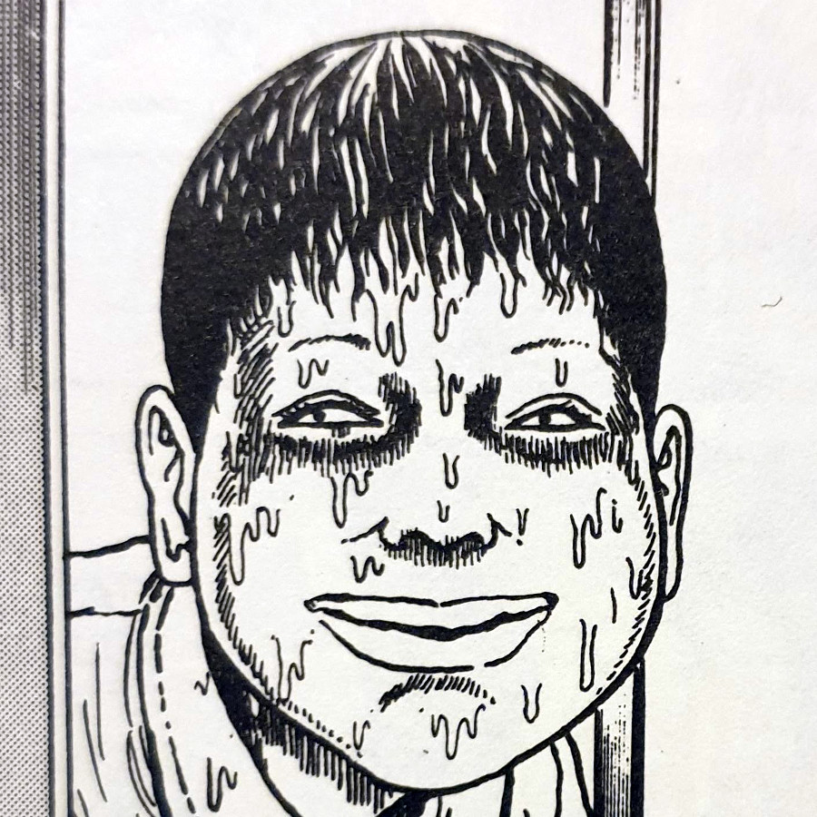](https://davidpeach.co.uk/wp-content/uploads/2023/03/Katayama.jpg)

Katayama

[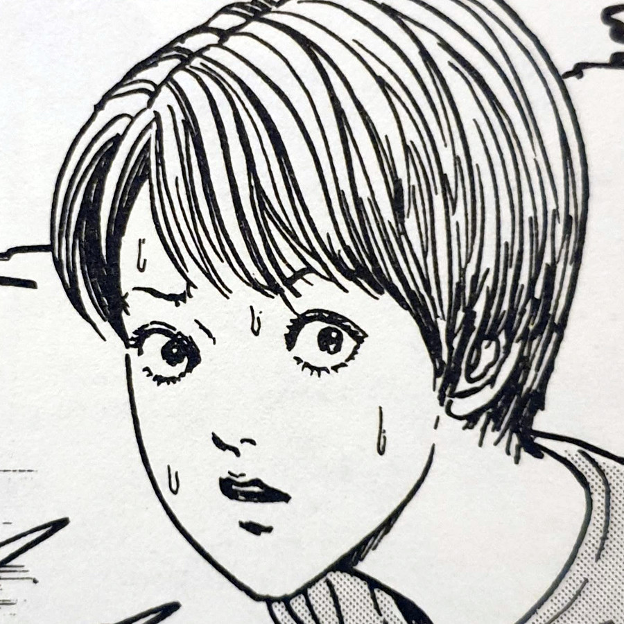](https://davidpeach.co.uk/wp-content/uploads/2023/03/Kirie.jpg)

Kirie

[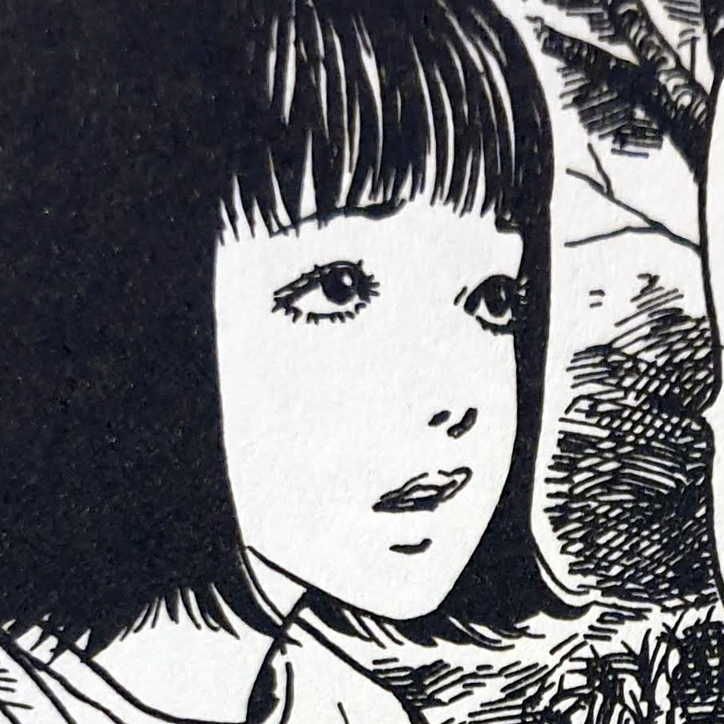](https://davidpeach.co.uk/wp-content/uploads/2023/03/Kiries-Friend.jpg)

Kirie's friend

[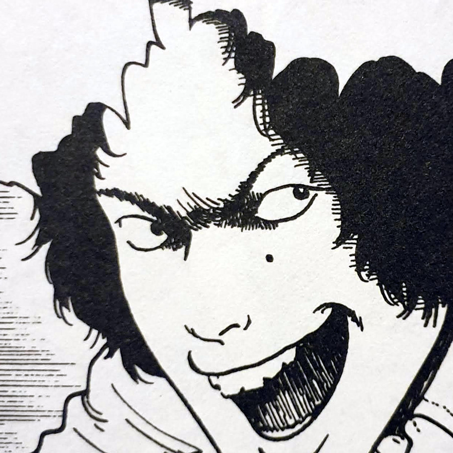](https://davidpeach.co.uk/wp-content/uploads/2023/03/Tsumura.jpg)

Tsumura

[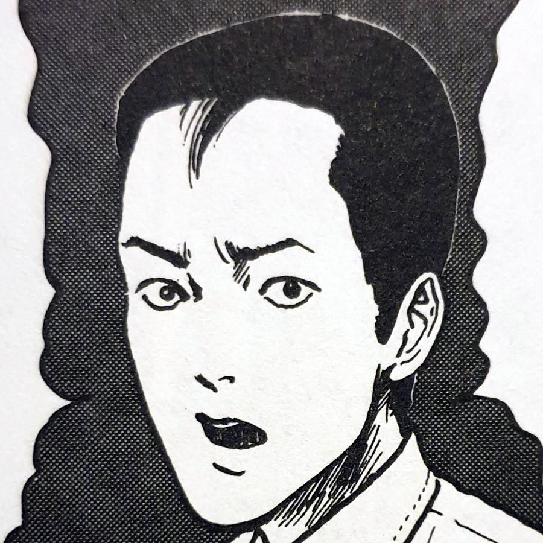](https://davidpeach.co.uk/wp-content/uploads/2023/03/Mr-Yokota.jpg)

Mr Yokota

## The Spiral Rises

There are two starting points for the spirals in Uzumaki, as I can see. The first is in spirals that already exist in the world. Like with small whirlpools in water, snail shells and in coiled springs. Then there have been the appearances of spirals that have seemingly come from nowhere. Like with [Kirie's hair problems](https://junjiitomanga.com/medusa-uzumaki-part-6/) and the girl with [the scar](https://junjiitomanga.com/the-scar-uzumaki-part-3/).

In The Snail, we see the latter — a large spiral mark on Katayama's back seems to point to the origin of his grotesque transformation. Once this mark is discovered, after Tsumura drags a naked and humiliated Katayama into the hallway, the transformation seems to speed up. Presumably, to get the reputation of being slow, it would have to have been a part of his personality for a while before this chapter begins. It's almost as if the spiral speeds up the transformation process once it is discovered.

There was one thing I noticed that I found very interesting to note too. Once Katayama turned, and was given sanctuary in the shelter on school grounds, Tsumura starts poking him with a stick. Soon afterwards he himself begins to show signs of slowing down. Then later on, when another character destroys the snail eggs left behind in the woods, they too seem to be targeted.

I wonder whether the spiral is completely self aware and is actually beginning to target these people out of malice or revenge. If so, it would indeed give some new angles from which to view other chapters in the Uzumaki collection.

[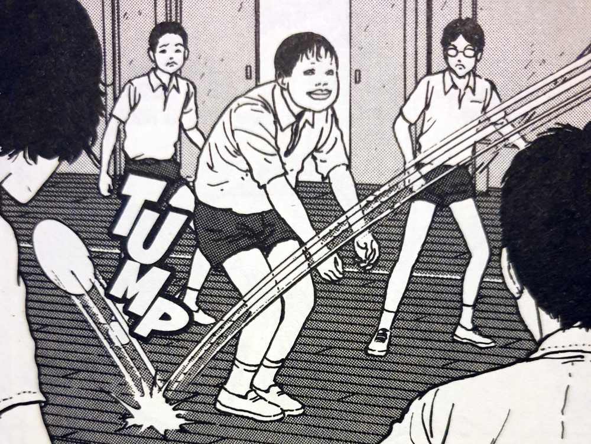](https://davidpeach.co.uk/wp-content/uploads/2023/03/Katayama-is-bad-at-sports-due-to-his-slowness.jpg)

Katayama is bad at sports due to his slowness

## Enter the grotesque

There haven't been too many moments in Uzumaki so far, where I have had to squint from disgust. Save perhaps for [when Shuichi's mother stabbed herself in her ears and cut her own finger tips off](https://junjiitomanga.com/the-spiral-obsession-part-2-uzumaki-part-2/). But with how Junji Ito manages to capture the depictions of human-sized snails, he almost got me wincing from the page.

Everything from the bumpy slimy textures of the bodies, to the bulging, elongated eye sockets. Even down to the way he shows Snail-Katayama peeling slowly off the school's outer wall as he is forced off by students with brooms. These Kafka-esque depictions of spiral-controlled snails display a horror manga artist at the top of his game.

There was another thing that I found worked at both the grotesque and the dark comedy levels too. The moment when both Katayama and Tsumura, both fully-transformed, are kept together in the pen. They soon begin to mate, as snails do, which brought a whole new layer to the story. Not only are these both young men at heart, or at least they were, they were also the complete opposite of friends. The idea that you have a bully and his victim now mating as human-sized snails, brings a whole new level of horror, and dare I say comedy, that only someone like Junji Ito could conjure up.

[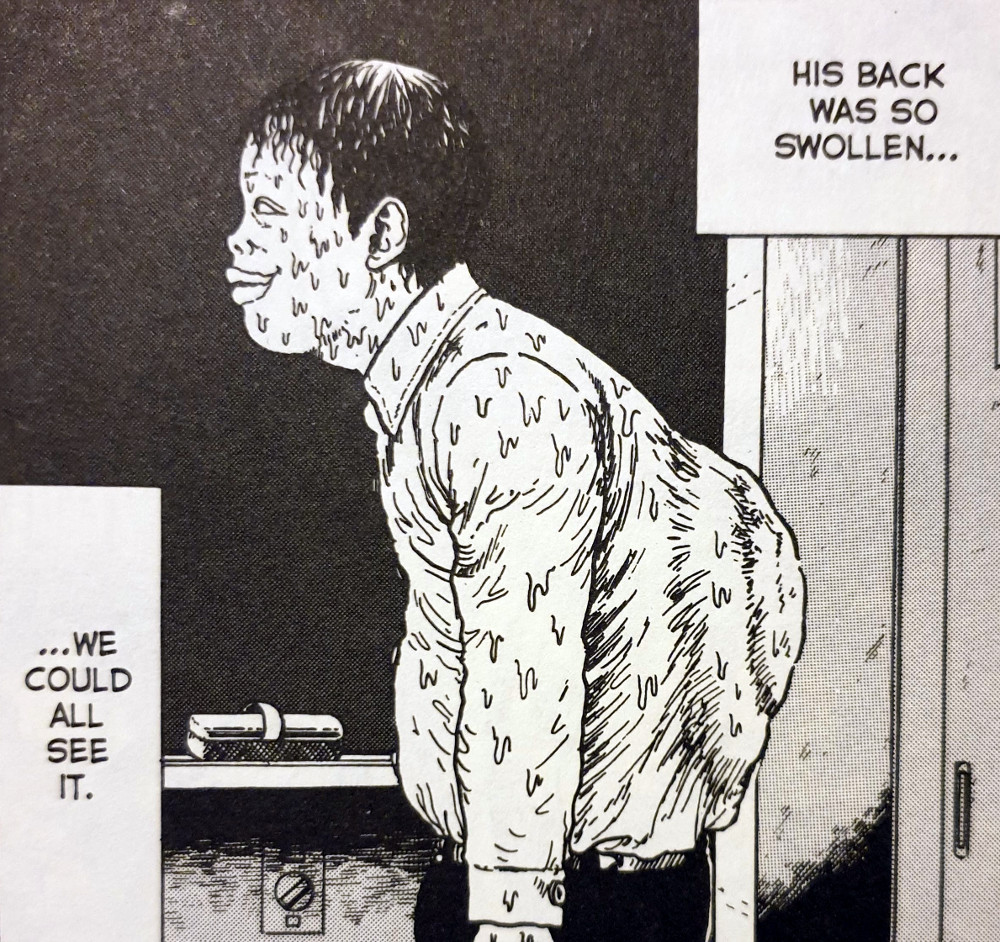](https://davidpeach.co.uk/wp-content/uploads/2023/03/Katayamas-back-becomes-swollen.jpg)

Katayama's back becomes swollen

[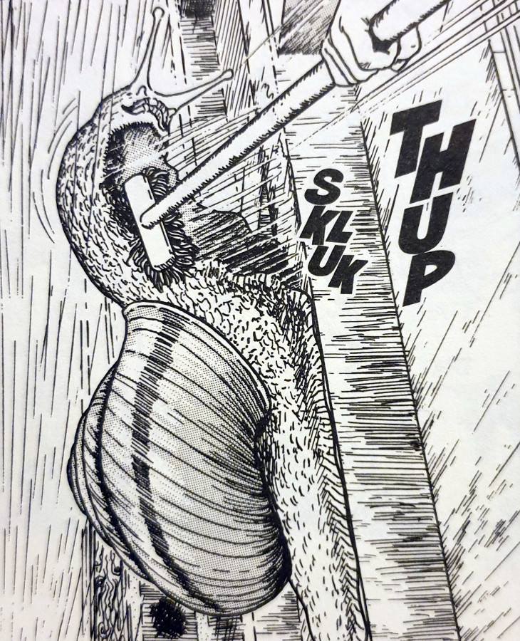](https://davidpeach.co.uk/wp-content/uploads/2023/03/Forcing-the-snail-off-the-school-wall.jpg)

Forcing the snail off the school wall

[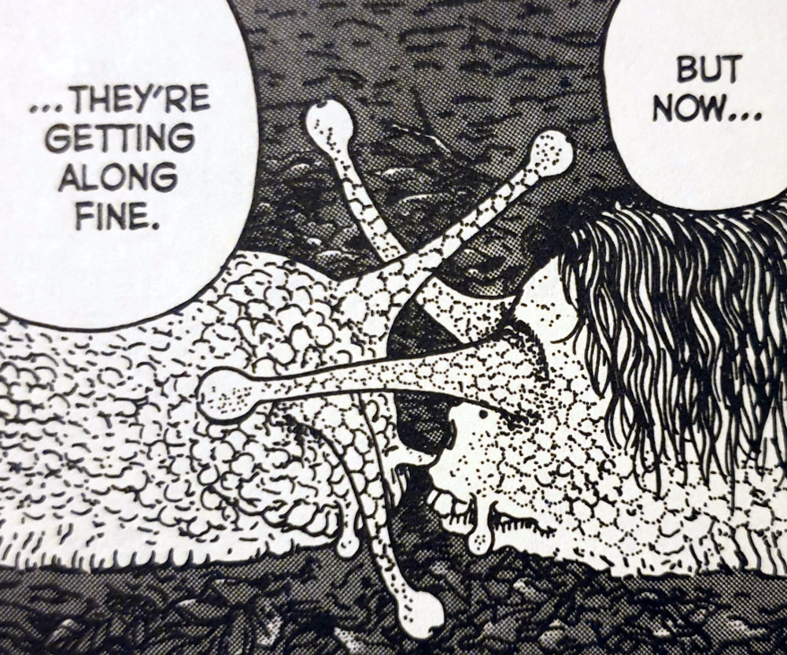](https://davidpeach.co.uk/wp-content/uploads/2023/03/Katayama-and-Tsumura-begin-mating-as-snails.jpg)

Katayama and Tsumura begin mating as snails

[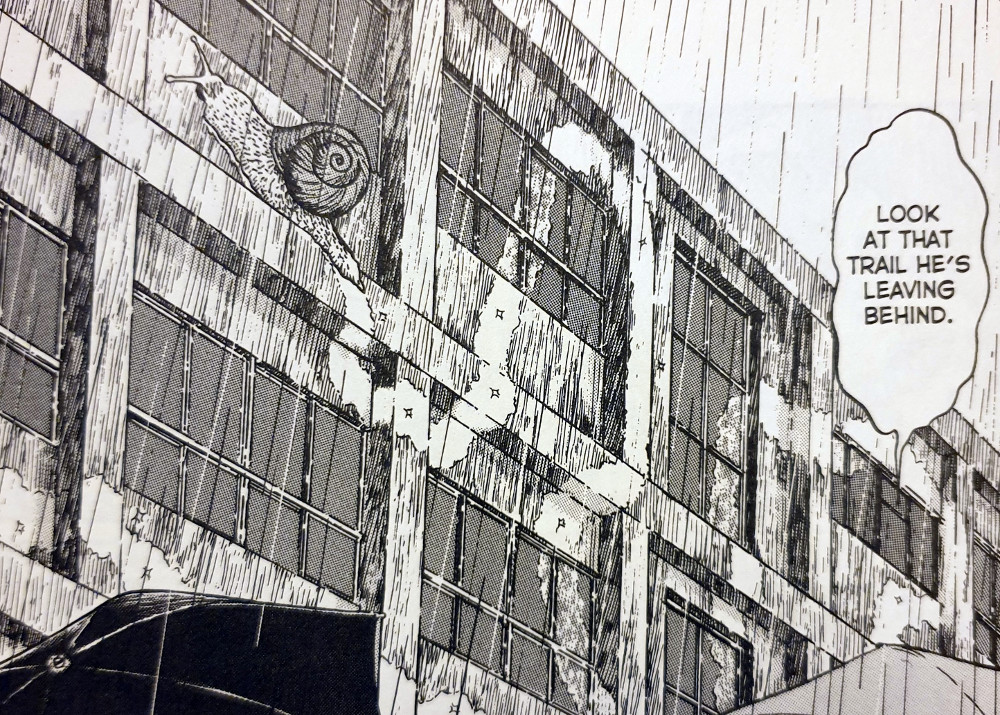](https://davidpeach.co.uk/wp-content/uploads/2023/03/Katayama-leaves-a-slime-trail.jpg)

Katayama leaves a slime trail

## In Conclusion

I feel like The Snail is more of a mid-level entry into the weirdness of Junji Ito's worlds. You are safe from the violence and body horror found elsewhere, however, instead you are treated to spine-tingling depictions of gross transformations.

I think it works really well as a standalone story too. The fact that Katayama is slow by reputation, means that the story doesn't need to rely on the surrounding spiral nightmares of the town of Kurouzu-cho. This could just as easily be a one-shot nightmare of Ito's.

If you are feeling particularly brave you could go in with reading The Snail first. It will give you some great examples of Ito's artwork and indeed his comedy-aware writing style. Or you could start at the beginning of the Uzumaki Collection and let this one sneak up on you slowly. Give it a read if you think you can stomach it.
