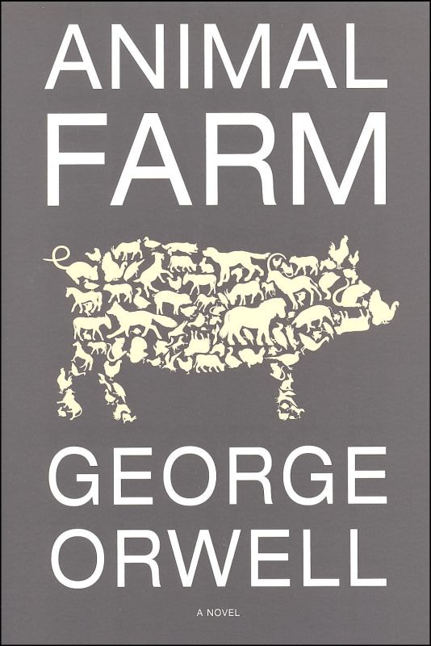
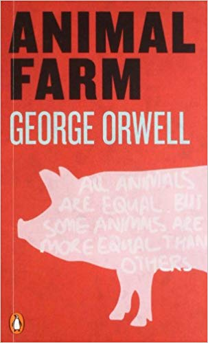
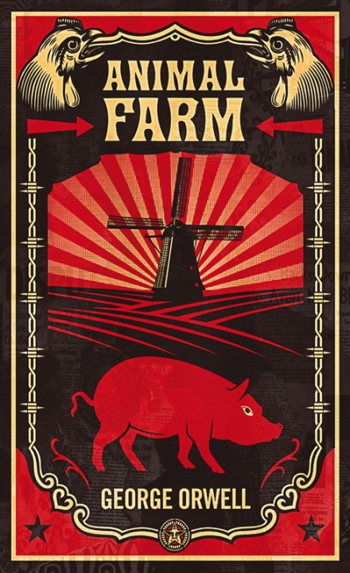
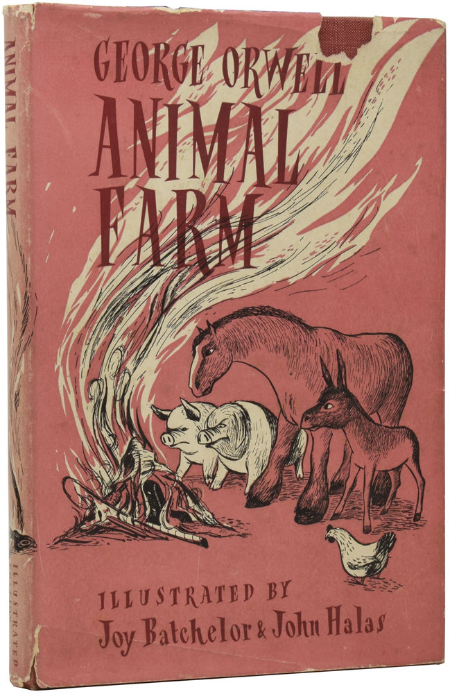
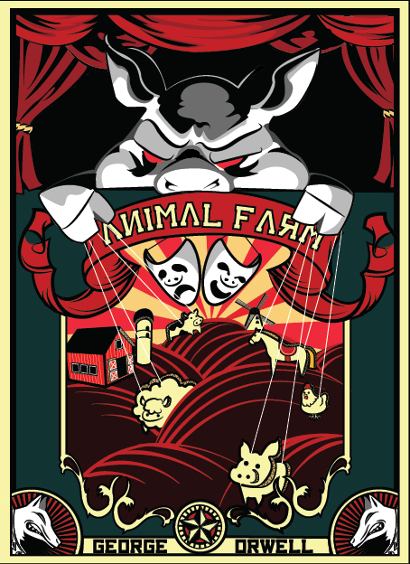
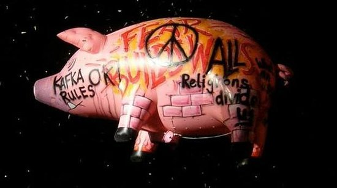

The story of Manor Farm and the animals who revolt after being inspired to fight for a better life. But those who assume command inevitably become the enemy of the society they are trying to create.

> All animals are equal. But some animals are more equal than others.
> 
> A single commandment

Animal Farm is a story that I was already aware of before reading — like many other people no doubt. I was aware of the rough idea of the animals taking over Manor Farm and eventually becoming a particular type of society. But even knowing this, I still enjoyed the book so much that I read it in two sittings pretty much.

The language of the book was pretty simple and to-the-point — language that is too fancy and, dare I say it, flamboyant, tends to throw me off the story sometimes. But yes, Animal Farm delivered it's message in a straight-forward and to-the-point way.

I'm not sure if it was Orwell's intention, or whether it was just my imagination working over it, but my internal pictures of the farm become more and more lacking in colour as it moved towards its conclusion. I pictured the farm and it's inhabitants in a darkened black and white as they toiled over their labours towards the end.

The pigs in the manor house, however, I pictured in full colour as the other animals watched on on that final scene from the window.

I found some similar themes as I remember from Nineteen Eighty Four too. Namely the idea of rewriting history to suit the narrative being created by the ruling class. And then those under the boot just believe that they themselves must have been mistaken when originally reading their seven commandments.

I knew that there was a reason this book was regarded as a classic. Now I understand why.

## Other book covers

Here's a collection of cool covers for Animal Farm that I've found. These could get added to over time if I stumble over some more.

## Pink Floyd's Animals

Animals by Pink Floyd is one of my favourite albums ever made. Definitely in my top 10. Until I read Animal Farm I hadn't made the connection between it and that album. I mean how could I miss out on the giant inflatable pig and not link that with the pig in power from the book?

Roger Waters inflatable pig

Roger Waters, in his recent tours with his own solo band, has kept the spirit of this pig alive with warnings and messages to the people watching. Messages such as "**Fear Builds Walls**" and "**Religions Divide Us**". Roger is one of my favourite artists from both his Pink Floyd-penned albums and his excellent solo material. I must write up my thoughts on his stuff soon.

There is a decent [article here that discusses some of the similar themes between the album and the book](http://www.openculture.com/2017/04/pink-floyd-adapts-orwells-animal-farm-into-its-1977-concept-album-animals.html). It is written better that I could attempt right now.
