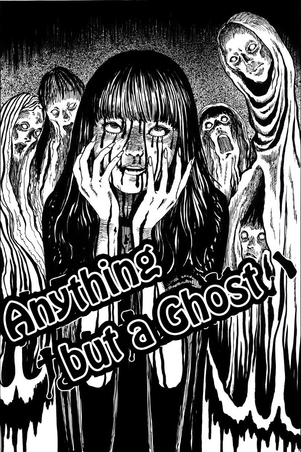

> She died giving birth to me. When I came out, she was already a ghost. But she still cared about me. Even after that, she would come to breastfeed me.
> 
> Misaki tells Shigeru about her twisted past.

## Anything but a Ghost — synopsis

Whilst driving through a mountain area, Shigeru finds a woman stood at the roadside with her back to the road. On leaving his car and walking up to her, he sees that she seems completely stunned whilst being covered in blood. Without hesitation, he drives her to the nearest hospital to get her checked out. As it turns out, the blood is not hers and she isn't even injured in the slightest.

After some time has past, Shigeru and his wife are going about their lives — they even have a child on the way. Then out of nowhere there is a knock at the door. On opening it, Shigeru sees a beautiful young woman standing there, but fails to recognise her straight away. She introduces herself as the woman he helped by the roadside that day, and tells him her name is Misaki.

But it seems that she is to have a negative impact on his life. Her and Shigeru begin seeing each other in secret and soon reveals a strange, twisted secret about herself — one that he simply doesn't believe. However, as the closing pages of this manga reveal themselves, not only does her secret show itself to be true, but things also get a whole lot stranger and a lot more darker.

Shigeru

Yuina

Misaki

Characters from Anything but a Ghost

## A twist on the ghost story

Anything but a Ghost is a ghost story where the ghosts are not the ones to be feared. Misaki is a young woman who seems to be somewhere between that of a ghost and that of a human. And even though she is drawn as a very innocent and delicate looking woman, she always has an air of creepiness to her. This is helped largely due to how she is introduced to us. We know something is not quite right — we just don't know what it is at this point.

When she mentions that she can see Shigeru's ghosts following him, I immediately thought of them as malevolent things. I was sure these ghosts she talked about would be grotesque monsters that live in the next plain of existence, just waiting to come through. But the truth is far more sinister than that.

I always enjoy how [Junji Ito](https://junjiitomanga.com/) seems to be able to take our preconceived ideas of what typical sorts of horror stories are, and turns them on their head.

Misaki shows her true self

## Strange food cravings

In horror fiction, I think we are used to seeing monsters that prey upon the weak before eating them. Whether that be vampires, werewolves, other-worldly beasts or even cannibals. But this is the first time, as is a lot of the times reading Junji Ito's work, that I have seen the idea of eating one's victims in quite this way.

The very idea of having a person who feeds on ghosts is an incredibly inventive one and, dare I say it, genius in it's own way. But it doesn't just end there. I absolutely loved how, when Misaki would bite down into her ethereal feast, somehow blood would spill out and cover her face. It's almost like she is able to pull the ghosts of those who have passed, into our world, if only for a moment — for one last taste of pain and suffering. As if death wasn't enough.

And without giving too much away, the visions that Junji Ito was able to put into my mind, purely by suggestion, were pretty horrific. When she bites into what she eats towards the end, I could see every single blood-curdling inch of it, yet Ito drew none of it. He is truly a master of not only his own imagination, but of toying with his readers' imaginations too.

Shigeru finds the blood covered woman beside the road

Shigeru starts seeing Misaki in secret

What is Misaki eating?

## In Conclusion

This is an excellent stand-alone story from Junji Ito that is as unsettling as it is inventive. What was perhaps most noteworthy for me, was how it is completely grotesque — especially with what she eats towards the end — but without you actually seeing the action itself. Kind of like how Quentin Tarantino was able to gross out early 90's audiences with his famous ear-cutting scene in [Reservoir Dogs](https://en.wikipedia.org/wiki/Reservoir_Dogs). Despite never even seeing the cut.

You never actually see her biting into any pound of flesh. But the result is no less effective. If anything it's perhaps more so.

I would highly recommend this as a first read from Junji Ito's catalogue of work. It is readable out in public without attracting people's concerned stares, with no real displays of gore and flesh. However, it will perhaps leave you feeling like you have seen as much.

Anything But A Ghost is anything but a standard ghost story.

_You can [read Anything but a Ghost here](https://kissmanga.com/Manga/Shin-Yami-no-Koe-Kaidan/Vol-001-Ch-004--Anything-but-a-Ghost?id=103564). (**Please support Junji Ito** by buying his manga in your own language where available)_
