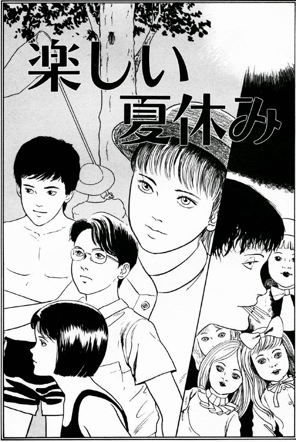
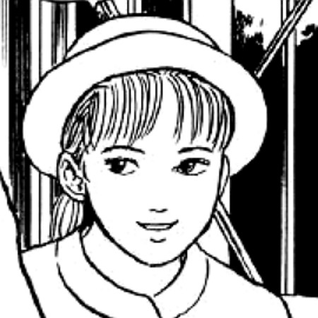
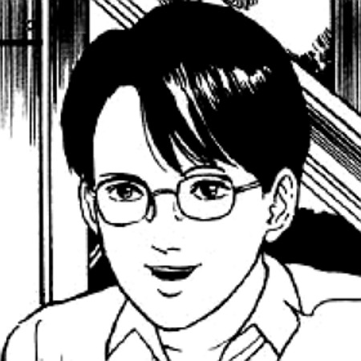
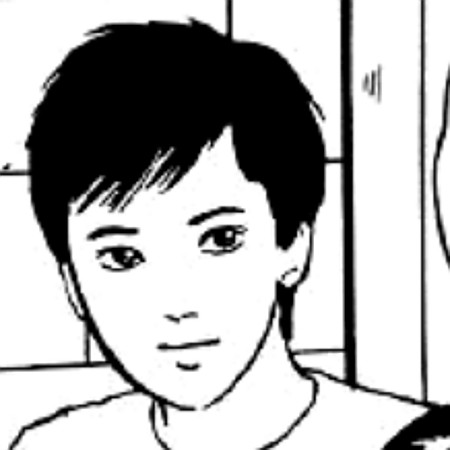
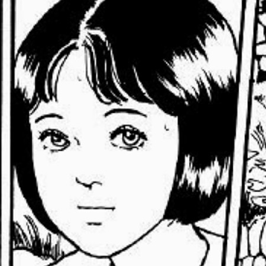
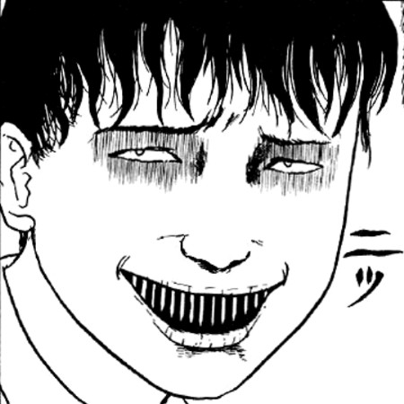
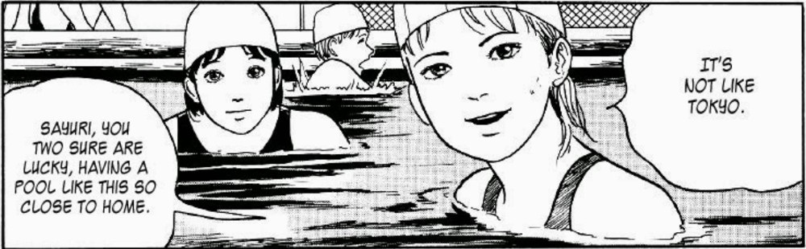
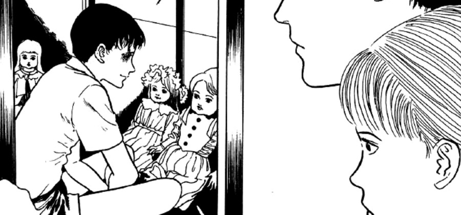
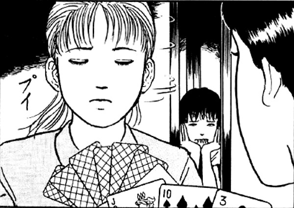
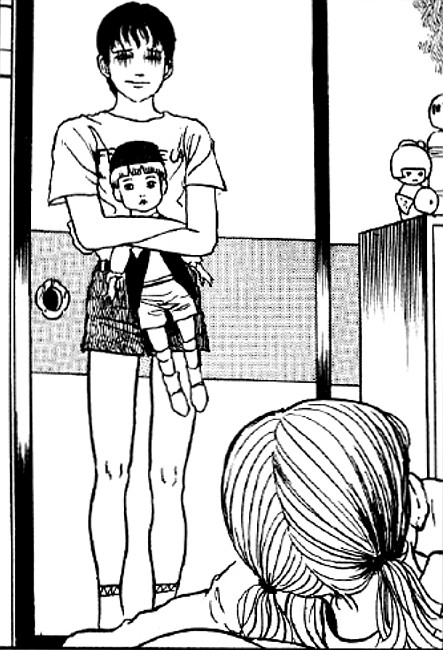

> On nights like this, I go out onto the streets, and suck blood out from women's jugular veins.
> 
> Souichi displaying some of his madness to Michina

## Fun Summer Vacation — Synopsis

Yuusuke and Michina have travelled on the train to see some relatives of theirs. These relatives are six people who live in the same home. The Mother; Father; Grandfather; two sons and the daughter. Most of the family are very warm and welcoming to the visiting brother and sister. However, they soon get to meet their reclusive, and ever-so-slightly evil, younger son — Souichi.

The very first thing that we see of Souichi, is him spitting a small metal nail at the visitors. This is as they try to take him some food up to his room. You see, by this time they had yet to meet him and so they are trying to say hello to him. Souichi's first response is to be hostile towards them.

As their family holiday passes each day, Souichi displays more strange behaviours — sinister laughs; curses on the family; attacks with deadly nails. With his hostility specifically targeted towards his visiting cousins. But how far will Souichi go to make his presence known to them, despite being so introverted?

Michina

Yuusuke

Kouichi

Sayuri

Souichi

Characters from Fun Summer Vacation

## Introduction to Souichi

When I had previously thought about Souichi, I had only remembered him from the manga "Souichi's Selfish Curse". I think that is the most popular Souichi story, possibly due to it being an early episode in the Junji Ito Anime Collection. But I was surprised, and happy, to learn that there are in fact a whole bunch of manga stories involving the evil-doing, twisted young boy.

What is perhaps interesting too, is that he isn't really the central character of this particular manga — Fun Summer Vacation. He is just the strange young son who seems to haunt his family from the shadows. Driven by some strange internal need to punish and hurt those around him.

He is seen skulking about in his room, sucking on old nails and trying to curse people with his doll replicas of them. He isn't the most likeable of Junji Ito's characters but I would be lying if I said that I didn't have a small piece of my heart set aside for this boy-terror.

## Does he just need some love?

His actions towards Michina, although twisted and selfish, opened up a crack in his evil facade for me. I couldn't help but feel that he was trying to curse her simply to get her to stay back at the family home with him. That way they could remain together, while the others went out to the swimming pool again. Maybe he was lonely after all and felt that he could only really connect with _her_. Perhaps he was even in love with Michina in some twisted sort of way?

Despite his appearance of hostility, maybe Souichi is just a little boy lost? His mother seems to enable some of his behaviour by taking his meals to his room, and allowing him to stay locked away. His father doesn't really seem to do much by the way of discipline either. And his older brother seems to just wish that Souichi was something that he isn't. Perhaps if the parents had set similar boundaries and punishments as they presumably had for the eldest two siblings, maybe he wouldn't be acting out in this way?

Or maybe Souichi is just a little evil-incarnate brat who simply loves to see people in pain. Whatever it is that drives him, I can't help but feel that there is more below his diabolical surface than meets the eye.

Yuusuke and Michina find Souichi talking to his dolls

The family play cards whilst Souichi hides in the shadows

Souichi comes to Michina when they are alone in the home

## In Conclusion

I really want to say that I loved this story, but in all honesty it isn't too high on my list of favourites. Now don't get me wrong, this is still a good manga to read - especially as it is the first appearance (I believe) of the now-famous character of Souichi. However, I can't recommend it over more memorable stories such as [Flesh Colored Horror](https://junjiitomanga.com/flesh-colored-horror/) or [Army of One](https://junjiitomanga.com/army-of-one/).

But despite the story not being one that particular drew me in too much, Souichi is definitely a favourite character of mine. Even if I've only seen him in three stories (including this one) at the time of writing this post. I trust Junji Ito enough to believe that he can take Souichi into some pretty dark and even comedic places before reaching the end of the crazy boy's story.

I'm looking forward to further exploring the world of Souichi, his curses, and just how those around him manage to survive.
