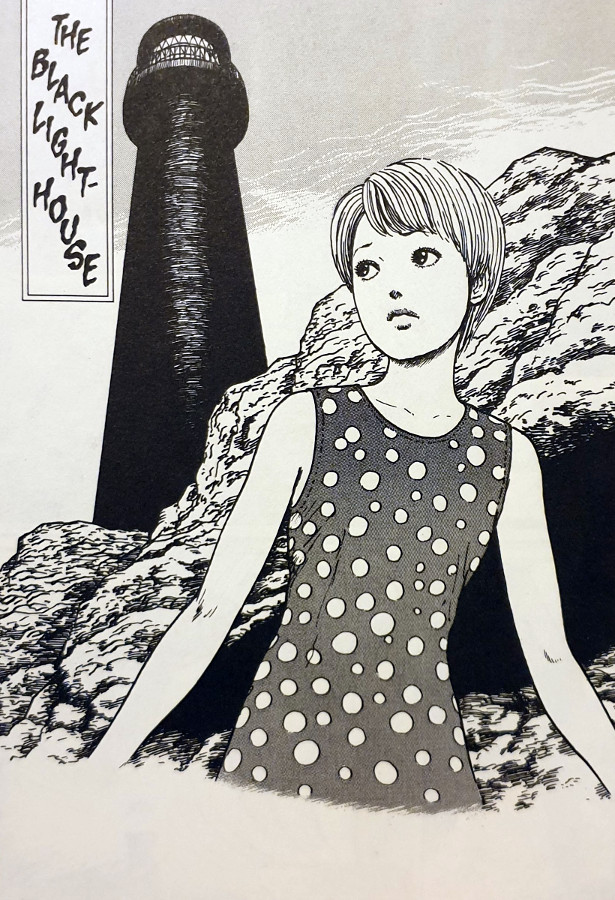

> As I walked further... spiral patterns appeared on the walls and ceiling. They glowed eerily in the dark.
> 
> Kirie describes her journey up the steps of The Black Lighthouse

## The Black Lighthouse — synopsis

After sitting abandoned for quite some time, the lighthouse on the coast of Kurouzu-cho suddenly springs to life. At dusk, it begins shining out a powerful swirling beam all around through the night. This beam begins to mesmerise the townspeople more and more as the time goes on.

People can be seen in the streets running in circles as if possessed by the same spiral evil that now haunts the lighthouse. After some of these strange happenings some of the men in the town decide to head inside the lighthouse to get to the bottom of the mystery.

After the men have gone missing inside for some time, Kirie spots her younger brother with his friends heading towards what is known as The Black Lighthouse. Although she warns him, her brother runs inside with his three friends. Of course, she has no option but to run after them, which she does with gusto.

The further that Kirie climbs up the lighthouse steps, the stranger the place becomes. Patterns on the walls that give off a weird glow, lighting her way; the feeling of lost time and disorientation; and an horrific discovery that she finds towards the top.

As dusk approaches and Kirie still searches for her brother and his friends, what awaits them all in the Black Lighthouse's top floor? And just what gruesome discoveries will they all find?

Kirie Goshima

Mitsuo

## The Spiral Light

This is perhaps the furthest reach that the spiral has had over the town up until now. From its smaller beginnings of affecting individual people and their family's lives, to the larger moments within Kurouzu-cho school — [The Snail](https://junjiitomanga.com/the-snail-uzumaki-part-8/) and [Medusa](https://junjiitomanga.com/medusa-uzumaki-part-6/), specifically. But never before has the spiral been so bold as to cast itself over the entire town at once.

The light stretches out over the town leaving no-one and nothing outside of its gaze. Even the light rays themselves seem to be beamed out in a spiral fashion. I also found that it reminded me of the Great Eye from [Lord of the Rings](https://en.wikipedia.org/wiki/The_Lord_of_the_Rings). I wonder if that was an inspiration for [Junji Ito](https://junjiitomanga.com) in this chapter? In fact, when Kirie arrives at the tower's top floor, she is greeted by the melted lens of the lighthouse's light source — melted into a spiral-shaped eye!

And just as the Great Eye had it's vision set across all of Middle-Earth, so too does the spiral have its gaze across all that _it_ sees. Even a small boat nearing the town's coastline is pulled in and run aground. There is quite literally nowhere to hide from this town's curse of [Uzumaki](https://junjiitomanga.com/tag/uzumaki/).

People of Kurozu cho staring at the light

## Claustrophobia

Despite the fact that the nature of this aspect of Uzumaki covers the widest amount of space, it also causes some interesting claustrophobic affects on the characters.

Although the power of the black lighthouse stretches out across the entire town and out to sea, the wider investigation of its power is done within its very narrow stairwell that seems to make those who ascend lose their sense of time. We see first-hand with Kirie the almost-dizzying effect this spiral staircase has on her, and the spiral patterns that emerge on the walls as she climbs higher. Uzumaki is literally closing in on her.

The real pay off in this chapter though, comes when Kirie discovers the burnt bodies of the men that went in some time before her. Beside which she finds two of her brother's friends sat shaking in fear.

## Spirals and charred remains

I advise you to really take the time to look over the depiction of those men's remains too, as morbid as that sounds. Junji Ito's detail of how he shows those men's remains are impressive images to behold. He has painstakingly drawn in levels of details that lesser artists would have perhaps left out. Every crease and piece of charred flesh is accounted for.

And when I was taking the time to really focus in on those panels inside the stairwell, I then started to really notice the spiral patterns on the walls. Made up of hundreds of tiny little dots throughout every hallway depicted. A real inspiration and an insight into his patience and his craft.

The Black Lighthouse on the rocks

People start to behave very strangely

Kirie investigates the Black Lighthouse

## In Conclusion

The Black Lighthouse is not my favourite of the Uzumaki collection, but it does however contain some of my favourite images from it. Namely the ones mentioned above with the fire-eaten remains of the men who went to investigate the lighthouse. As well as the spiral eye in the lighthouse's lens remains.

I also felt this had a very interesting part towards the end, when Kirie comes face to face with the town's curse. Although not the centre of the spiral madness (that comes later on in the collection), with the lighthouse's lens melted into a strange swirling eye, Kirie is able to look straight into it. Perhaps somehow into the heart of the spiral itself?

I probably wouldn't advise this being read out of the context of the collection, simply because I didn't really feel it was able to stand apart from the greater cursed narrative that runs through it. As a part of the greater series arc it works really well and shows how the spiral is making itself more and more noticeable. However, it doesn't stand as well on its own feet as perhaps chapters like [Jack In The Box](https://junjiitomanga.com/jack-in-the-box-uzumaki-part-7/) and [The Scar](https://junjiitomanga.com/the-scar-uzumaki-part-3/) do.
