[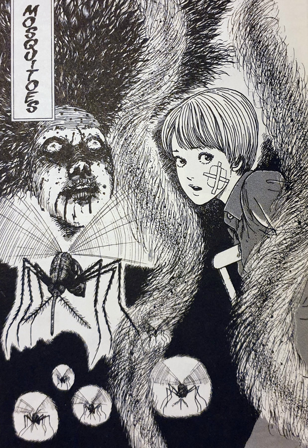](images/Mosquitoes-Uzumaki-part-10.jpg)

> They needed raw blood for their babies!
> 
> Kirie must survive a blood-soaked nightmare

It is Summer time in Kurouzu-cho and Kirie Goshima is in hospital. She is still being treated for the wounds that she incurred when she and her brother escaped from the [Black Lighthouse](https://junjiitomanga.com/the-black-lighthouse-uzumaki-part-9/) in the previous chapter. But what is not helping her heal, is the number of mosquitoes that have increased in numbers recently.

In fact, during a quick walk around the outside of the hospital Kirie and her friend notice a huge, thick collection of mosquitoes all buzzing around in a tight circular motion. Her friend tells her about how this is called a "Mosquito Column", and occurs when all of the males get together to try and attract a mate. But within seconds of them seeing the column, things go from curious to horrific very quickly.

Kirie and her friend discover the body of a pregnant woman in the hospital grounds, with a face contorted into a look of pain and a body mutilated and full of holes. Soon after, more and more pregnant women get admitted to the hospital, as a result of mosquito swarm attacks. One of which is Kirie's cousin Keiko.

As the story moves forward, more strange and horrific things begin to occur within the walls of the hospital. But what will Kirie and her Keiko do when they find themselves at the centre of a hellish nightmare?

[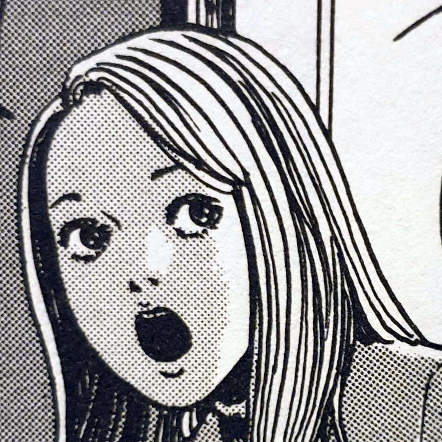](images/Kirie-Goshima1.jpg)

Kirie

[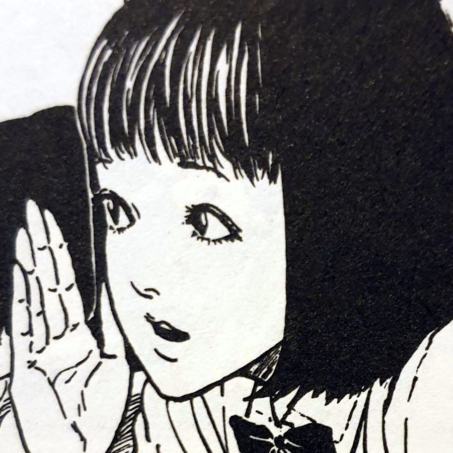](images/Kiries-friend.jpg)

Kirie's Friend

[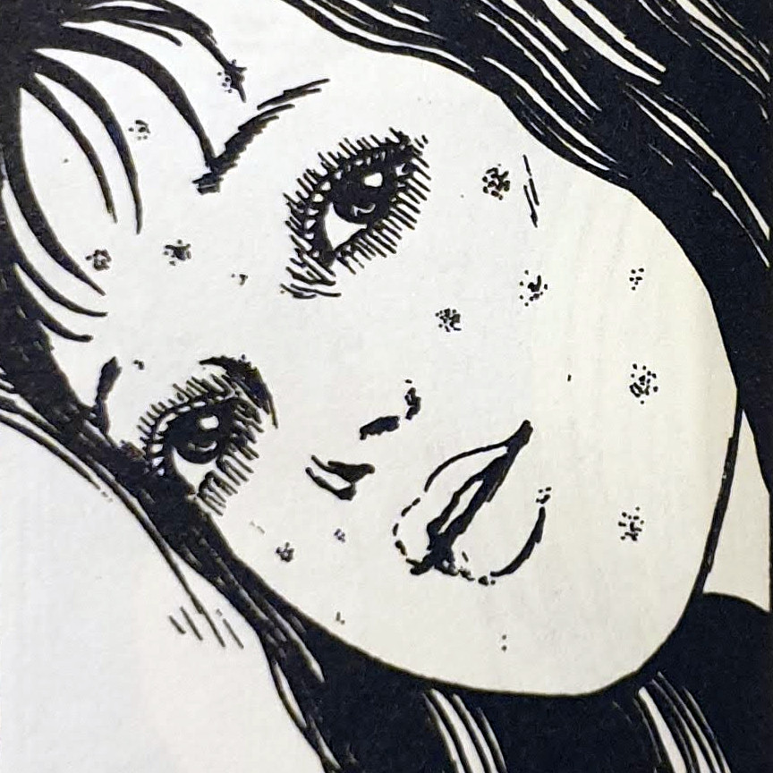](images/Keiko.jpg)

Keiko

[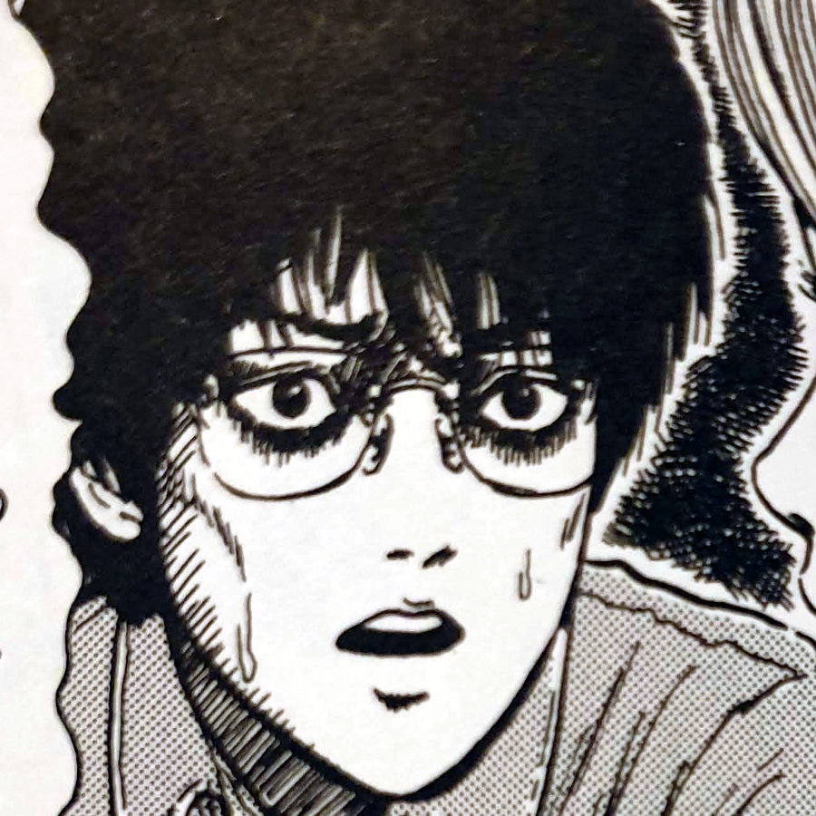](images/Shuichi1.jpg)

Shuichi

## Vampyric tendencies

Vampires are a staple of horror and have been so for over a hundred years - arguably starting with the [Bram Stoker novel Dracula](https://en.wikipedia.org/wiki/Dracula). Many modern-day horror stories that tackle the idea of the vampire lean very heavily on the story of Dracula too. Especially with both his strengths and his weaknesses. But what I loved about Mosquitoes by Junji Ito, was how he has managed to create his own vampire-like story with absolutely no mention of vampires.

The blood sucking women throughout the second half of the story are not controlled by some greater being that has sired them. Except, of course, if you consider the spiral at the centre of all things in Kurouzu-cho to be the controller. Instead, these women have simply taken on the attributes of the mosquitoes.

And that is the stroke of genius that sits at the heart of this chapter: "What if people took on the same behaviours as mosquitoes?". And in Junji Ito's own unique way, he has explored that question with gusto. Here you have pregnant women drilling holes in people to drink their blood, in order to feed the unborn babies inside of them.

[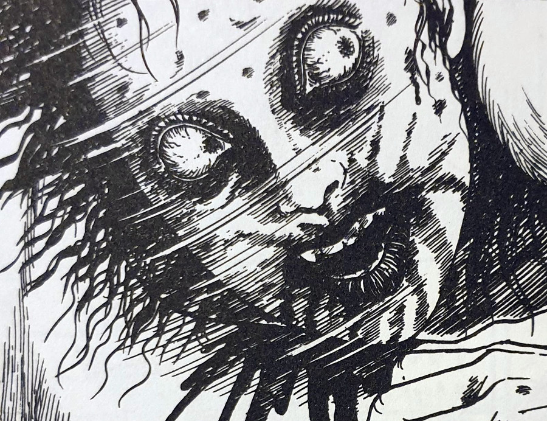](images/The-women-are-demonic-looking.jpg)

The women are demonic looking

## Gripping and Horrific

Mosquitoes packs so much into its thirty or so pages that I couldn't help but feel wiped out by the end of it. This is possibly the most horrific night that Kirie has had so far in [Uzumaki](https://junjiitomanga.com/tag/uzumaki/). Taking the deceptively simple premise of "what if people started becoming like mosquitoes" opened up a whole load of horror possibilities.

As mentioned above, the similarities with vampires was a comparison that I couldn't help but make. But so too there are similarities with zombie films. There is one panel in particular where Kirie steps out to investigate a strange noise that she hears in the corridors. That investigation takes her straight towards a group of demonic-looking women all after one thing — blood.

Despite them being mindful of what they are doing and how they are doing it, the horde of evil ladies drew big parallels with scenes I'd seen from zombie films. Such as the group pursuing as one demonic pack; the people who come out to investigate and get caught and devoured. But perhaps my favourite part was when Kirie manages to escape the horde and lock herself back in her own room, only to be locked inside with something already lurking in there.

[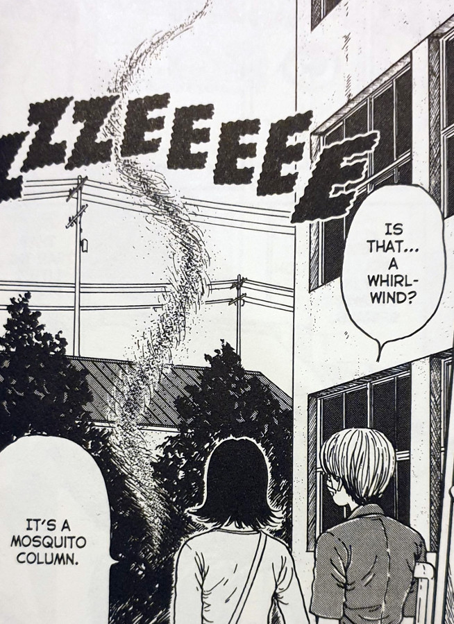](images/Kirie-and-her-friend-find-a-mosquito-column.jpg)

[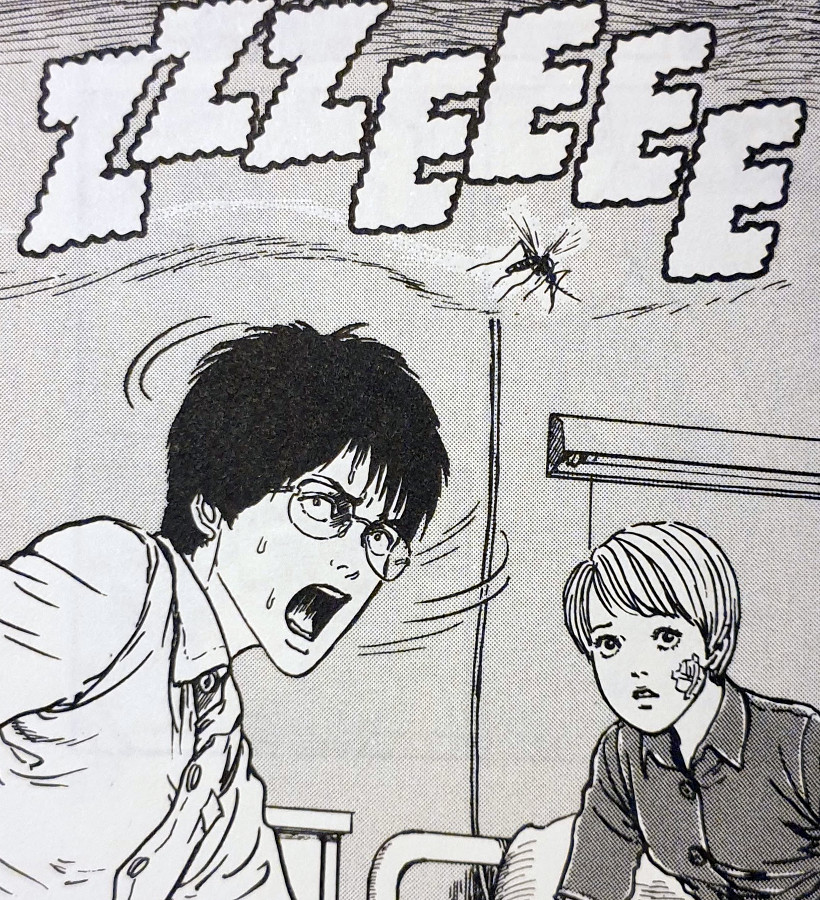](images/Shuichi-comes-to-visit.jpg)

[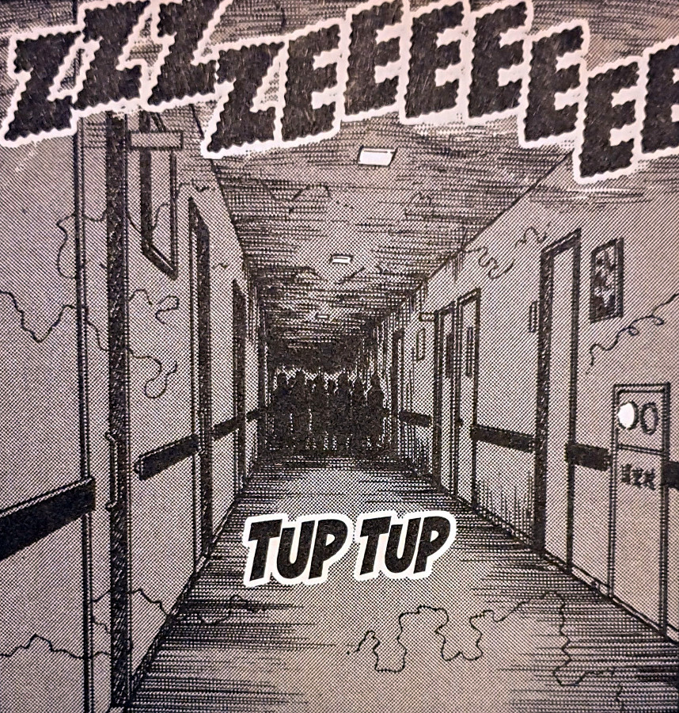](images/The-shadowy-group-in-the-hospital.jpg)

[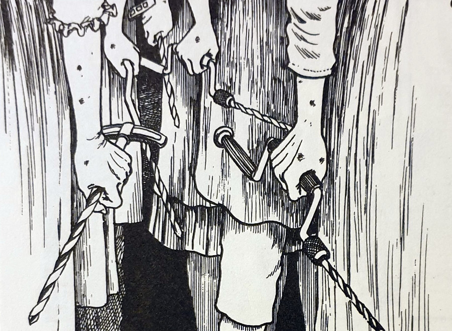](images/The-women-carry-strange-tools-with-them.jpg)

[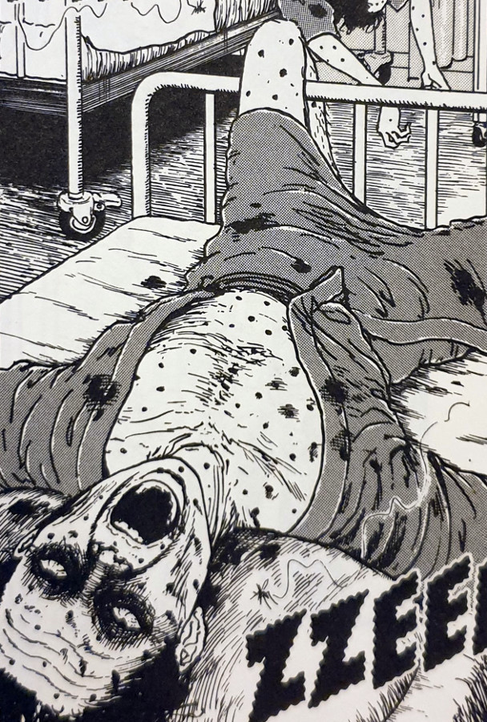](images/Mosquito-bites-found-on-the-victims.jpg)

## In Conclusion

Without a doubt, Mosquitoes is one of my top three favourite Uzumaki chapters. I'm not quite sure if it's my absolute number one yet. But I think it'll be a close one.

What's great too, is that this story works great as it's own standalone tale, separate from the surrounding story of the spiral nightmare. Junji Ito's genius is on full show here with his gruesome depictions of blood-thirsty women being like mosquitoes. But instead of them just being pests as their tiny counterparts tend to be, these women are wild-eyed, demonic animals. And they will kill on site anyone who crosses their path.

Despite this being able to stand on it's own story merits, it is actually followed on directly by the next chapter, "Umbilical Cord". I can't remember the story itself, having only just read the next chapter's title. But seeing as it deals with the babies that came as a result of that evil night, it definitely feels like it will be just as crazier — perhaps more so.

If you're looking for a reason to start reading Uzumaki, or even just Junji Ito in general, please do give this one a read. You could even go to your local bookshop that has it in stock, and jump straight to page 299. I guarantee you will at least enjoy the experience. But you'll more likely than not end up buying the collection then and there.
