> What have you done to it?! What have you done to its eyes?!
> 
> Rosemary Woodhouse

## A Horror Classic

Rosemary's Baby is one of those classic horror films that I have known about for years, yet never got round to watching it. But I decided it was time to sit down and finally watch it — and I was so glad I did.

I can't offer any in-depth analysis or deeply philosophical film essays on this, or any other films I watch to be honest. What I will do though, is give my thoughts and feelings about it.

From it's opening shot across Manhattan, **this film felt very much like a Hitchcock film to me**. Which was an instant hit for me. However, this isn't a Hitchcock film - it was in fact made by Roman Polanski. In fact, it was the first film of Polanski's that I have seen, that I remember.

[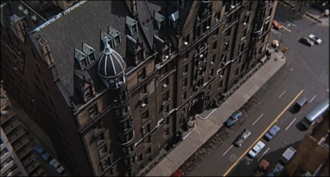](images/Appartment-building-from-Rosemarys-Baby.jpg)

## Sustained terror and paranoia

I absolutely loved the feeling of sustained terror throughout most of the piece. It has been referred to as a "horror film that contains no horror", although I would argue that **the scenes depicted in Rosemary's "nightmare" on baby night got pretty bloody scary**. The images in that nightmare brought up the thought of witches in my mind. And there's something about witches in older cinema that just creeps me out — even the film version of _Roald Dahl's_ "The Witches" still haunts me to this day.

But for most of the film, the kind of horror that it uses is that of paranoia. The paranoia that builds up in Rosemary as the baby gets closer and closer to it's due date, and the paranoia I felt towards the excellent cast that surround the actress playing Rosemary, Mia Farrow.

Even in their very first scenes, I could tell that certain characters were dodgy. But I'm not sure whether that is because I am watching it 52 years after it's release - with, no doubt, many known films I _had_ seen having being inspired by it.

Ruth Gordon and Sidney Blackmer were great as Minnie and Roman Castevet. They have a certain friendliness and over-familiarity that I couldn't help get the heeby jeebies from.

[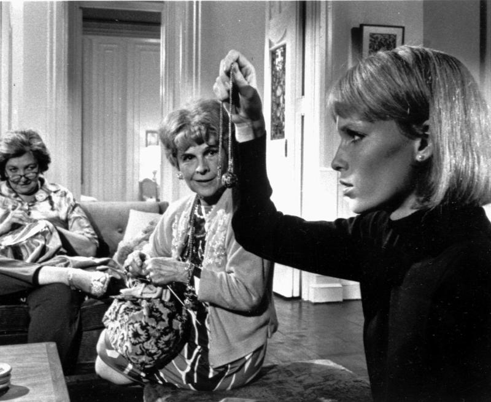](images/Rosemary-receives-a-gift.jpg)

Rosemary receives a gift

[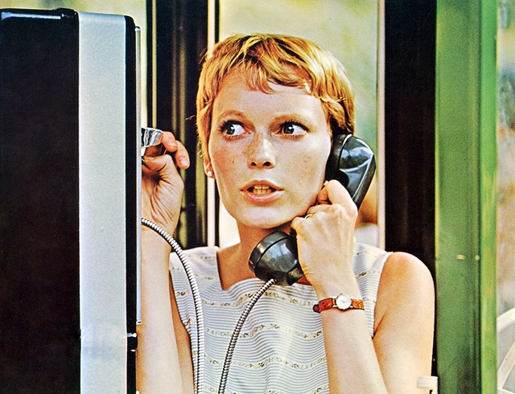](images/Rosemary-in-the-phone-box.jpg)

Rosemary in the phone box

[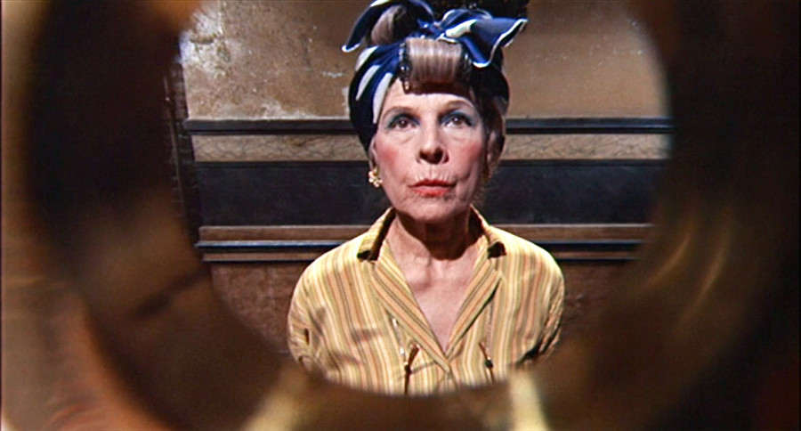](images/Minnie-Castevet.jpg)

Minnie Castevet is at the door

[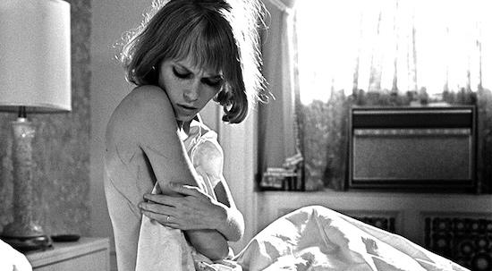](images/Rosemary-wakes-after-baby-night.jpg)

Rosemary wakes after "baby night" with cuts

[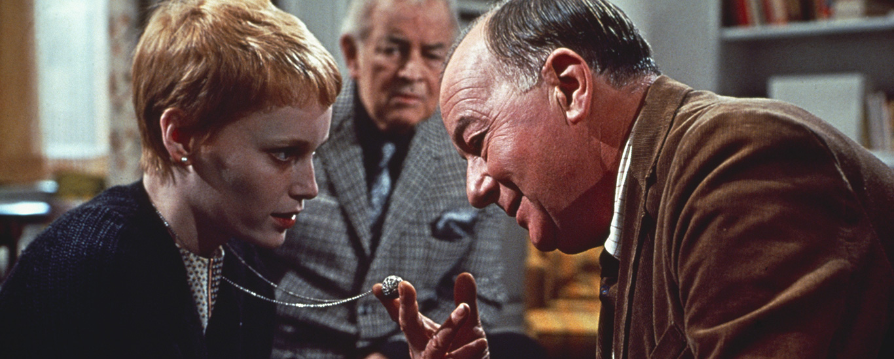](images/Rosemary-Roman-and-Hutch.jpg)

Rosemary Roman and Hutch

## A false sense of security

Something else occurred to me whilst writing this post too. I don't remember there being any dark, particularly scary moments, except for the nightmare I mentioned above. The film takes place mostly in the day time with well-lit rooms and colourful surroundings — I absolutely loved the colours and the choice of camera used here.

The people that are around Rosemary seem to be always brightly coloured too. It's almost like the film is trying to put you at ease with it's colourful, welcoming surroundings whilst the possibility of a dark, sinister underbelly becomes more and more likely as it moves forwards.

On looking back, it really did feel that the film was easing me into a false sense of security.

[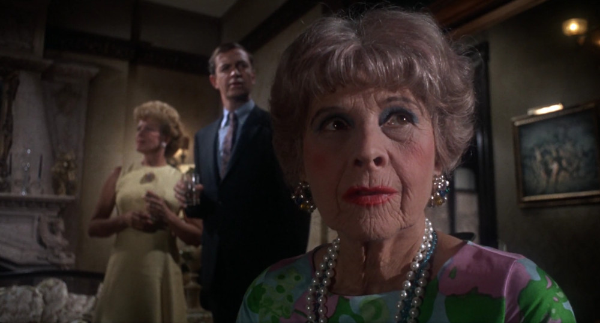](images/Ruth-Gordon-as-Minnie-Castevet.jpg)

Minnie Castevet

[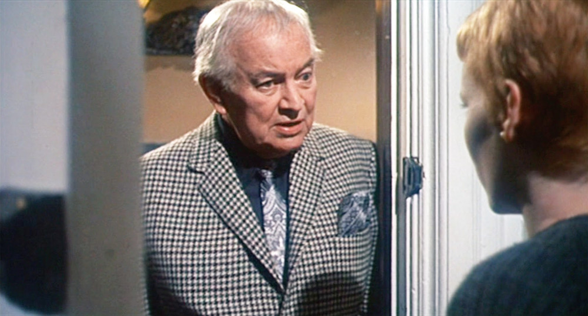](images/Sidney-Blackmer-as-Roman-Castevet.jpg)

Roman Castevet

[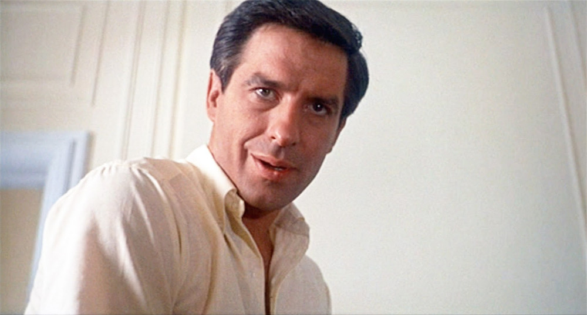](images/Guy-Woodhouse.jpg)

Guy Woodhouse -- Rosemary's husband

[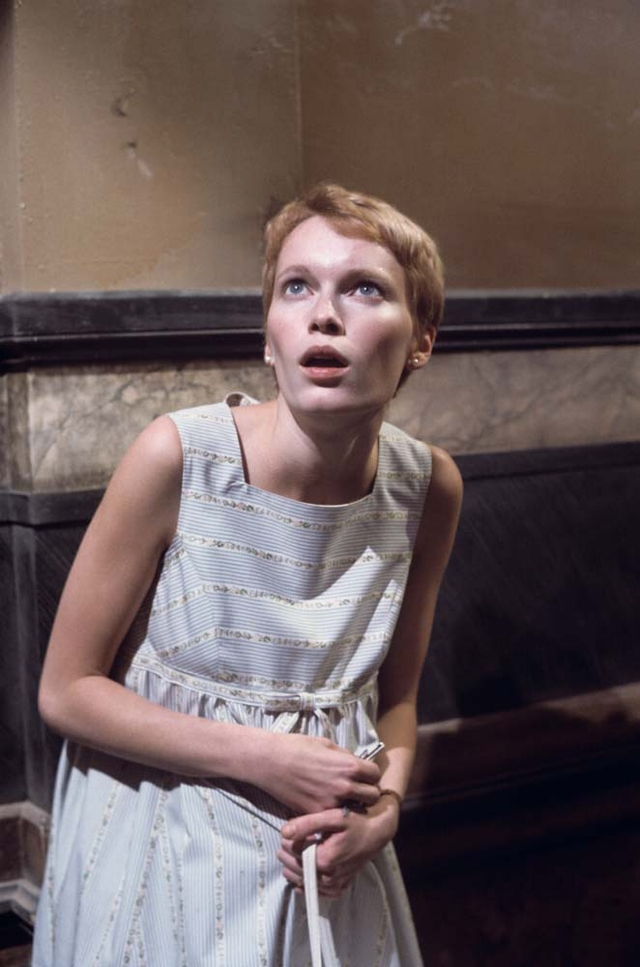](images/Rosemary-clutching-at-her-tummy.jpg)

Rosemary Woodhouse

## In Conclusion

As so many people have said before me, this really is a horror classic. It stands the test of time for me as both a psychological horror and at times a dark comedy -- especially with those scenes involving those over-familiar neighbours of theirs.

I'd urge you, if you haven't already, to give this film a watch. Don't leave it as long as I have. It has scenes that I'm still thinking about now -- days after I actually saw it. And I don't doubt that I'll be thinking about them again in the future.

[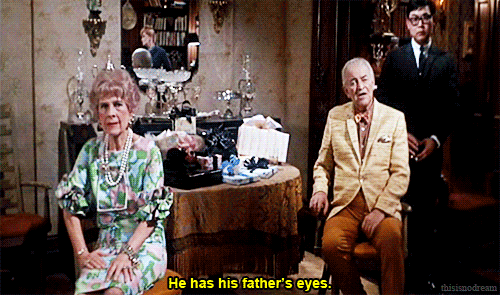](images/Fathers-eyes.gif)

## External Articles

[Kate Middleton Accidentally Wore a Dress from _Rosemary's Baby_ for Prince Louis' Debut](https://www.harpersbazaar.com/celebrity/red-carpet-dresses/a20084057/kate-middleton-rosemarys-baby-dress-coincidence/)

[Is _Mother!_ a _Rosemary’s Baby_ Remake? Is This Poster a Red Herring? Why Do I Suddenly Care?](https://www.themarysue.com/is-mother-a-rosemarys-baby-remake-is-this-poster-a-red-herring-why-do-i-suddenly-care/)
