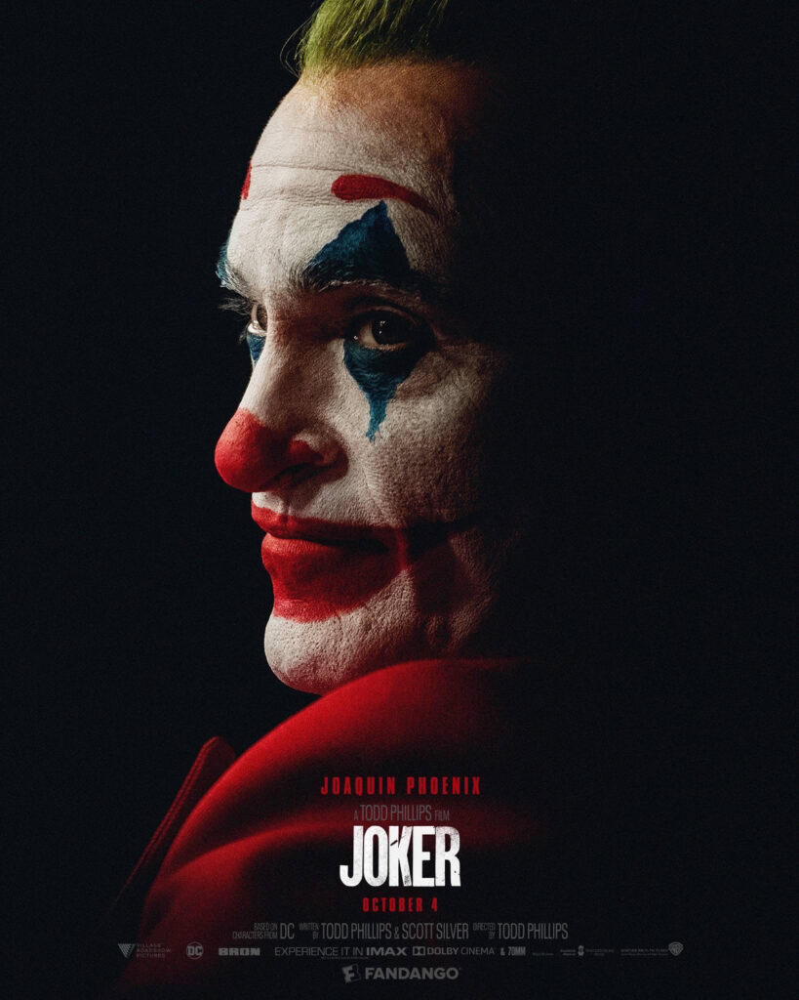
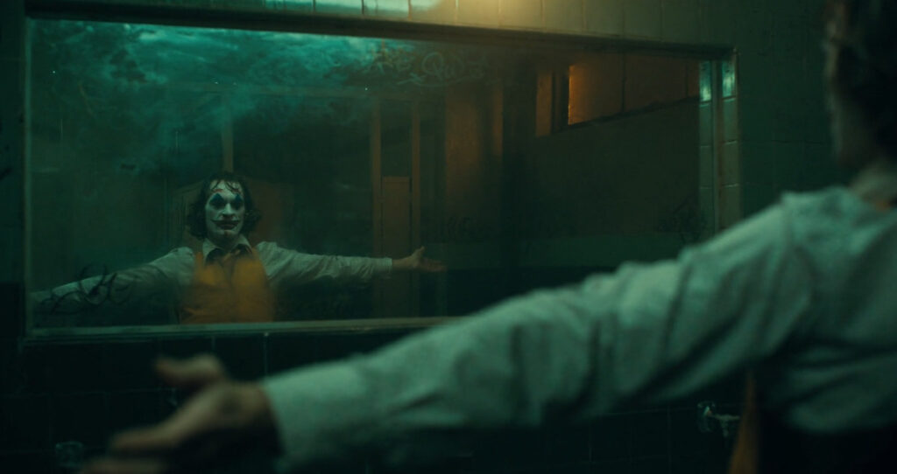
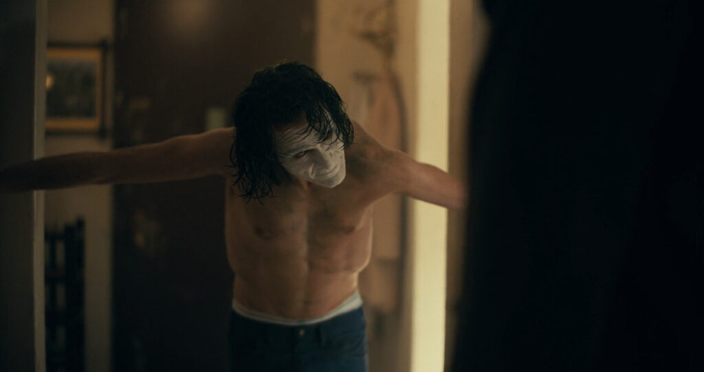
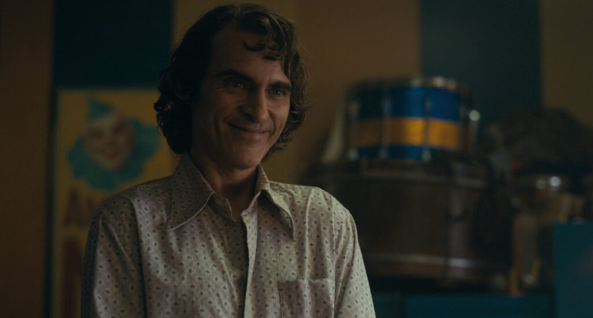
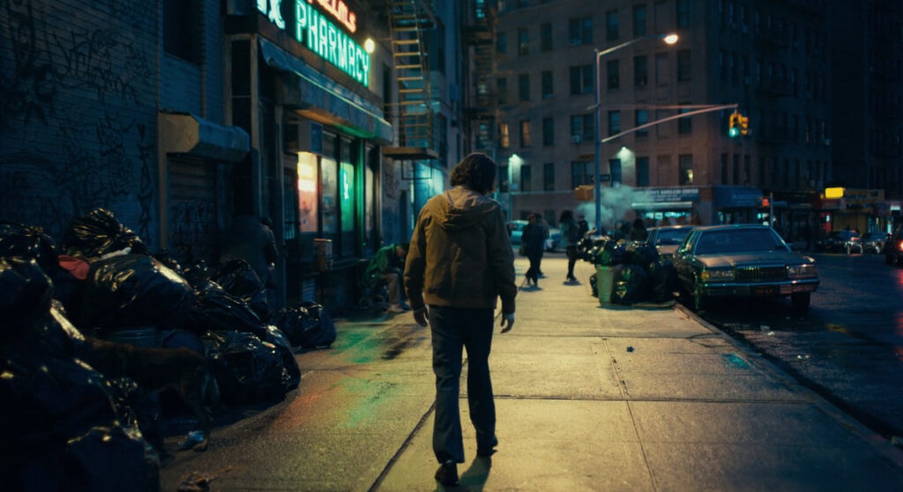
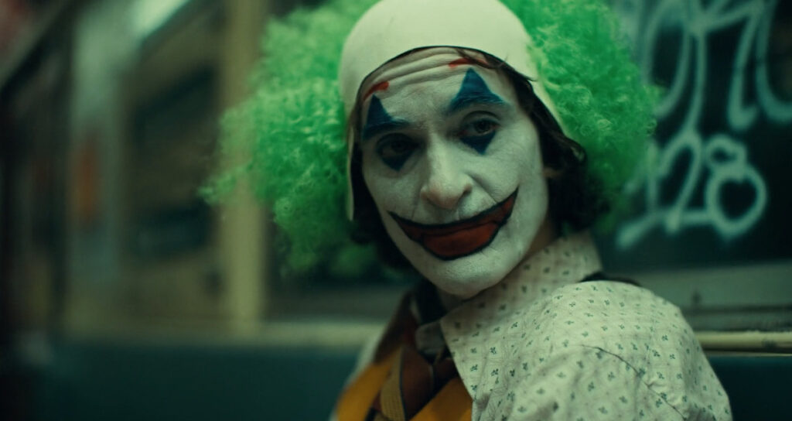
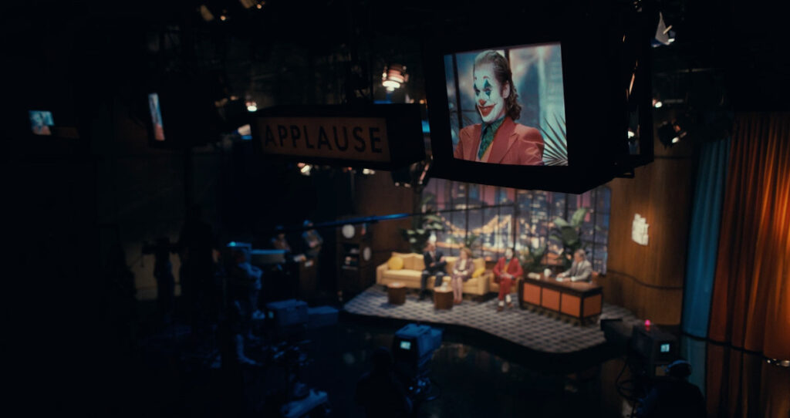
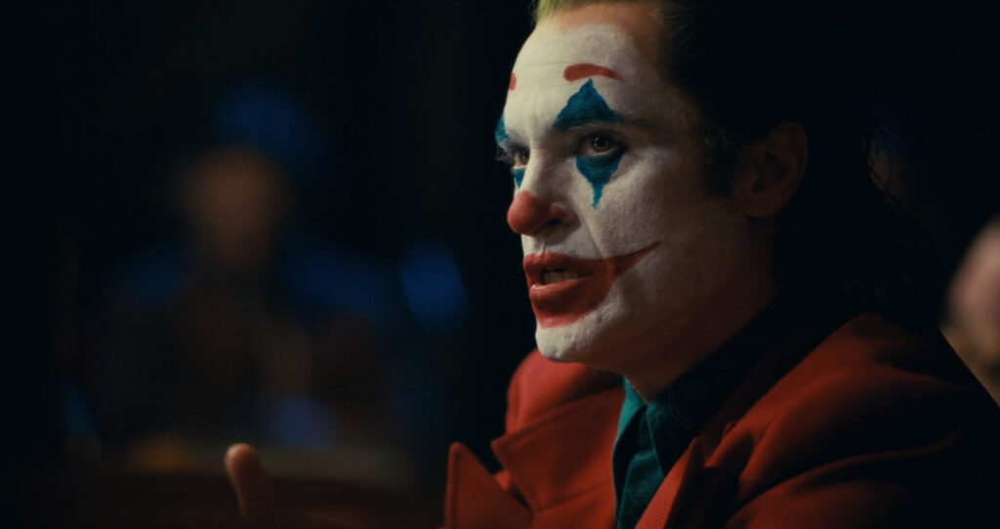

> \--is it just me, or is it getting crazier out there?
> 
> Arthur Fleck speaking with his Social Worker

Joker is a phenomenal film, released in 2019, that explores a possible origin story for Batman's famous arch-nemesis.

I can't believe that I was sat right where I am now as I write this, considering _not_ going to see Joker for my second time at the cinema. This film is absolutely stunning for so many reasons -- some of wish I will try and put over to you here.

Please note however, that this isn't a typical "comic book film" -- it's so much more than that.

I should also say that there are some spoilers ahead.

## A Stunning Performance

Joaquin Phoenix is probably my favourite representative of the character of Joker that I've seen on screen. He isn't playing a huge comic book, larger-than-life character. Instead he is playing a grounded human being, living in almost-poverty, dealing with a whole manner of uphill battles.

At front and centre of his performance was the mental health issues that Arthur Fleck (later to become Joker) is dealing with throughout the film and his life. Joaquin's portrayal of Fleck with these issues was incredible - I couldn't help but imagine the amount of energy that this role must have taken day to day to get to what we see on screen. Nothing seems to be held back - even the look of his malnourished body from his weight loss for the role stands as a testament to his dedication here.

What I found the most profound though, was the way that Joaquin managed to blend comedy and tragedy into the same performance, so naturally. I remember a key scene where his boss at the clown hire company calls him to see him, essentially blaming him for getting beat up by a gang of kids. Fleck forces himself to 'put on a happy face', which for a second is passable as such. But as the camera moves in closer, I could see and feel the anguish and anger building up in him. That one moment made him worthy of his 2020 oscar win for best actor, in my opinion.

## The Music is perfect

I discovered a new instrument when hearing the soundtrack to Joker: the Halldorophone. The instrument is similar to a cello, I think. It is so haunting, so intense and so desolate-sounding, that it perfectly represented the mental isolation that Fleck experiences on the busy streets of Gotham City. The film's composer, [Hildur Guðnadóttir](https://www.hildurness.com/), has created a sound that managed to cut down to Fleck's core and expose it to the audience.

When I think about the score, I go straight to a bathroom scene where Fleck slow dances by himself having just killed the three suits on the subway. The way that the instrument filled the cinema as Fleck seemed to be slipping into something a lot more comfortable, mentally speaking, created a single moment in cinema that I will never forget.

Arthur begins to fit into his emerging persona

Along with Hildur Guðnadóttir's incredible score, are the use of some classic songs at key moments in Fleck's transformation. Frank Sinatra's "That's life" seemed to perfectly capture an acceptance that life can beat you down at times. But it's done with it's calm, almost relaxing, accompaniment that it fit so well into the Joker's embracing and enjoyment of using his experiences to fuel what he is to become.

> I said, that's life (that's life), and as funny as it may seem  
> Some people get their kicks  
> Stompin' on a dream  
> But I don't let it, let it get me down  
> 'Cause this fine old world it keeps spinnin' around
> 
> That's Life - Frank Sinatra

I loved the use of Rock 'N' Roll (Part 2) too. After living with Arthur and experiencing his hardships first hand up to this point, this song was almost like a release of some of the tension. In fact that seemed to be exactly what Arthur was experiencing too as he danced along to it down them well-trodden steps in one of the film's most iconic scenes. But even from that up-beat foot-tapping song, Hildur's excellent score blends back in and takes over to remind us that despite this 'happy face', at his core is still that desolate and broken man.

## An unlikely hero

Joker is probably one of the most unlikely heroes of all of the villains I've come across in films. Up until now that is. But of course, that is completely dependant on your perspective. In all of the Batman films, Thomas Wayne was this beacon of hope for the city who, after his death, became a catalyst for his son Bruce to pursue his own destiny as the Batman. But when you come at the story from the side of the "villain" (quotes intended), it makes things not quite so black and white.

Arthur Fleck comes from the impoverished side of gotham, where the people are pretty much forgotten about and frowned upon by the rich society. There is a moment when Thomas Wayne appears on television, to the excitement of Fleck's mother, to be interviewed about the three killings on the subway.

From what we saw on that train car, we know that those three men were complete scumbags - harassing an innocent woman and then beating on Arthur. Yes, Arthur's reaction was extreme. But after a life of being beaten on by his peers and society around him, and with the only means of self-defence to hand, is it really that surprising that he reacted how he did?

But then to have Thomas Wayne, the poster child for success and wealth in the city, give the following statement, it puts him in a completely opposing light to how I'd seen him previously: "And until that jealousy ends, those of us who've made a good life for ourselves will always look at those who haven't as nothing but clowns.".

Arthur getting ready for the Murray Franklin show

> And until that jealousy ends, those of us who've made a good life for ourselves will always look at those who haven't as nothing but clowns.
> 
> Thomas Wayne, interviewed on TV

I think it was inevitable that there was going to be some civil unrest on the city streets. But it just so happened that Arthur was at the right place at the right time to kick start the revolution and lead it into a new era for Gotham.

## Births and Deaths

There was a moment at the end that caused my mouth to drop with excitement and awe. It was just at the height of all of the rioting, as Fleck (almost fully Joker) is being broken out of the police car following his television appearance. We see Thomas and Martha Wayne leaving the theatre with their son Bruce in tow. I thought - hang on, this seems familiar.

As they run down a side alley to escape the escalating violence they are approached by one of the extreme protesters in a clown mask. This immediately sent me back to being about ten years old again seeing Tim Burton's batman - "You ever dance with the Devil in the pale moonlight?". The attacker in Joker didn't say this, as it wasn't the same character as in Batman (In Batman it is a criminal called Jack Napier who becomes the Joker). But it was no less powerful for me to see this scene play out at this film's climax.

But the most powerful moment for me was the awakening of Joker on the bonnet of the police car -- after having been broken out, and the deaths of both of Bruce Wayne's parents. Although the metaphor is pretty obvious I just wanted to note it down: It is the perfect representation of the births of both Joker and Batman happening at the same point in time.

Joker is raised up and revered as the leader of a crusade for the beaten and down-trodden in society. At the same time the seeds of what Bruce is to become are planted at the very moment that his parents are taken away from him.

Arthur does his best to keep his anger inside

Arthur Fleck walks home after his therapy session

Arthur on the subway

Arthur on the Murray Franklin show

Arthur has a heated discussion with Murray Franklin

## In Conclusion

I have only seen a couple of different versions of the Joker, from the New 52 DC comics to the classic Jack Nicholson perforce in Tim Burton's Batman. And from Heath Ledger's iconic performance back to Batman: The Animated Series. But I have to say that so far, I think that Joaquin Phoenix's portrayal has easily become my favourite -- of the ones I've seen on screen, anyway.

His version is so grounded in reality, so much so that this didn't even feel like a typical 'Comic Book Film' for one second as I watched it. This is a psychological thriller through and through - and a damn excellent one too.

Joker does have it's funny moments, but they are sometimes hard to spot -- depending on your sense of humour. But if you are inclined towards darker comedy, there are some pretty funny moments in here.

## Related Links

Composer [Hildur Guðnadóttir's website](https://www.hildurness.com/).

[‘Joker’ Originally Had A Very Different Bathroom Scene](https://www.slashfilm.com/joker-bathroom-scene-creation/) - from SlashFIlm

[Every Song On Joker’s Soundtrack](https://screenrant.com/joker-movie-soundtrack-songs/). - from Screen Rant
