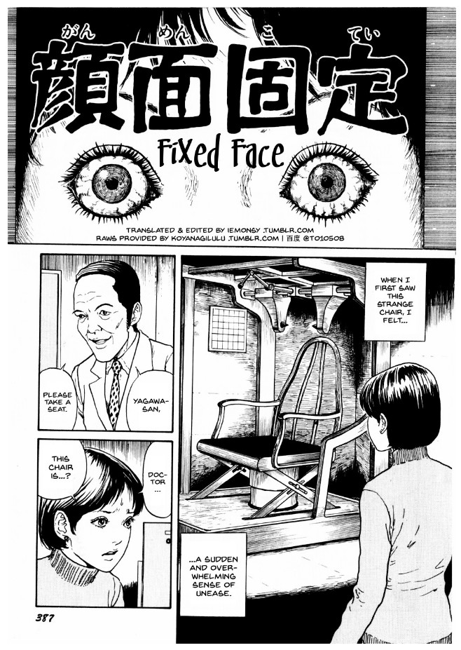
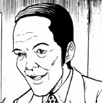
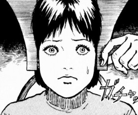
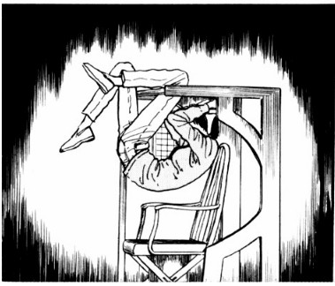
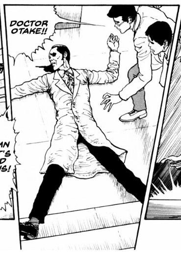
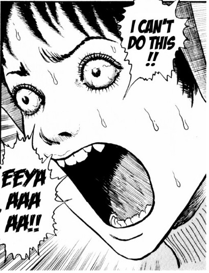

> This is a facility made specifically to capture the features on the lower portion of the face.
> 
> The Doctor explains the chair that makes Yagawa feel so uneasy.

## Synopsis -- Fixed Face

Fixed face is one of Junji Ito's shorter stories, but is no less terrifying in its smaller page count.

Yagawa is a young lady who has gone to a dental hospital for some unknown reason. We don't know her treatment and, for the purposes of this story, it isn't really important. On arriving, the doctor welcomes her to take the only seat -- the dental chair -- and to place her head between two ominous-looking clamps.

These clamps, the doctor says, are to fix the person's head in place to allow them to capture exactly the features of the lower part of their face. The clamp is made up of a huge over-arching machine. That machine reaches round a person's head with pointed metal pieces that are to be placed inside the person's ears.

However, on fixing the lady in place, the doctor realises he needs to leave the room for a moment. Not long after leaving, he trips down the stairs on one of the hospital's lower floors -- killing himself.

The location of the dental room is an area of the hospital not often covered by many people. So the lady is left alone, head clamped in place, without a word from the doctor or any other soul.

She has no idea about the fate of her doctor. And has no way to get herself out of the place in which she is trapped. What will happen to the lady? Will she _ever_ get out? And if so, at what cost will she manage to break free?

Doctor Otake

Yagawa

## Fear of never being found

I remember hearing an urban legend when I was younger about [a person buried alive](https://en.wikipedia.org/wiki/Taphophobia) and never being found. The thought of being trapped in a place where nobody knows where you are is scary in itself.

But Junji Ito has created a similar story here, no doubt inspired by his own time as a working dentist. When Yagawa is fixed in place into the dental chair and then left, she is left in a very vulnerable position. But when we see how the Doctor ends up dying, she has no idea -- however, we as the readers do.

We have a power over her that somehow reinforces Yagawa's increasing anxiety. As she freaks out in the chair, unable to free herself and with seemingly no one coming to her help, we are forced to just watch her struggle.

What I found interesting too, was that there are no malevolent forces in operation here. There are no evil spirits, forces of nature, or a bad doctor trying to trick her. It is a situation of pure bad luck -- for both Yagawa _and_ her doctor. A situation that Yagawa must then try to escape from.

## It reminded me of Tomie: Babysitter and Amigara Fault

In [Tomie: Babysitter](https://junjiitomanga.com/babysitter-tomie-part-16/), the main character, Erita, falls into a similar situation. After being locked in a family's baby's nursery as a precaution, she ultimately finds herself trapped. With the only people who know she's there unable to let her out. Although it is for very different reasons that her captors are unable to free her, the result is still similar.

Perhaps this fear of been locked away, or being forgotten, is a legitimate fear of Junji Ito's? And maybe it's that fear that he lets feed into his work in these stories? Or maybe it is just that the fear of being forgotten is such a common human fear, that it naturally ended up finding its way into his work.

Another similarity I felt in this story was of The [Enigma of Amigara Fault](https://junjiitomanga.com/the-enigma-of-amigara-fault/). When we see Yagawa struggling and convinced that the ear clamps are pinching further into her head, it reminded me of the closing panels of Amigara Fault. Where we would see the tunnels gradually squeezing and bending the people who entered out of shape.

That idea of being trapped and seemingly under the control of some outside force closing in on you is scary. And I think that similar theme was used well here in Fixed Face too -- albeit without the human-shaped holes.

Doctor Otake falls down dead

Yagawa starts freaking out

## In Conclusion

I find Fixed Face to be a very effective little horror story that is light enough on its surface to make for an easy read. But I think there is a lot to admire in those moments where Yagawa is getting more and more frightened in her fixed position.

There are some great examples of Ito's penmanship on display. This is especially apparent where we see the lady's close up face broken out into a sweat and panic. The fear is palpable and really jumps out of the page. Even the sense of motion as Ito draws her swinging to get out of her trap is really well done. Her increasing stress and anxiety is put across in a way that made it feel as though the pace was truly picking up. Almost as though I could hear the woman's ever-increasing heart beat growing louder and louder.

Despite the slightly-contrived way in which Ito sets up this situation -- the man just having to leave the room and just so happens to trip and die -- this is still up there as a favourite of mine. This is less of an evolving story per-se. It is more of a situation that this woman, and by extension us as readers, must endure.
