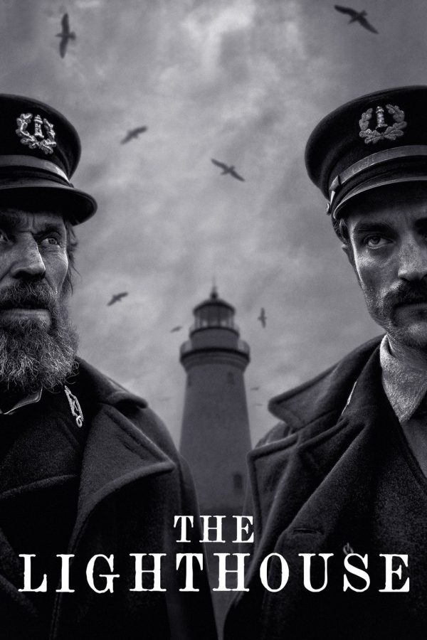
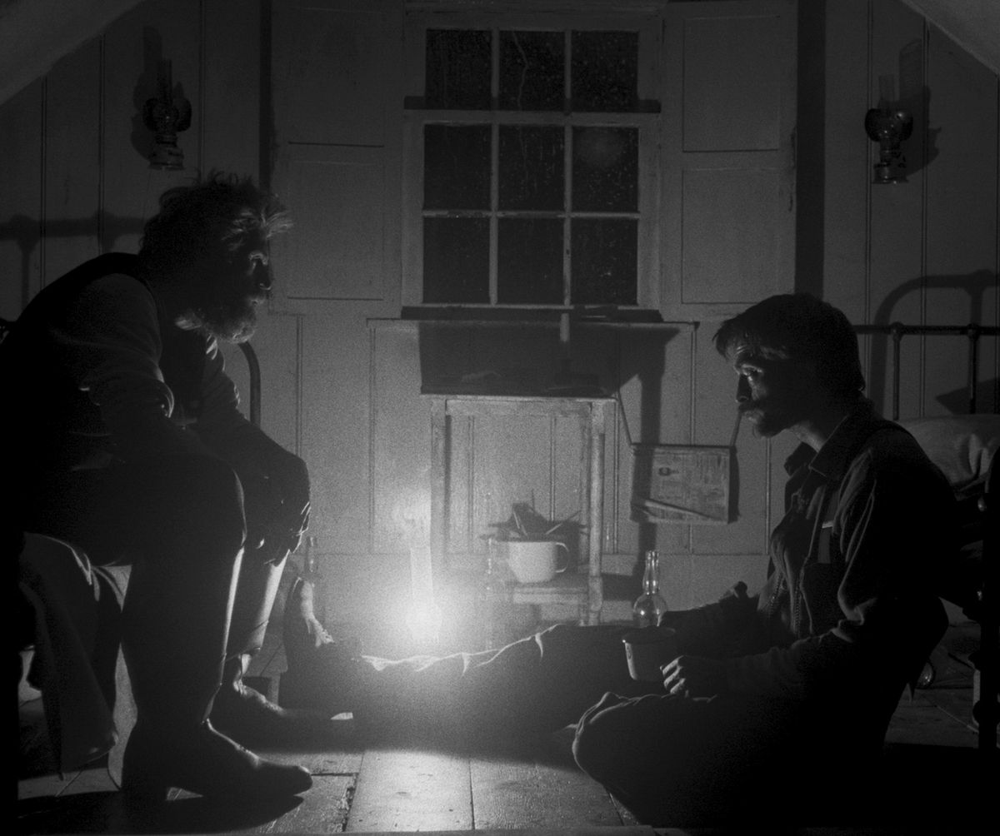
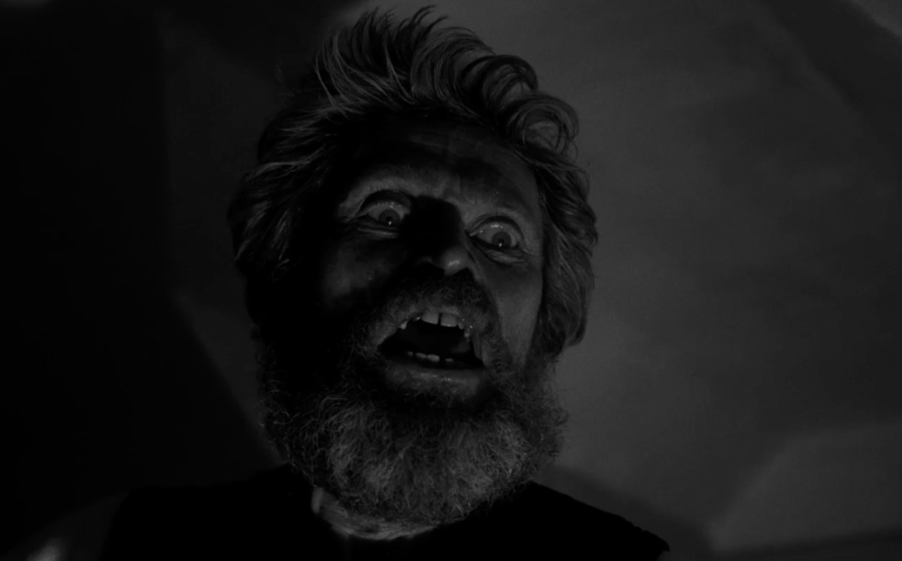
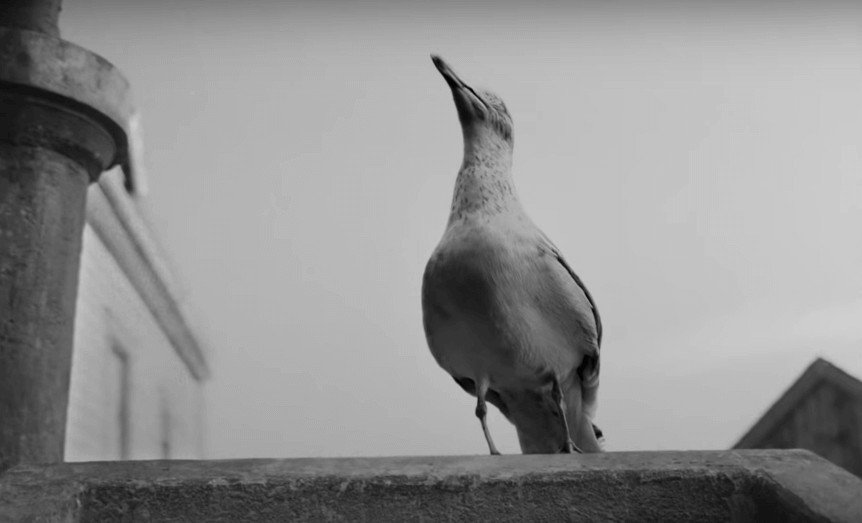

The Lighthouse is a slow-burn descent into madness expertly portrayed by Robert Pattinson and Willem Dafoe.

They play lighthouse keepers with the task of manning the lighthouse on a rock out at sea for four weeks. But their isolation and growing annoyances of the other, soon guide them down the path of madness.

Directed by Robert Eggers, the man behind another favourite film of mine from recent years -- The Witch.

I found myself completely transfixed to these two people throughout the entirety of this film. From their initial landing on the island -- passing their predecessors on the walk to their new, month-long home -- up to the crazy final scenes that played out like some kind of demonic version of Alfred Hitchcock.

While I'm not going to spoil anything here, what I will say is roughly what the film is about -- very roughly.

Pattinson and Defoe play two lighthouse keepers. Pattinson is new to the job and quiet initially, whilst Defoe plays an almost-caricature of a typical old sea-dog with many old tales and superstitions to impart.

Their relationship is pretty intense throughout, as would be expected between boss and worker that also live together -- especially in such a close and isolated proximity.

I've lived and worked with a boss-like figure in the past and I can tell you for one that it can get pretty tense pretty fast if you're not careful.

They often argue and disagree, usually with Defoe coming out on top, but at times they let off steam by getting completely drunk and sing songs of old times in their drunken stupor.

The film's climax is one that I will be thinking about for days to come, I think. It has no hard explanation, at least not that I could tell. What it does have is a heart-pumping ending that leaves itself open to interpretation -- complete with metaphor and Greek mythological imagery.

## Pattinson and Defoe

I'd not seen Robert Pattinson in anything before, so didn't know what to expect. Willem Dafoe, on the other hand, I had seen a few times and so was aware of him and his idiosyncrasies as an actor.

What I found was that both of their performances were absolutely incredible. As I heard in a review after watching the film, this film displays the whole gamut of human emotions. We see both characters at their most powerful and their most vulnerable too, I would say. From the heights of joy in alcohol-fuelled excitement, to some moments of personal fantasy and depravity.

Willem Dafoe's Shakespearean, powerful monologues were absolutely hypnotic to watch -- as were his eyes whilst he delivered said speeches. Lit up like someone would be at a campfire telling ghost stories -- a piercing light shining from below and up against his intense expression. He became almost scary to see but I found myself unable to look away.

I'd only heard about Robert Pattinson through knowing about his starring roles in the Twilight films, so that had coloured my perception of him if I'm honest (despite having never seen them). But all I can say is "wow", based on his role in The Lighthouse. His descent into madness and the odd visions that he witnesses in the desolate, rocky surroundings, are pieces of cinema I wont forget in a hurry.

## Superstition and suspense

The was a heavy air of suspense throughout the entire film, which for me didn't really end until the very final shot. At times I felt like I was watching the love child film of both Alfred Hitchcock and David Lynch.

The film was presented in an old-style square frame as opposed to the typical widescreen format that we are used to nowadays. It was also shot completely in black and white. These two factors, along with the fucking incredible score by [Mark Korven](http://www.markkorven.com/) gave the story the added claustrophobia that the characters on screen were no-doubt facing themselves.

And as for that score, it was intense, atmospheric and downright terrifying at times. That, coupled with the films overall great sound design, made for what I can't help but feel will be one of the greatest auditory experiences I will experience in the cinema this year.

It was just a shame that some dick in the row in front of me kept piping up to his mate with short sentences after some of the film's big moments.

## In Conclusion

What can I say other than this is a film that will treat all of your cinema-viewing senses to a real treat. The performances are incredible; the story itself is left up to you to interpret; and the atmosphere is one of constant isolation and sustained dread.

I loved it from beginning to end and found myself enjoying the emotional journey that these two men were going on. The more I sit and think about it now afterwards, the more my mind is starting to think about the possible symbolism throughout the film. And the more I am starting to form my own interpretations of what I have seen tonight.

Maybe I'll write these interpretations into a separate post once I have some kind of coherent way of putting those thoughts together.

If you enjoyed The Witch, to which this is a sort of spiritual companion, or are simply open to something very different from your regular cinema experience, then I can't recommend The Lighthouse enough. If you can watch it for the first time at a cinema then you definitely should.
