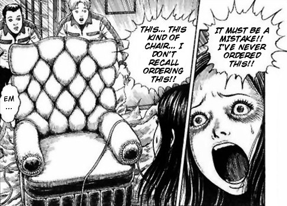

> ...but I have a feeling that there really was a man living in the chair... and he leaves the chair every night...
> 
> Is Yoshiko's paranoia getting the better of her?

Always support Junji Ito's work where you can. However, I couldn't find an English released copy of Human Chair so you could [read it here](https://mangakakalot.com/chapter/human_chair/chapter_0).

## What is The Human Chair about?

When a lady author speaks with a furniture maker about getting a new chair, he goes on to tell her the story of an author from long ago, Togawa Yoshiko. Yoshiko had a large, soft writing chair bought for her by her husband -- similar to the one that the Young Lady is being shown today.

Yoshiko would often receive letters from new authors in the hope of guidance and / or exposure into the arts. One such letter details the story of a chair maker who decided to build secret compartments into the lining of his chairs -- places for him to sit beneath those sat on the chairs.

Yoshiko's paranoia gets the better of her, and she becomes convinced that her own chair is the one spoken of in the letter. Whether that is the case or not, I will leave you to discover through reading The Human Chair for yourself. What I can say though, is that Yoshiko's story has a direct effect on the lady author from the start of the manga.

Whether that is good or bad, I will leave you to discover for yourself...

## Based on a short story of the same name

In 1925, [the short story "The Human Chair"](https://en.wikipedia.org/wiki/The_Human_Chair) was published in Kuraku literature magazine by Edogawa Ranpo. In Junji Ito's manga adaptation, he has used the narrative of that short story as his backstory. It is very much a sequel to that original story.

The chair's history is actually described in more detail in the original short story, I believe. However, in the context of Ito's interpretation, this isn't as important. Instead he uses the basis of that original story as a spring board from which to explore the darker recesses of the tale.

Apologies if I am wrong here, but I think I am right in saying that Ito seems to create his own additions to the end of Yoshiko's legend. The original ends at the point at which the chair-maker's confession letter turns out to be a short story manuscript from an aspiring writer. However, Junji Ito takes us further into Yoshiko's paranoia and the horror that may just be hidden beneath her chair's soft upholstery.

Perhaps the original story was left ambiguous for the reader to formulate those possibilities in their own minds. Here we get to see how Ito interpreted that story, and just how _he_ imagines it moving forwards.

## Horror in plain sight

Once again, Junji Ito brings us a slice of horror that would have perhaps never been considered -- chairs. Yes it was based on a previous work, but he obviously saw something interesting and creepy in that story that he wished to bring into his own world of Horror Manga, before sharing it with us -- his fans.

Although most of Human Chair is telling the back story of Yoshiko -- it is an adaptation after all, I found the present day story interesting too. The unnamed modern-day lady author and the creepy chair maker / salesman. If I'm honest though, I'd liked to have seen a bit more story around the two of them.

I myself have a history with chairs and horror, ever since I saw [Ghostbusters](https://en.wikipedia.org/wiki/Ghostbusters) when I was young. That scene with Dana Barrett in her chair... and those arms... damn still creeps me out to this day.

Since then I can not really sit in a room with space and a door behind me. For fear of someone grabbing me from behind -- especially when watching or reading horror. In fact I'd not even considered this to be an actual fear of mine until writing this post. :?

Perhaps this is a fear more common than I thought. Maybe that is what drew Ito to it for working on his adaptation.

## In Summary

Human Chair is a story I will find myself revisiting now and again. I love how Junji Ito manages to find horror in the everyday things. Like with his own cats in 'Yon and Mu' or everyday shapes, such as the spiral in [Uzumaki](https://junjiitomanga.com/tag/uzumaki/). Chairs are such ubiquitous things that to consider them as places of horror is perhaps not often considered.

But Junji Ito considered it. And not only that, he has created a mystery that uses a classic Japanese short story as a basis from which to explore his themes of paranoia and a yearning for love.

His artwork in it is just as great as I have come to expect too -- detailed and demanding to be read multiple times. It's a pity that the only versions I can currently find are small scans that have been roughly translated into English online. I would really love to own this story as part of an original collection.
