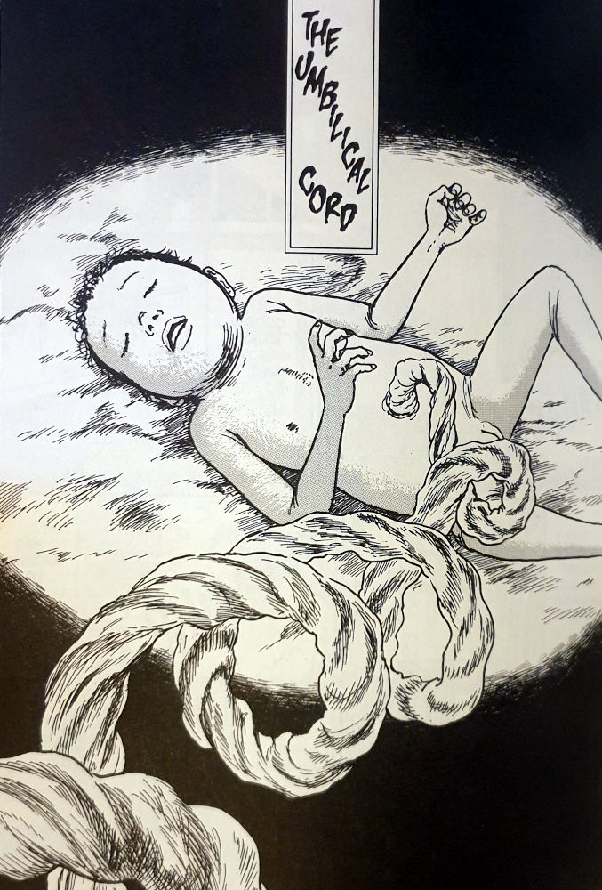
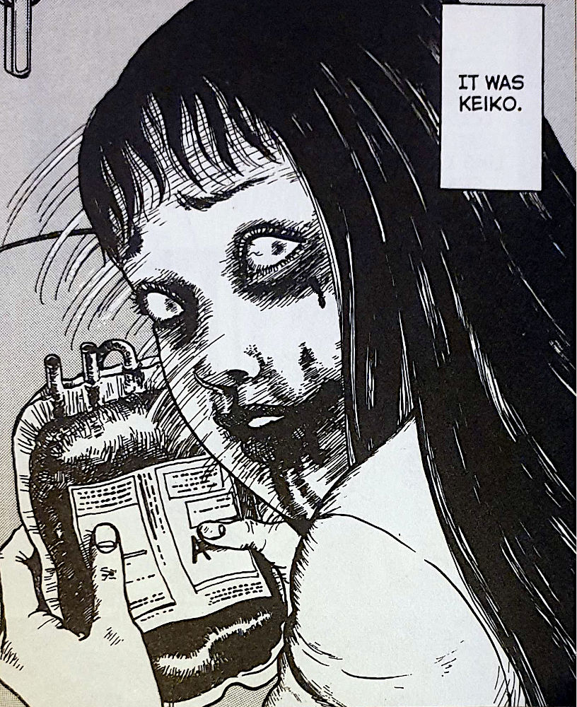
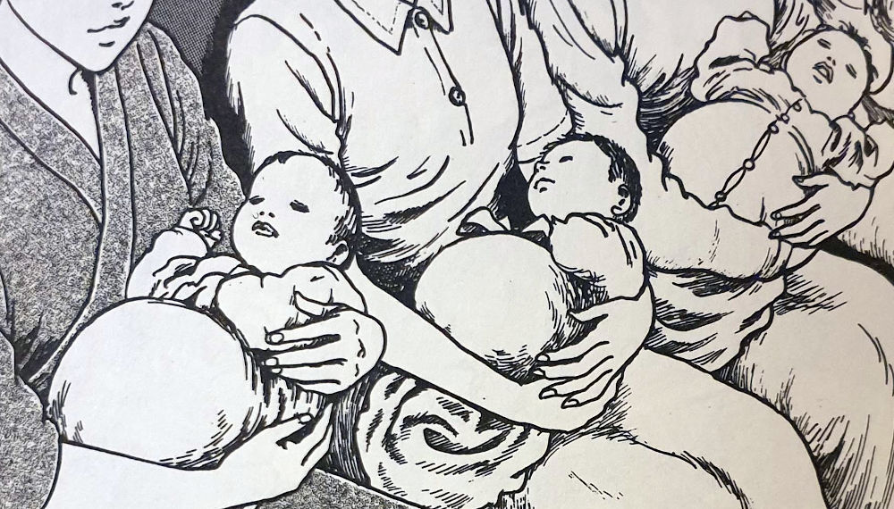

> So it's been born. I wonder what it looks like. A baby gorged with human blood...
> 
> Kirie is curious about the newly born

Some time after the bloody events of Uzumaki's tenth chapter, Mosquitoes, Kirie is faced once again with the insidious spiral that seems to haunt her. The pregnant women who she saw feeding on human blood are about to give birth to their little bundles of joy. But what sorts of monsters will be born from such horrific actions?

As it turns out, the baby's are born and are all perfectly normal -- the cutest baby's ever, some would say. But you can trust that these baby's are going to be very far from normal. In fact, each of them is hiding a gross deformity and a very strange desire to return to the womb.

Of course, Kirie is alone in her suspicions and is still doubted about the events of the hospital massacre. But by the time this chapter reaches its own bloody conclusion, you can bet that there will be no room to doubt Kirie on the events that unfold.

Some spoilers below

## The Source of Life

The umbilical cord is the source of life for humans as their grow within their mother's womb. What the mother feeds on has an effect on the kinds of nutrients that the baby will ultimately be absorbing. So is it any wonder that the feeding on human blood did strange things to them?

The introduction of the mushrooms in the hospital food was equally inventive as it was disgusting. Our first feeding as humans comes from the umbilical cord so it was interesting how the patients were attracted to this strange new food without knowing its origin.

I have heard of people actually eating their own placenta after giving birth. And whilst I would never dream of doing such a thing, I wont say bad things about those that choose to. I just love how Junji Ito, once again, takes this occurrence in real life and delves deeper into his strange imagination of "What ifs".

## A Yearning to return

Who has dreamed about just being able to return to the womb? To just leave all the cares of the world and struggles of life and just be taken care of once again. Many of us, myself included, even occasionally sleep in the fetal position -- it's a feeling of comfort very deeply rooted in the psychology of us humans.

I love how Ito took this and had us witness these babies literally wanting to return back to their mother's womb. With a deranged doctor willing to carry out the surgery!

This led me to imagine this omnipresent spiral presence, the [Uzumaki](https://junjiitomanga.com/tag/uzumaki/), in control of all of this -- the spiral patterns in the regrown placentas no doubt being used to hypnotise him into carrying out this force's will.

Newly born babies in a row

## Coming back to the spiral

Let's imagine for a second that we humans are all metaphorical spirals that begin at the moment of our conception. We grow into our fetal positions, almost as if we are trying to wrap around ourselves.

Then we are born. If we are lucky we are soon held closely by our mother, who will hold us the tightest that they ever will, metaphorically speaking. And then, as we get older and older, we are held less and less. And even though the love is always there, for those of us who are fortunate enough, the gaps begin to form and we go out into the world on our own. Perhaps to start our own families.

I can imagine this way of life, the growing apart yet still being connected, as the motions of the spiral as it continues round on its journey. Still connected to its origin yet moving further outwards into the world.

The spiral really is all around, both in Junji Ito's Uzumaki and our everyday lives.

## In Conclusion

Umbilical Cord rounds off its three-chapter mini-arc nicely as it follows directly on from [Mosquitoes](https://junjiitomanga.com/mosquitoes-uzumaki-part-10/) and [The Black Lighthouse](https://junjiitomanga.com/the-black-lighthouse-uzumaki-part-9/). (The light burns Kirie received in The Black Lighthouse being the reason she was actually in the hospital as a patient).

This chapter is also a daring one too, I would say, as it deals with the births of babies. And not just regular babies either -- babies born after their mothers have been feeding on human blood. But Ito handles it with his expert pen as you would come to expect from him.

Whilst I wouldn't say there was too much in the way of violent horror in this one, there is a good dose of creepy body horror. Body horror that does a really good job in unsettling its readers. At least it did with me on my first time reading.

I would probably not recommend this as a first time read for Ito's work. Perhaps I would recommend reading Mosquitoes first _followed_ by this one. But then again I would say that Uzumaki is worth it from start to finish.
