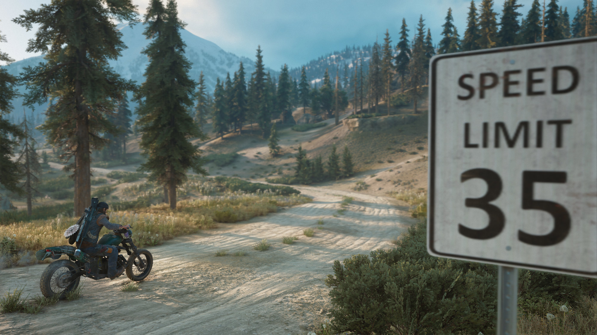
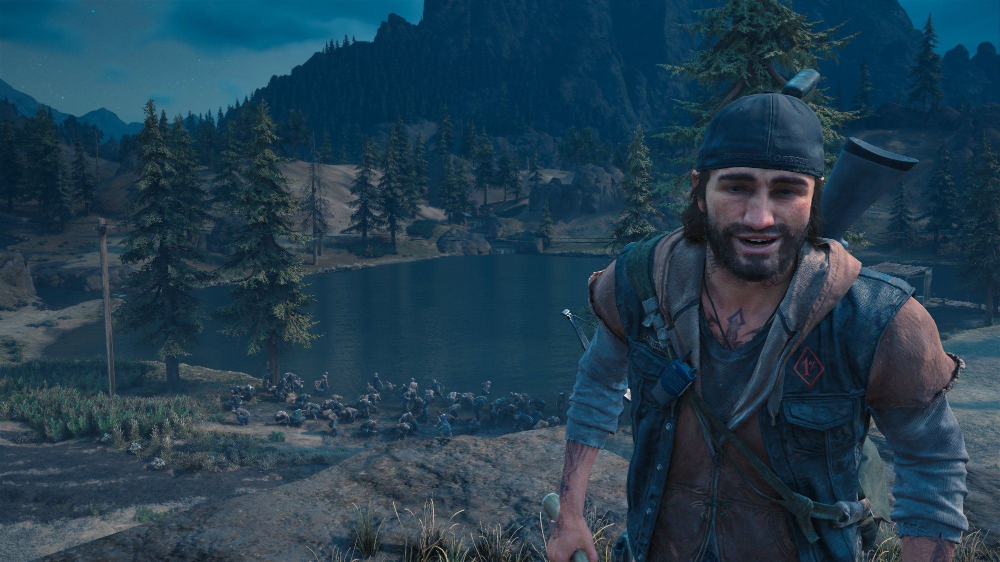

Bend Studios' Days Gone took a while to grow on me, I wont lie. The main reason for this was a couple of blue screen crashes I experienced during the early hours of it.

However, fast forward a few months to my restarting it and **it quickly became a favourite game of mine**.

As replayability goes, this is up there as one of the best for me -- I literally jumped straight back into New Game + after the credits had rolled on my first playthrough.

## What is Days Gone about?

Days Gone puts you in the very capable boots of Mr Deacon Saint John -- a biker from Farewell, Oregon. The story opens on day zero of a mysterious outbreak that sees people devolve into violent none-thinking animals.

After his wife Sarah is injured, they are separated as he manages to secure her a place on an outbound medical helicopter -- Deacon must stay behind to make sure his best friend, Boozer, makes it out alive. However, that is the last he sees of her.

Fast-forward 2 years or so and we join Deacon and Boozer riding through the Oregon forest roads in pursuit of someone. From here you take control of Deacon's destiny and must survive a world that is literally always coming for you.

One of the main threads throughout the story is whether or not Deacon will ever see Sarah again. That story and his undying love for his beloved is beautifully told by not only the writers but the people portraying those characters too.

## An unfolding story

One of the biggest criticisms I see for Days Gone is it's narrative structure and how it almost feels like it could be ending, before introducing a new set of characters. But I found this to be one of its biggest draws for me.

The story felt more like a novel at times than a typical video game narrative. And I loved that story.

Instead of a simple structure like:

1. Setup characters

3. Setup conflict

5. Work to resolve conflict

It was more like:

1. Setup main characters and the world they live in

3. Drop into their lives at a given point

5. See how their lives unfold from there

Our own lives are rich and we meet people at different points in those lives. We don't just get introduced to all the people we will ever know at the start and continue to the finish line.

Days Gone does a great job at actually telling an unfolding story where different characters enter and exit at various points. It gives it that extra piece of realism for me and it's a story that just keeps getting better.

## The World

The World of Days Gone is fucking stunning. That's the only way I can put across my complete love for this world. The weather effects look incredible -- especially in the heavy rain and blizzards.

The towns, outputs and lake houses dotted all over and hidden amongst the wilderness beg to be found and explored. I can't really put across the feeling I get whilst just wandering about the world finding new houses and farms.

I could spend hours just riding the broken roads -- circling the entirety of the map -- just for relaxation. Of course that relaxation is quashed when you accidentally run up against a horde of freakers.

Oh and I haven't mentioned the wildlife yet!

I remember one instance after completing the game's main story where I was riding around looking for the collectables. I kind of got lazy in my diligence and before I knew it, as I was getting off my bike, one of the world's many huge bears attacked me from out of nowhere. I literally jumped out of my skin.

And then there are the pack-hunting wolves and later, the crows.

The world of Days Gone is brutal and unforgiving, and I love it.

## Freakers and Hordes

Freakers are the "zombies" of Days Gone, except more fierce, fast and agile than traditional zombies. Although one on one isn't too much of a challenge -- in fact the AI can be very easy to get around at times -- as soon as you pull more than a few freakers, things can escalate... very quickly.

One of this games technical achievements that made the press was the concept of a Horde of freakers: literally hundreds of enemies on screen and running at you at once. That feeling of discovering your first Horde -- the world has many of them -- coming over the brow of a hill or feeding in a pit, is a hard feeling to beat.

The freakers are often found dotted around the world in most places -- especially at night -- but Hordes will travel in a large pack between a water source, a feeding pit and their daytime refuge -- a nearby cave normally. Choosing when and where to attack will depend very much on your confidence and fighting preferences.

One thing I will say is that these Horde battles can get unbearably tough at times (and long) -- especially on higher difficulties. Being chased by hundreds of freakers often means that more will be pulled into that group as you pass by the other freakers just wandering the world.

I had one fight recently on my new game plus that lasted just less than an hour, and I barely made it out alive.

## Summary

Days Gone is as beautiful as it is deadly. With many of the familiar parts of a traditional open world game -- bandit camps, collectables, side quests and varying storylines -- this game still manages to carve out its own niche within that genre.

It's in a league of its own. And although it can be very occasionally buggy, the amount of stunning moments this game holds, greatly outweighs it's very few flaws.

If you like Open World games and Horror, you need to be checking out Days Gone.
